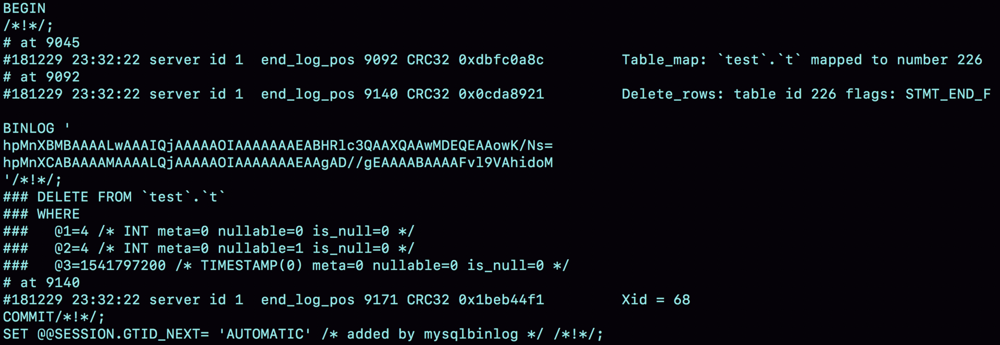
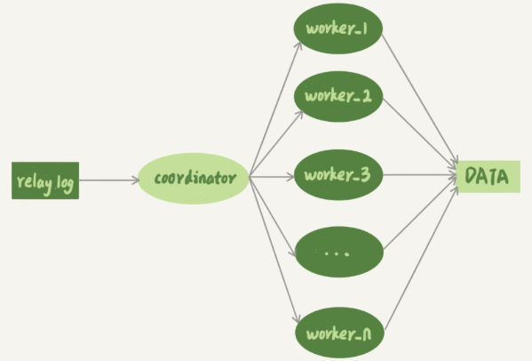
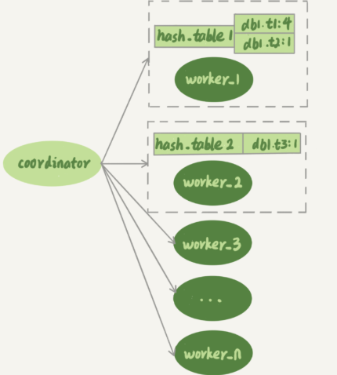
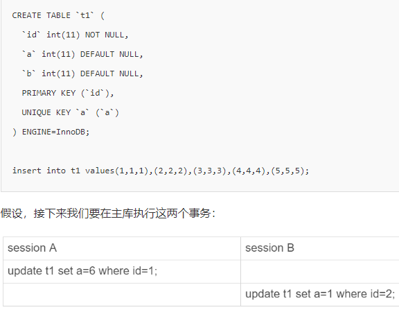

## MySQL主备相关

### `mysql` 主备结构

​	*主备切换流程*


在状态 1 中，客户端的读写都直接访问节点 A，而节点 B 是 A 的备库，只是将 A 的更新都同步过来，到本地执行。这样可以保持节点 B 和 A 的数据是相同的。当需要切换的时候，就切成状态 2。这时候客户端读写访问的是节点 B，而节点 A 是 B 的备库。

#### 节点 A 到 B 这条线的内部流程是：

​			*update 语句在节点 A 执行，然后同步到节点 B 的流程图*


主库接收到客户端的更新请求后，执行内部事务的更新逻辑，同时写 `binlog`。备库 B 跟主库 A 之间维持了一个长连接。主库 A 内部有一个线程，专门用于服务备库 B 的长连接。一个事务日志同步的完整过程是：

1.在备库 B 上通过 `change master` 命令，设置主库 A 的 IP、端口、用户名、密码、以及要从哪个位置开始请求 `binlog`，这个位子包含文件名和日志偏移量

2.在备库 B 上执行 `start slave` 命令，这时候备库会自动启动两个线程，即（`io_thread` 和 `sql_thread`）。其中 `io_thread` 负责与主库建立连接

3.主库 A 校验完用户名，密码后，开始按照备库 B 传过来的位置，从本地读取 `binlog`，发给 B

4.备库 B 拿到 `binlog` 后，写到本地文件，称为中转日志（`relay log`）

5.`sql_thread` 读取中转日志，解析出日志里的命令，并执行

后来由于多线程复制方案的引入，`sql_thread` 演化成多线程。

#### `binlog` 三种格式

`sql` 语句

```mysql
delete from t /*comment*/ where a>=4 and t_modified<='2018-11-10' limit 1;
```

##### `binlog_format = 'statement'` 格式是记录 `sql` 语句

​	*`statement`格式 `binlog`*


第二行的 `Begin` ，跟第四行的 `commit` 对应，表示中间是一个事务

第三行是真实执行的语句，在真实执行的 `delete` 命令之前，还有一个 `use test` 命令。这条命令不是主动执行的，而是 `MySQL` 根据当前要操作的表所在的数据库，自行添加的。这样做可以保证日志传到备库去执行的时候，不论当前的工作线程在那个库里，都能正确地更新到 `test` 库的表 `t`，`binlog` 会将注释一起记录下来

最后一行是一个 `COMMIT` 

##### 当`binlog_format = 'row'` 时的 `binlog`

​	*`row`格式`binlog`*


与 `statement` 格式的 `binlog` 相比，前后的 `BEGIN` 和 `COMMIT` 是一样的，但是 `row` 格式的 `binlog` 里没有了 `SQL` 语句的原文，而是替换成了两个 `event`：`Table_map` 和 `Delete_rows`

`Table_map_event`，用于说明接下来要操作的表是 `test` 库的表 t

`Delete_rows_event`，用于定义删除的行为

使用 `mysqlbinlog` 工具来解析查看 `binlog` 中的内容（这个事务的 `binlog` 是从 8900 这个位置开始的）

```mysql
mysqlbinlog -vv data/master.00001 --start-position=8900;
```

​		*`row` 格式 `binlog` 示例的详细信息*



其中信息如下：

`server id 1` ，表示这个事务是在 `server_id = 1` 的这个库上执行

每个 `event` 都有 `CRC32` 的值，这是因为参数 `binlog_checksum` 值为 `CRC32`

`Table_map` 显示了要打开的表，`map` 到数字 226，如果要操作多张表，每个表都有一个对应的 `Table_map_event`，都会 `map` 到一个单独的数字，用于区分对不同表的操作

`mysqlbinlog` 的命令中，`-vv` 参数是为了把内容都解析处理，所以结果里可以看到各个字段的值

`binlog_row_image` 的默认配置是 `FULL`，因此 `Delete_event` 里面，包含了删掉的行的所有字段的值。如果把 `binlog_row_image` 设置为 `MINIMAL`，则只会记录必要的信息（此语句中只会记录 `id = 4` ）

`Xid event` 表示事务被正确提交了

当 `binlog_format` 使用 `row` 格式的时候，`binlog` 里面记录了真实删除行的主键 `id`，这样 `binlog` 传到备库去的时候，就会删除 `id=4` 的行，不会有主备删除不同行的问题

##### `mixed` 格式

* 有些 `statement` 格式的 `binlog` 可能会导致主备不一致，所以要使用 `row` 格式
* 但是 `row` 格式的缺点是，很占空间。（如果用 `delete` 语句删掉 10 万行数据，用 `statement` 的话就是一个 `SQL` 语句被记录到 `binlog` 中，占用几十个字节空间。但如果用 `row` 格式的 `binlog` ，就要把这 10 万条记录都写到 `binlog` 中。这样，不仅会占用更大的空间，同时写 `binlog` 也要耗费 `IO` 资源，影响执行速度）
* `mixed` 格式的意思是，`MySQL` 自己会判断这条 `SQL` 语句是否可能引起主备不一致，如果有可能，就用 `row` 格式，否则就用 `statement` 格式。即，`mixed` 格式可以利用 `statement` 格式的优点，用时又避免数据不一致的风险

#### `binlog` 格式最佳实践

**即如果线上 `MySQL` 设置的 `binlog` 格式是 `statement` 的话，基本可以认为这是一个不合理的设置。至少应该把 `binlog` 的格式设置为 `mixed` 但是越来越多的场景要求把 `MySQL` 的 `binlog` 格式设置成 `row`，直接好处是恢复数据**

* 如果执行的是 `delete` 语句，`row` 格式的 `binlog` 也会把删掉的行的整行信息保存起来。所以在执行完一条 `delete` 语句以后，发现删除错误了，可以直接把 `binlog` 中记录的 `delete` 语句转成 `insert` ，把被错删的数据插入回去就可以恢复了
* 如果执行错了 `insert` 语句，`row` 格式下，`insert` 语句的 `binlog` 里会记录所有的字段信息，这些信息可以用来精确定位刚刚被插入的那一行。这是，直接把 `insert` 语句转成 `delete` 语句，删除掉这被误插入的一行数据就可以了
* 如果执行的是 `update` 语句，`binlog` 里面会记录修改前整行的数据和修改后的整行数据。如果误执行 `update` 语句的话，只需要把这个 `event` 前后的两行信息对调一下，再去数据库里执行，就能恢复这个更新操作

#### 使用 `binlog` 恢复数据

如果用 `mysqlbinlog解析`出日志，然后把里面的 `statement` 直接拷贝出来执行的话，会存在数据一致风险，因为这些语句的执行结果是依赖于上下文命令的，直接执行的结果很可能是错误

用 `binlog` 来恢复数据的标准做法是，用 `mysqlbinlog` 工具解析出来，然后把解析结果整个发给 `MySQL` 执行，类似如下指令

```mysql
// 将 `master.000001` 文件里面从第2738字节到第2973字节中间这段内容解析出来，放到MySQL去执行
mysqlbinlog master.000001  --start-position=2738 --stop-position=2973 | mysql -h127.0.0.1 -P13000 -u$user -p$pwd;
```

### 双主结构

​	*MySQL主备双M结构*

​	

双 M 结构和 M-S 结构，区别是多了一条线，即，节点 A 和 B 之间总是互为主备关系。这样在切换的时候就不用再修改主备关系

#### 双 M 结构循环复制问题

业务逻辑在节点 A 上更新了一条语句，然后再把生成的 `binlog` 发给节点 B，节点 B 执行完这条更新语句后也会生成 `binlog`。（配置参数 `log_slave_updates` 为 on，则备库执行 `reley log` 后生成 `binlog`）

如果节点 A 同时是节点 B 的备库，相当于又把节点 B 新生成的 `binlog` 拿过来执行了一次，然后节点 A 和 B 间，会不断地循环执行这个更新语句，即循环复制。

#### 解决循环复制

* 规定两个库的 `server id` 必须不同，如果相同，则它们之间不能设定为主备关系

* 一个备库连接到 `binlog` 并在重放的过程中，生成与原 `binlog` 的 `server id` 相同的新的  `binlog`

* 每个库在收到从自己的主库发过来的日志后，先判断 `server id` ，如果跟自己的相同，表示这个日志是自己生成的，就直接丢弃这个日志。此结构的日志执行流程：

  从节点 A 更新的事务，`binlog` 里面记的都是 A 的 `server id`，传到节点 B  生成的 `binlog` 的 `server id` 也是 A 的 `server id`，再传回给节点 A，A 判断到这个 `server id` 与自己的相同，就不会再处理这个日志。

### 备库并行复制

在主库上，影响并发度的原因是各种锁。由于 `InnoDB` 引擎支持行锁，除了所有并发事务都在更新同一行这种极端场景外，它对业务并发度的支持还是很友好的。而日志在备库上执行，如果用单线程的话，就会导致被扣应用日志不够快，造成主备延迟。在官方 5.6 版本之前，`MySQL` 只支持单线程复制，由此在主库并发高，`TPS` 高时就会出现严重的主备延迟问题

多线程复制机制，即使将一个线程的 `sql_thread` 拆成多个线程，符合以下模型

​			*备库多线程模型*



`coordinator` 即使原来的 `sql_thread` ，不过现在它不再直接更新数据了，只负责读取中转日志和分发事务。真正更新日志的，变成了 `worker` 线程组。而 `work` 线程的数量，是由**slave_parallel_workers**决定的。一般设置为 CPU 核心的二分之一，为备库查询留下余量

因为 CPU 的调度策略，事务不能按照轮询的方式分发给各个 `worker` 

同一个事务的多个更新语句，也不能分给不同的 `worker` (一个事务更新了表 `t1` 和表 `t2` 中的各一行，如果这两条更新语句被分到不同 `worker` 的话，虽然最终的结果是主备一致，但如果表 `t1` 执行完成的瞬间，备库上有一个查询，就会看到这个事务“更新了一半的结果”，破坏了事务逻辑的隔离性)

`coordinator` 在分发的时候，需要满足以下这两个基本要求

* 不能造成更新覆盖。这要求更新同一行的两个事务，必须被分发到同一个 `worker` 中
* 同一个事务不能被拆开，必须放到同一个 `worker` 中

#### 按表分发策略

按表分发事务的基本思路是，如果两个事务更新不同的表，它们就可以并行。因为数据是存储在表里的，所以按表分发，可以保证两个 `worker` 不会更新同一行。如果有跨表的事务，还是要把两张表放在一起考虑

​			*按表并行复制线程模型*



每个 `worker` 线程对应一个 `hash` 表，用于保存当前正在这个 `worker` 的 “执行队列“ 里的事务所涉及的表。`hash` 表的 `key` 是 "库名.表名"，`value` 是一个数字，表示队列中有多少个事务修改这个表

在有事务分配给 `worker` 时，事务里面涉及的表会被加到对应的 `hash` 表中。`worker` 执行完成后，这个表会被从 `hash` 表中去掉。`hash_table_1` 表示，现在 `worker_1` 的“待执行事务队列”里，有 4 个事务涉及到 `db1.t1` 表，有 1 个事务涉及到 `db2.t2` 表；`hash_table_2` 表示， 现在 `worker_2` 中有一个事务涉及到表 `t3`

假设在图中的情况下，`coordinator` 从中转日志中读入一个新事务 `T`，这个事务修改的行涉及到表 `t1` 和 `t3`，此时事务 T 的分配流程是

1.由于事务 T 中涉及修改表 `t1`，而 `worker_1` 队列中有事务在修改表 `t1`，事务 `T` 和队列中某个事务要修改同一个表的数据，这种情况即事务 T 和 `worker_1` 是冲突的

2.按照以上逻辑，顺序判断事务 T 和每个 `worker` 队列的冲突关系，会发现事务 T 跟 `worker_2` 也冲突

3.事务 T 跟多于一个 `worker` 冲突，`coordinator` 线程就进入等待

4.每个 `worker` 继续执行，同时修改 `hash_table` 。假设 `hash_table_2` 里面涉及到修改表 `t3` 的事务先执行完成，就会从 `hash_table_2` 中把 `db1.t3` 这一项去掉。

5.这样 `coordinator` 会发现跟事务 T 冲突的 `worker` 只有 `worker_1` 了，因此就把它分配给 `worker_1`

6.`coordinator` 继续读下一个中转日志，继续分配事务。

即是，每个事务在分发的时候，跟所有 `worker` 的冲突关系包括以下三种情况：

1.如果跟所有 `worker` 都不冲突，`coordinator` 线程就会把这个事务分配给最空闲的 `worker`

2.如果跟多于一个 `worker` 冲突，`coordinator` 线程就进入等待状态，直到和这个事务存在冲突关系的 `worker` 只剩下 1 个；

3.如果只跟一个 `worker` 冲突，`coordinator` 线程就会把这个事务分配给这个存在冲突关系的 `worker` 

这个按表分发的方案，在多个表负载均衡的场景里应用效果很好。但是，如果碰到热点表，比如所有的更新事务都会涉及到某一个表的时候，所有事务都会被分配到用一个 `worker` 中，就变成单线程复制了。

#### 按行分发策略

要解决热点表的并行复制问题，就需要一个按行并行复制的方案。按行复制的核心思路是：如果两个事务没有更新相同的行，它们在备库上可以并行执行。这种模式要求 `binlog` 格式必须是 `row`

此时，判断一个事务 T 和 `worker` 是否冲突，规则是是否“修改同一行“

按行复制和按表复制的数据结构差不多，也是为每个 `worker`，分配一个 `hash` 表。只是要实现按行分发，这时候的 `key`，就必须是 "库名 + 表名 + 唯一键的值"

但是这个唯一键只有主键 id 还是不够的，还需要考虑下面这种场景，表 `t1` 中除了主键，还有唯一索引 a；

​			*唯一键冲突示例*



此时，这两个事务要更新的行的主键值不同，但是如果它们被分到不同的 `worker` ，就有可能 `session B` 的语句先执行。这时候 `id = 1` 的行的 a 的值还是 1，就会报唯一键冲突。因此，基于行的策略，事务 `hash` 表中还需要考虑唯一键，即 `key` 应该是 "库名 + 表名 + 索引 a 的名字 + a 的值"。

即在表 `t1` 上执行 `update t1 set a=1 where id = 2` 语句，在 `binlog` 里面记录了整行的数据修改前各个字段的值，和修改后各个字段的值。因此 `coordinator` 在解析这个语句的 `binlog` 的时候，这个事务的 `hash` 表就有三个项：

1. `key=hash_func(db1+t1+ "PRIMARY" + 2), value = 2`；这里 `value = 2` 是因为修改前后的行 `id` 值不变，出现了两次
2. `key = hash_func(db1 + t1 + "a" + 2)， value = 1`；表示会影响到这个表的 `a = 2` 的行
3. `key = hash_func(db1 + t1 + "a" + 1)，value = 1`；表示会影响到这个表的 `a = 1` 的行

相比于按表并行分发策略，按行并行策略在决定线程分发的时候，需要消耗更多的计算资源。

#### 策略约束

两个方案的约束条件

* 要能够从 `binlog` 里面解析出表名、主键值和唯一索引的值。即使，主库的 `binlog` 格式必须是 `row`
* 表必须有主键
* 不能有外键。表上如果有外键，级联更新的行不会记录在 `binlog` 中，这样冲突检测就不准确

对比按表分发和按行分发这两个方案，按行分发策略的并行度更高。不过，如果是要操作很多行的大事务的话，按行分发的策略有两个问题：

* 耗费内存。如果一个语句要删除 100 万行数据，这时候 `hash` 表就要记录 100 万个项
* 耗费 CPU。解析 `binlog` ，计算 `hash` 值，对于大事务，成功很高

实现这个策略的时候会设置一个阈值，单个事务如果超过设置的行数阈值（如果单个事务更新的行数超过 10 万行），就暂时退化为单线程模式，退化过程的逻辑：

1. `coordinator` 暂时阻塞在这个事务上
2. 等到所有 `worker` 都执行完成，变成空队列
3. `coordinator` 直接执行这个事务
4. 恢复并行模式

#### MySQL 5.6 版本的并行复制策略

官方 5.6 版本，支持了并行复制，支持粒度是按库并行。理解了上面介绍的按表分发策略和按行分发策略。决定分发策略的 `hash` 表里，`key` 就是数据库名。这个策略的并行效果，取决于压力模型。如果在主库上有多个 DB，并且各个 DB 的压力均衡，使用这个策略的效果会很好。对比按表和按行分发，这个策略的优势是

1.构造 `hash` 值的时候很快，只需要库名；而且实例上 `DB` 数也不会很多，不会出现需要构造 100 万个项这种情况

2.不要求 `binlog` 格式，`statement` 格式的 `binlog` 也可以很容易拿到库名

但是，如果主库上的表都放在同一个 DB 里面，这个策略就没有效果了；如果不同 DB 的热点不同，那也起不到并行的效果。理论上可以创建不同的DB，把相同热度的表均匀分到这些不同的 DB 中，强行使用这个策略（不过，由于需要特地的移动数据，这个策略用得并不多）

#### MariaDB 的并行复制策略

利用 `redo log` 组提交优化，而 `MariaDB` 的并行复制策略利用的就是这个特性

1.能够在同一组里提交的事务，一定不会修改同一行

2.主库上可以并行执行的事务，备库上也一定可以并行执行的

在实现上，`MariaDB` 采用模拟主库的并行模式

1.在一组里面一起提交的事务，有一个相同的 `commit_id`，下一组就是 `commit_id + 1`;

2.`commit_id` 直接写到 `binlog` 里面；

3.传到备库应用的时候，相同 `commit_id` 的事务分发到多个 `worker` 执行

4.这一组全部执行完成后，`coordinator` 再去取下一批

但该策略并不是真正模拟主库的并发度，在主库上，一组事务在 `commit` 的时候，下一组事务是同时处于 "执行中" 状态的，而 `MariaDB` 必须要等同一 `commit_id` 执行完后，再执行下一组

#### MySQL 5.7 的并行复制策略

由参数 `slave-parallel-type` 来控制并行复制策略

1.配置为 `DATABASE`，即使用 5.6 版本的按库并行策略

2.配置为 `LOGICAL_CLOCK`，表示的类似 `MariaDB` 的策略

5.7 对并行度做了优化即：

1.同时处于 `prepare` 状态的事务，在备库执行时是可以并行的；

2.处于 `prepare` 状态的事务，与处于 `commit` 状态的事务之间，在备库执行时也是可以并行的

`binlog` 的组提交的时候：

`binlog_group_commit_sync_delay` 参数，表示延迟多少微妙后才调用 `fsync`

`binlog_group_commit_sync_no_delay_count` 参数，表示累积多少次以后才调用 `fsync`

在两个参数在 5.7 处理备库延迟的时候，可以调整这两个参数值，来达到提升备库复制并发度的目的

#### MySQL 5.7.22 的并行复制策略

增加了基于 `WRITESET` 的并行复制，使用参数 `binlog-transaction-dependency-tracking`，用来控制是否启用这个新策略。这个参数的可选值有：

1.`COMMIT_ORDER`，表示根据同时进入 `prepare` 和 `commit` 来判断是否可以并行的策略

2.`WRITESET`，表示对于事务涉及更新的每一行，计算出这一行的 `hash` 值，组成集合 `writeset` 。如果两个事务没有操作相同的行，即 `writeset` 没有交集，就可以并行

3.`WRITESET_SESSION`，是在 `WRITESET` 的基础上多了一个约束，即在主库上同一个线程先后执行的两个事务，在备库执行的时候，要保证相同的先后顺序

这个 hash 值是通过 "库名 + 表名 + 索引名 + 值" 计算出来的，如果一个表上除了有主键索引外，还有其他唯一索引，那么对于每个唯一索引，`insert` 语句对应的 `writeset` 就要多增加一个 `hash` 值，MySQL 官方的这个实现有很大的优势

1.`writeset` 是在主库生成后直接写入到 `binlog` 里面，这样在备库执行的时候，不需要解析 `binlog` 内容（event 里的行数据），节省了很多计算量

2.不需要把整个事务的 `binlog` 都扫一遍才能决定分发到那个 `worker` ，更省内存

3.由于备库的分发策略不依赖于 `binlog` 内容，所以 `blnlog` 是 `statement` 格式也是可以的。

当然，对于“表上没主键”和“外键约束”的场景，`WRITESET` 策略也是没法并行的，也会暂时退化为单线程

官方 MySQL 5.7.22 版本新增的并行策略，修改了 `binlog` 的内容，即 `binlog` 协议并不是向上兼容的，在主备切换，版本升级的时候需要把这个因素也考虑进去

### 如何判断一个数据库是不是出问题了

在一主一备的双M架构里，主备切换只需要把客户端流量切到备库；而在一主多从架构里，主备切换除了要把客户端流量切到备库外，还需要把从库接到新主库上。主备切换有两种场景，一种是主动切换，一种是被动切换。而其中被动切换，往往是因为主库出问题了，由 HA 系统发起的。怎么判断一个主库出问题了

#### SELECT 1 判断

实际上，`select 1` 成功返回，只能说明这个库的进程还在，并不能说明主库没问题。

`innodb_thread_concurrency` 参数的目的是，控制 `InnoDB` 的并发线程上限。即，一旦并发线程数达到这个值，`InnoDB` 在接收到新请求的时候，就会进入等待状态，直到有线程退出。在 `InnoDb` 中，`innodb_thread_concurrency` 这个参数的默认值是 0，表示不限制并发线程数量。但是，不限制并发线程数肯定不行，因为，一个机器的 CPU 核数有限，线程全冲进来，上下文切换的成本就会太高。

所以，通常情况下，建议把 `innodb_thread_concurrency` 设置为 64-128 之间的值。

**并发连接和并发查询**：并发连接和并发查询，并不是同一个概念。`show processlist` 的结果里，看到的连接，指的是并发连接。而 “当前正在执行” 的语句，才是并发查询。并发连接数达到几千个影响并不大，就是多占一些内存而已。应该关注的是并发查询，因为并发查询太高才是 CPU 杀手。这也是设置 `innodb_thread_concurrency` 参数的原因

在线程进入锁等待以后，并发线程的计数会减一，即等行锁（包括间隙锁）的线程不算在 `innodb_thread_concurrency` 里。虽然在等待的线程不算在并发线程计数里，但如果它在真正地执行查询，如（`select sleep(100) from t`），还是要算进并发线程的计数的

#### 查表判断

为了能够检测 `InnoDB` 并发线程数过多导致的系统不可用的情况，我们需要找一个访问 `InnoDB` 的场景。一般的做法是，在系统库（`mysql`库）里创建一个表，如 `health_check`，里面只放一行数据，然后定期执行

```mysql
select * from mysql.health_check;
```

使用这个方法，可以检测出由于并发线程过多导致的数据库不可用的情况。但，空间满了后，这种方法又会变得不好用。

更新事务要写 `binlog`，而一旦 `binlog` 所在磁盘的空间占用率达到 100 %，那么所有的更新语句和事务提交的 `commit` 语句就都会被堵住。但是，系统这时候还是可以正常读数据的

#### 更新判断

常见做法是放一个 `timestamp` 字段，用来表示最后一次执行检测的时间。这个更新语句类似于

```mysql
update mysql.health_check set t_modified=now();
```

节点可用性的检测都应该包含主库和备库。如果用更新来检测主库的话，那么备库也要进行更新检测。但，备库的检测也是要写 `binlog` 的。（双M结构下，在备库上执行的检测命令，也要发回主库 A）。但是如果主库 A 和备库 B 都用相同的更新命令，就可能出现冲突，也就是可能会导致主备同步停止。

为了让主备之间的更新不产生冲突，可以在 `mysql.health_check` 表上存入多行数据，并用 `A、B` 的 `server_id` 做主键

更新语句，如果失败或超时，就可以发起主备切换了，但要考虑判定慢的问题。

#### 判定慢问题

判定慢的问题，涉及到的是服务器IO资源分配的问题

首先，所有检查逻辑都需要一个超时时间 N。执行一条 `update` 语句，超过 N  秒后还不返回，就认为系统不可用。

假定一个日志盘的 IO 利用率已经是 100% 的场景。这时候，整个系统响应非常慢，已经需要做主备切换了。

IO 利用率 100% 表示系统的 IO 是在正在工作的，每个请求都有机会获得 IO 资源，执行自己的任务。而检测使用的 `update` 命令，需要的资源很少，所以可能在拿到 IO 资源的时候就可以提交成功，并且在超时时间 N 秒未到达之前就返回给了检测系统。

此时，`update` 命令没有超时，此时更新检测会得到“系统正常”的结论、实际上，此时业务系统上正常的 SQL 语句已经执行得很慢了。

出现判定慢的情况，在于上述方法都是基于外部检测的。外部检测天然有一个问题，就是随机性。因为外部检测都需要定时轮询，所以系统可能已经出问题了，但是却需要等到下一个检测发起执行语句的时候，才可能发现问题。而且可能第一次轮询还不能发现，因此会导致切换慢。

#### 内部统计

MySQL 5.6 版本以后提供的 `performance_schema` 库，就在 `file_summary_by_event_name` 表里统计了每次 IO 请求的时间。

`file_summary_by_event_name` 表里有很多行数据。


`event_name = wait/io/file/innodb/innodb_log_file` 这一行表示统计的是 `redo log` 的写入时间，第一列 `EVENT_NAME` 表示统计的类型。下面的三组数据，显示的是 `redo log` 操作的时间统计

第一组五列，是所有 IO 类型的统计。其中 `COUNT_STAR` 是所有 IO 的总次数，接下来 4 列是具体的统计项目，单位是皮秒；前缀 SUM、MIN、AVG、MAX、指的是总和、最小值、平均值、最大值

第二组六列，是读操作的统计。最后一列 `SUM_NUMBER_OF_BYTES_READ` 统计的是，总共从 `redo log` 里读了多少字节

第三组六列，统计的是写操作。

最后的第四组数据，是对其他类型数据的统计。在 `redo log` 里，可以认为是对 `fsync` 的统计。

在 `performance_schema` 库的 `file_summary_by_event_name` 表里，`binlog` 对应的是 `event_name='wait/io/file/sql/binlog'` 这一行。各个字段的统计逻辑，与 `redo log` 的各个字段完全相同。

我们每一次操作数据库，`performance_schema` 都需要额外地统计这些信息，所以打开这个统计功能是有性能损耗的。如果打开所有的 `performance_schema` 项，性能大概会下降 10% 左右。

可以按需打开统计。如果要打开 `redo log` 的时间监控，可以执行

```sql
mysql> update setup_instruments set ENABLED='YES', Timed='YES' where name like '%wait/io/file/innodb/innodb_log_file%'
```

如果已经开启了 `redo log` 和 `binlog` 这两项统计信息，就可以通过 `MAX_TIMER` 的值来判断数据库是否出问题了。可以设定阈值，单词 `IO` 请求时间超过 200 毫秒属于异常

```mysql
// 检测逻辑
mysql> select event_name,MAX_TIMER_WAIT  FROM performance_schema.file_summary_by_event_name where event_name in ('wait/io/file/innodb/innodb_log_file','wait/io/file/sql/binlog') and MAX_TIMER_WAIT>200*1000000000;
```

发现异常后，取到需要的信息，再通过下面这条语句

```mysql
mysql> truncate table performance_schema.file_summary_by_event_name;
```

把之前的统计信息清空。这样如果后面的监控中，再次出现这个异常，就可以加入监控累积值了。

​         