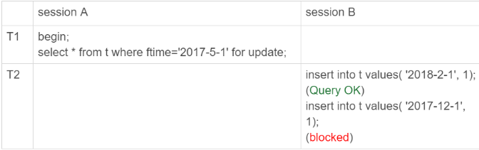
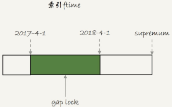
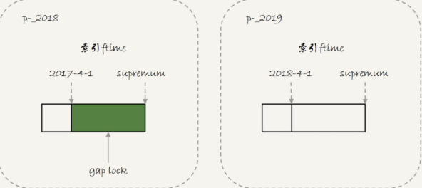
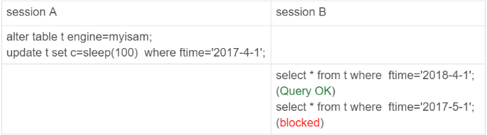

## 分区相关

### 分区表

#### 分区表创建

范围分区表的创建与插入记录

```mysql
create table `t` (
	`ftime` datetime not null,
	`c` int(11) default null,
	key (`ftime`)
) engine=InnoDB default charset=utf8mb4 parition by range (YEAR(ftime)) (
	parition p_2017 values less than (2017) engine = InnoDB,
	parition p_2018 values less than (2018) engine = InnoDB,
	parition p_2019 values less than (2019) engine = InnoDB,
	parition p_other values less than MAXVALUE engine = InnoDB
);
insert into t values('2017-4-1', 1),('2018-4-1', 1);
```

*分区表的磁盘文件*


表 t 中初始化插入了两行记录，按照定义的分区规则，这两行记录分别落在 `p_2108` 和 `p_2019` 这两个分区上。这个表包含了一个 `.frm` 文件和 4 个 `ibd` 文件，每个分区对应一个 `ibd` 文件，即：

* 对于引擎层来说，这是 4 个表
* 对于 server 层来说，这是 1 个表

MySQL 还支持 hash 分区，list 分区等。实际使用时，分区表跟用户表比起来，一个是第一次访问的时候需要访问所有分区；一个是共用 MDL 锁。

因此如果要使用分区表，就不要创建太多的分区。

分区并不是越细越好。实际上，单表或者单分区的数据一千万行，只要没有特别大的索引，对于现在的硬件能力来说都已经是小表了。分区不要预留太多，在使用之前预先创建即可。

#### 分区表的引擎层行为

##### InnoDB 引擎行为

*innodb分区表间隙锁*



初始化表 t 的时候，只插入了两行数据，`ftime` 的值分别是，'2017-4-1' 和 '2018-4-1'。`session A` 的 `select` 语句对索引 `ftime` 上这两个记录之间的间隙加了锁。如果是一个普通表的话，那么表 t 的 ftime 索引上，间隙和加锁状态

*普通表间隙锁加锁范围*



即，'2017-4-1' 和 '2018-4-1' 这两个记录之间的间隙是会被锁住的。那么，`session B` 的两条插入语句应该都有进入锁等待状态。

`session B` 的第一个 `insert` 语句是可以执行成功的，这是因为，对于 `InnoDB` 引擎来说，`p_2018` 和 `p_2019` 是两个不同的表，即，`2017-4-1` 的下个记录不是 `2018-4-1` ，而是 `p_2018` 分区的 `supremum`。所以 T1 时刻，在表 t 的 `ftime` 索引上，间隙和加锁的状态是：

*分区表的加锁范围*



由于分区表的规则，`session A` 的 `select` 语句其实只操作了分区 `p_2018`，因此加锁范围只是 2017-4-1 ~ `supremum`，所以，`session B` 要写入一行 `ftime` 是 `2018-2-1` 的时候是可以成功的，而要写入 `2017-12-1` 这个记录，就要等 `session A` 的间隙锁

*session B 的锁信息*


##### MyISAM 引擎行为

*MyISAM分区表间隙锁*



由于 MyISAM 引擎只支持表锁，所以这条 `update` 语句会锁住整个表 t 上的读。`session B` 的第一条查询语句是可以正常执行的，第二条语句才进入锁等待状态。这是因为 MyISAM 表锁是在引擎层实现的，`session A` 加的表锁，其实是锁在分区 `p_2018` 上。因此，只会堵住这个分区上执行的查询，落到其他分区的查询是不受影响的

#### 手动分表

手动分表的逻辑，是找到需要更新的所有分表，然后依次执行更新，在性能上，这个分区表并没有实质的差别。分区表和手动分表，一个是由 `server` 层来决定使用哪个分区，一个是由应用层代码来决定使用哪个分表。因此，从引擎层看，这两种方式也是没有差别的。区别是在 `server` 层：从 `server` 层看，打开表的行为

#### 分区策略

每当第一次访问一个分区表的时候，MySQL 需要把所有的分区都访问一遍。一个典型的报错情况是：如果一个分区表的分区很多，超过了 1000 个，而 MySQL 启动的时候，`open_files_limit` 参数使用的是默认值 1024，那么就会访问这个表的时候，由于需要打开所有文件，导致打开表文件的个数超过了上限而报错。

MyISAM 分区表使用的分区策略是通用分区策略（generic partitioning），每次访问分区都有 server 层控制。通过分区策略，是 MySQL 一开始支持分区表的时候就存在的代码，在文件管理，表管理的实现上很粗糙，因此有比较严重的性能问题

从 MySQL 5.7.9 开始，InnoDB 引擎引入了本地分区策略（native partitioning）。这个策略是在 `InnoDB` 内部自己管理打开分区的行为。

MySQL 5.7.17 开始，将 MyISAM 分区表标记为即将弃用。8.0 开始，不允许创建 `MyISAM` 分区表，只允许创建已经实现了本地分区策略的引擎（InnoDB 和 NDB ）

#### 分区表的 server 层行为

MySQL 在第一次打开分区表的时候，需要访问所有的分区；

如果从 server 层看的话，一个分区表就只是一个表，因此所有分区共用同一个 MDL 锁

在引擎层，认为这是不同的表，因此 MDL 锁之后的执行过程，会根据分区表规则，只访问必要的分区

必要的分区的判断，就是根据 SQL 语句中的 where 条件，结合分区规则来实现的。**如果查询语句的 where 条件中没有分区 key，那就只能访问所有分区了**，即使使用业务分表的方式，where 条件中没有使用分表的 key，也必须访问所有的分表

#### 分区表应用场景

分区表的一个优势是对业务透明，相对于用户分表来说，使用分区表的业务代码更简洁。分区表可以很方便的清理历史数据。如果按照时间分区的分区表，可以直接通过 `alter table drop partition...` 这个语法删掉分区，从而删掉过期的历史数据。`alter table drop partition...` 操作是直接删除分区文件，效果跟 `drop` 普通表类似，相比 `delete` 语句速度快，对系统影响小。