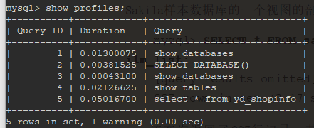
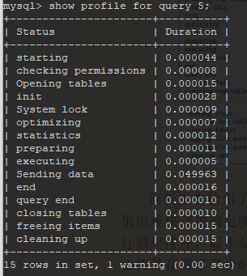
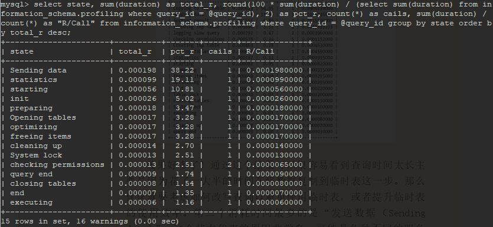
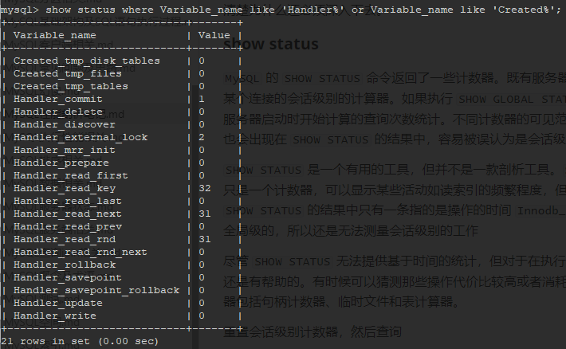

## 性能剖析相关

*MySQL性能分析*


### 剖析单条查询

在定位到需要优化的单条查询后，可以针对此查询获取更多的信息，确认为什么会花费这么长的时间执行，以及需要如何去优化。在实际应用中，可以使用 `show status`，`show profile`，检查慢查询日志的条目（必须是 `Percona Sever` ，官方版本的慢查询日志缺少了很多附加信息）。

#### 使用 show profile

`show profile` 命令是在 `MySQL 5.1` 以后的版本中引入的。默认是禁用的，可以通过服务器变量在会话级别动态地修改

* 查看 `profiling` 状态

  ```mysql
  select @@profiling;
  # 或
  show variables like 'profiling';
  ```

* 开启 `profiling`

  ```mysql
  set profiling = 1;
  # 或
  set profiling = 'ON';
  ```

  然后在服务器上执行的所有语句，都会测量其耗费的时间和其他一些查询执行状态变更相关的数据。这个功能在未来版本中可能会被 `Performance Schema` 所取代。当一条查询提交给服务器时，此工具会记录剖析信息到一张临时表，并且给查询赋予一个从 1 开始的整数标识符，执行完成后

* 查看 `profiles` 记录。

  ```mysql
  mysql> show profiles;
  ```

  *show profiles 结果*



* 查看单个 `profile` 记录

  ```mysql
  mysql> show profile for query 5;
  ```

  *show_profile查看单条分析语句.png*

  

  剖析报告给出了查询执行的每个步骤及其花费的时间，看结果很难快速地确定那个步骤花费的时间最多。因为输出时按照执行顺序排序，而不是按花费的时间排序的--如果不使用 `show profile` 命令而是直接查询 `INFORMATION_SCHEMA` 中对应的表，则可以按照需要格式化输出：

  ```mysql
  mysql> set @query_id = 1;
  mysql> select state, sum(duration) as total_r, round(100 * sum(duration) / (select sum(duration) from information_schema.profiling where query_id = @query_id), 2) as pct_r, count(*) as cails, sum(duration) / count(*) as "R/Call" from information_schema.profiling where query_id = @query_id group by state order by total_r desc;
  ```

  *information_schema分析profiling.png*

  

  `Sending data` 这个状态代表的原样非常多，可能是各种不同的服务器活动，包括在关联时搜索匹配的行记录等，这部分很难说优化节省多少消耗时间。

剖析报告能帮助我们定位到那些活动花费了最多的时间，但并不会告诉为什么会这样。要弄清楚为什么还必须深入下去。`SHOW PROFILE` 命令将被弃用，可以从 `information_schema` 中的 `profiling` 数据表进行查看。

#### show status

`MySQL` 的 `SHOW STATUS` 命令返回了一些计数器。既有服务器级别的全局计数器，也有基于某个连接的会话级别的计算器。如果执行 `SHOW GLOBAL STATUS` 则可以查看服务器级别的从服务器启动时开始计算的查询次数统计。不同计数器的可见范围不一样，不过全局的计算器也会出现在 `SHOW STATUS` 的结果中，容易被误认为是会话级别的。

`SHOW STATUS` 是一个有用的工具，但并不是一款剖析工具。`SHOW STATUS` 的大部分结果都只是一个计数器，可以显示某些活动如读索引的频繁程度，但无法给出消耗了多少时间。`SHOW STATUS` 的结果中只有一条指的是操作的时间 `Innodb_row_lock_time`，而且只能是全局级的，所以还是无法测量会话级别的工作

尽管 `SHOW STATUS` 无法提供基于时间的统计，但对于在执行完查询后观察某些计数器的值还是有帮助的。有时候可以猜测那些操作代价比较高或者消耗的时间比较多。最有用的计数器包括句柄计数器、临时文件和表计算器。

重置会话级别计数器，然后查询

```mysql
mysql> flush status;
mysql> select * from yd_shopinfo where status = 1;
mysql> show status where variable_name like 'Handler%' or variable_name like 'Created%';
```

*show_status分析查询执行.png*



通过 `explain` 查看查询的执行计划也可以获取大部分相同的信息，但 `EXPLAIN` 是通过估计得到的结果，而通过计数器则是实际的测量结果。

### 单条查询问题还是服务器问题

首先要确认是单条查询的问题，还是服务器的问题。如果服务器上所有的程序都突然变慢，又突然变好，每一条查询也都变慢了，那么慢查询可能就不一定是原因，而是由于其他问题导致的结果。反过来说，如果服务器整体运行没有问题，只有某条查询偶尔变慢，就需要将注意力放到这条特定的查询上面

如何判断是单条查询问题还是服务器问题，如果问题不停周期性出现，那么可以在某次活动中观察到：或者整夜运行脚本收集数据，第二天来分析结果。大多数情况下都可以通过三种技术来确定

#### 使用 show global status

这个方法实际上就是以较高的频率如一秒一次执行 `SHOW GLOBAL STATUS` 命令捕获数据，问题出现时，则可以通过某些计数器（如：`Threads_running`，`Threads_connected`，`Questions` 和 `Queries` ）的尖刺或凹陷来发现。这个方法很简单，对服务器的影响也很小。

#### 使用 show processlist

这个方法是通过不同地捕获 `show processlist` 的输出，来观察是否有大量线程处于不正常的状态或者其他不正常的特征。例如查询很少会长时间处于 `statistics` 状态，这个状态一般是指服务器在查询优化截断如果确定表关联的顺序--通常是非常快的。

查看 state 列状态，如果要查看不同的列，只需要修改 `grep` 的模式即可。

```shell
mysql -e 'show processlist\G' | grep State: | sort | uniq -c | sort -rn
```

如果 MySQL 服务器版本较新，可以直接查询 `INFORMATION_SCHEMA` 中的 `PROCESSLIST` 表

#### 使用查询日志

如果要通过查询日志发现问题，需要开启慢查询日志并在全局级别设置 `long_query_time` 为 0，并且要确认所有的连接都采用了新的设置。如果不能设置慢查询日志记录所有的查询，也可以通过 `tcpdump` 和 `pt_query_digest` 工具来模拟替代。要注意找到吞吐量突然下降时间段的日志。查询是在完成阶段才写入到慢查询日志的，所以堆积会造成大量查询处于完成阶段，直到阻塞其他查询的资源占用者释放资源后，其他的查询才能执行完成。这种行为特征的一个好处是，当遇到吞吐量突然下降时，可以归咎于吞吐量下降后完成的第一个查询（有时候也不一定是第一个查询。当某些查询被阻塞时，其他查询可以不受影响继续运行，所以不能完成依赖这个经验）

#### 慢查询定位

```mysql
# 查看慢查询是否开启
show variables like '%slow_query_log%';
# 开启慢查询
set global slow_query_log = 'ON';
# 查询慢查询时间阈值
show variables like '%long_query_time%';
# 修改慢查询记录时间
set global long_query_time = 3;
```

使用 MySQL 自带的 mysqlddumpslow 工具统计慢查询日志（依赖 Perl），myjsqlddumpslow 命令参数：

* `-s` ：采用 order 排序的方式，排序方式可以有：c（访问次数）、t（查询时间）、l（锁定时间）、r（返回时间）、ac（平均查询次数）、al（平均锁定时间）、ar（平均返回记录数）、at（平均查询时间，默认）
* `-t`：返回前 N 条数据
* `-g`：后面可以是正则，对大小写不敏感

```mysql
# 按照查询时间，查看前两条 SQL 语句
perl mysqldumpslow.pl -s t -t 2 "C:\ProgramData\MySQL\MySQL Server 8.0\Data\DESKTOP-4BK02RP-slow.log"
```

### EXPLAIN分析SQL语句

#### 使用 EXPLAIN 命令

EXPLAIN 命令是查看查询优化器是如何决定执行查询的主要方法。这个功能有局限性，并不总是正确。要使用 EXPLAIN 命令，只需在查询中的 SELECT 关键字前添加 EXPLAIN。MySQL 会在查询上设置一个标记。当执行查询时，这个标记会使其返回关于在执行计划中每一步的信息，而不是执行它。会返回一行或多行信息，显示出执行计划中的每一部分和执行的次序。在查询中每个表在输出中只有一行。如果查询时两个表的连接，输出中会有两行，别名表也算一个表（表包含：子查询，UNION 结果，实体表）

#### EXPLAIN 扩展

- EXPLAIN EXTENDED 和正常 EXPLAIN 一样，但会告诉服务器”逆向编译“执行计划为一个 SELECT 语句。可以通过紧接其后运行 `SHOW WARNINGS` 看到生成的这个语句。这个语句直接来自执行计划， 而不是原 SQL 语句。大部分场景下与原语句不同。（**已废弃**）
- EXPLAIN PRITITIONS 会显示查询将访问的分区，如果查询时基于分区表的话

#### EXPLAIN 局限性

- 如果查询在 FROM 子句中包括子查询，MySQL 实际会执行子查询，将其结果放在临时表中，然后完成外层查询优化。必须在完成外层查询优化之前处理类似的子查询。在 5.6 中取消该限制
- EXPLAIN 是近似结果
- 不区分具有相同名字的事物。内存排序和临时文件都使用 `filesort`，磁盘和内存临时表都显示 `Using temporary`
- 不会显示执行计划的所有信息，及特定优化，不支持存储过程。
- 不支持非 SELECT 语句

#### EXPLAIN 中的列

##### id

包含一个编号，表示 SELECT 所属的行。

##### select_type

这一列显示了对应行是简单还是复杂 SELECT （如果是后者，那么是三种复杂类型中的哪一种）SIMPLE 值意味着查询不包括子查询和 UNION。如果查询有任何复杂的子部分，则最外层部分标记为 **PRIMARY**。其他部分标记如下：

- **SUBQUERY**

  包含在 SELECT 列表中的子查询中的 SELECT （即不再 FROM 子句中）标记为 SUBQUERY

  ```mysql
  SELECT (SELECT 1 FROM <table> LIMIT 1) from <table>
  ```

- **DERIVED**

  用来表示包含在 FROM 子句的子查询中的 SELECT，MySQL 会递归执行并将结果放到一个临时表中。服务器内部标识为"派生表"，因为该临时表是从子查询中派生来的

- **UNION**

  在 UNION 中的第二个和随后的 SELECT 被标记为 UNION。第一个 SELECT 被标记就好像它以部分外查询来执行。如果 UNION 被 FROM 子句中子查询包含，那么它的第一个 SELECT 会被标记为 DERIVED

- **UNION RESULT**

  用来从 UNION 的匿名临时表检索结果的 SELECT 被标记为 UNION RESULT

SUBQUERY 和 UNION 还可被标记为 DEPENDENT 和 UNCACHEABLE。DEPENDENT 意味着 SELECT 依赖于外层查询中发现的数据；UNCACHEABLE 意味着 SELECT 中的某些特性组织结果被缓存于一个 Item_cache 中。

##### table

显示了对应行正在访问那个表。通常情况下，它就是那个表或该表的别名。可以在这一行中从上往下观察 MySQL 的关联优化器为查询选择的关联顺序。

- 派生表和联合

  当 FROM 子句中有子查询或有 UNION 时，table 列会变得复杂的多。在这些场景下，确实没有一个表可以参考，因为 MySQL 创建的匿名临时表仅在查询执行过程中存在

  当在 FROM 子句中有子查询时，table 列是 `<derivedN>` 的形式，其中 N 是子查询的 id。总是向前引用，N 指向 EXPLAIN 输出中后面的一行

  当有 UNION 时，UNION RESULT 的 table 列包含一个参与 UNION 的 id 列表。总是向后引用，因为 UNION RESULT 出现在 UNION 中所有参与行之后。

##### type

关联类型（MySQL 决定如何查找表中的行）以下性能依次从最差到最优

- **ALL**

  全表扫描，必须扫描整张表，从头到尾，去找需要的行。

- **Index**

  这个跟全表扫描一样，只是 MySQL 扫描表时按索引次序进行而不是行。避免了排序；要承担按索引次序读取整个表的开销（通常意味着是按随机次序访问的行，开销非常大）如果 Extra 列中看到 "Using index" 说明 MySQL 正在使用覆盖索引，它只扫描所有的数据，而不是按索引次序的每一行。比按索引次序全表扫描的开销要少很多

- **range**

  范围扫描就是一个有限制的索引扫描，它开始于索引里的某一点，返回匹配这个值域的行。这比全索引扫描好一些，因为它用不着遍历全部索引。显而易见的范围扫描是带有 BETWEEN 或在 WHERE 子句里带有范围比较操作符（如：>）的查询。

  当 mysql 使用索引去查找一系列值时，IN() 和 OR 列表，也会显示为范围扫描（但其实是不同的访问类型，在性能上有重要差异）

- **index_merge**

  合并索引，使用多个单列索引搜索

- **ref**

  索引访问（查找），返回所有匹配某个单个值的行。然而，它可能会找到多个符合条件的行，因此，是查找和扫描的混合体。此类访问只有当使用非唯一性索引或者唯一性索引的非唯一性前缀时才会发生。 `ref` 是因为索引要跟某个参考值比较。这个参考值或者是一个常数，或者是来自多表查询前一个表里的结果值。

  `ref_or_null` 是 ref 之上的一个变体，意味着 MySQL 必须在初次查找的结果里进行第二次查找以找出 NULL 条目

- **eq_ref**

  索引查找：MySQL 知道最多只返回一条符合条件的记录。这种访问方法可以在 MySQL 使用主键或者唯一性索引查找时看到，它会将它们与某个参考值做比较。MySQL 对于这类访问类型的优化做的非常好，因为它知道无须估计匹配行的范围或者找到匹配行后再继续查找，搜索时使用 primary key 或 unique 类型，常用于多表联查

- **const，system**

  当 MySQL 能对查询的某部分进行优化并将其转换成一个常量时，它就会使用这些访问类型。如使用主键或唯一索引（所有部分）与常量值进行比较。

  const 和 eq_ref 都使用了主键或唯一索引，区别在于，const 是于常量进行比较，查询效率会更快，而 `eq_ref` 通常用于多表联查中

  System 类型一般用于 MyISAM 或 Memory 表，属于 const 类型的特例，当表只有一行时连接类型为 system

- **NULL**

  这种访问意味着 MySQL 能在优化阶段分解查询语句，在执行阶段甚至用不着再访问表或者索引。

##### possible_keys

这一列显示了查询可以使用哪些索引，这是基于查询访问的列和使用的比较操作符来判断的。这个列表是在优化过程的早期创建，因此有些罗列出来的索引可能对于后续优化过程没有用

##### key

这一列显示了 MySQL 决定采用那个索引来优化对该表的访问。如果该索引没有出现在 `possible_keys` 列中，那么 mysql 选用它是出于另外的原因（如，它可能选择了一个覆盖索引，哪怕没有 where 子句）

即，`possible_keys` 揭示了那一个索引能有助于高效地行查找，而  `key` 显示的是优化器采用哪一个索引可以最小化查询成本。

##### key_len

显示了 MySQL 在索引里使用的字节数（使用的索引中字段的字节长度和）。如果 MySQL 正在使用的只是索引里的某些列，那么就可以用这个值来算出具体是哪些列。

MySQL 并不是总显示一个索引真正使用了多少字节长度。对一个前缀模式匹配执行 LIKE 查询，它会显示列的完全宽度正在被使用

key_len 列显示了在索引字段中可能的最大长度，而不是表中数据使用的实际字节数。即 key_len 通过查找表的定义而被计算出，而不是表中的数据的实际字节长度

##### ref

显示了之前的表在 key 列记录的索引中查找值所用的列或常量。

##### rows

估计为了找到所需的行而要读取的行数。这个数字是内嵌循环关联计划里的循环数目。不是 MySQL 认为它最终要从表里读取出来的行数，而是 MySQL 为了找到符合查询的每一点上标准的那些行而必须读取的行的平均数。

是 MySQL 认为它要检查的行数，而不是结果集里的行数。

##### filtered

针对表里符合某个条件（WHERE 子句或联接条件）的记录数的百分比所做的一个悲观估算。如果把 rows 列和这个百分比相乘，就能看到 MySQL 估算它将和查询计划里一个表关联的行数。优化器只有在 ALL，INDEX，RANGE，INDEX_MERGE 访问方法时才会用这一估算

##### Extra

这一列包含的是不适合在其他列显示的额外信息。常见的值：

- `Using index`

  此值表示 MySQL 将使用覆盖索引，比避免访问表。

- `Using where`

  MySQL 服务器将在存储引擎检索行后再进行过滤。许多 WHERE 条件里涉及索引中的列，当它读取索引时，就能被存储引擎检验，因此不是所有带 WHERE 子句的查询都会显示 "Using where"

  表示 MySQL 服务器将存储引擎返回行以后再应用 WHERE 过滤条件，此时引擎层已锁住获取的所有行

- `Using temporary`

  MySQL 在对查询结果排序时会使用一个临时表

- `Using filesort`

  MySQL 会对结果使用一个外部索引排序，而不是按索引次序从表里读取行。

- `Range checked for each record(index map: N)`

  意味没好用的索引，新的索引将在联接的每一行上重新估算。N 是显示在 possible_keys 列中索引的位图，并且是冗余的