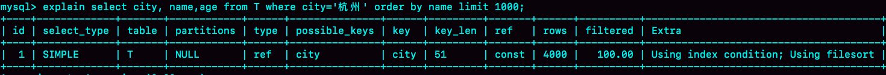

## MySQL 排序相关

### `order by` 的工作原理

#### 全字段排序

```mysql
explain select city, name, age from T where city='杭州' order by name limit 1000
```

*explain分析带排序查询语句*



`Extra` 字段中的 `Using filesort` 表示的是需要排序，`MySQL` 会给每个线程分配一块内存用于排序，称为 `sort_buffer`

该语句的执行流程为：

1. 初始化 `sort_buffer`，确定放入 `name` ，`city`，`age` 这三个字段
2. 从索引 `city` 找到第一个满足 `city = 杭州` 条件的主键 id
3. 到主键 `id` 索引取出整行，取 `name`，`city`，`age` 三个字段的值，存入 `sort_buffer` 中
4. 从索引 `city` 取下一个记录的主键 `id`
5. 重复步骤 3、4 直到 `city` 的值不满足查询条件为止
6. 对 `sort_buffer` 中的数据按照字段 `name` 做快速排序
7. 按照排序结果取前 1000 行返回给客户端

*全字段排序*


按 `name` 排序这个动作，可能在内存中完成，也可能需要使用外部排序，这取决于排序所需的内存和参数 `sort_buffer_size`

`sort_buffer_size`，即 `MySQL` 为排序开辟的内存 (`sort_buffer`) 的大小。如果要排序的数据量小于 `sort_buffer_size`，排序就在内存中完成。但如果排序数据量太大，内存放不下，则不得不利用磁盘临时文件辅助排序

使用以下方法来确定排序语句是否使用了临时文件

```mysql
/* 打开 optimizer_trace，只对本线程有效 */
SET optimizer_trace = 'enabled=on';
/* @a 保存 Innodb_rows_read  的初始值 */
select VARIABLE_VALUE into @a from performance_schema.session_status where variable_name = 'Innodb_rows_read';
/* 执行语句 */
select city，name，age from t where city='杭州' order by name limit 1000;
/* 查看 OPTIMIZER_TRACE 输出 */
select * from `information_schema`.`OPTIMIZER_TRACE`\G
/* @b 保存 Innodb_rows_read 的当前值 */
select VARIABLE_VALUE into @b from perfromance_schema.session_status where variable_name = 'Innodb_rows_read';
/* 计算 Innodb_rows_read 差值 */
select @b-@a;
```

以上是通过查看 `OPTIMIZER_TRACE` 的结果来确认的，可以从 `number_of_tmp_files` 中看到是否使用临时文件

*全排序的 OPTIMIZER_TRACE 部分结果*


`number_of_tmp_files` 表示的是，排序过程中使用的临时文件数。当内存放不下时，需要使用外部排序，外部排序一般使用归并排序算法。`MySQL` 将需要排序的数据分成 `number_of_tmp_files` 份，每一份单独排序后存在这些临时文件中。然后把这些有序文件再合并成一个有序的大文件。

如果 `sort_buffer_size` 超过了需要排序的数据量的大小，`number_of_tmp_files` 就是 0，表示排序可以直接在内存中完成。否则就需要放在临时文件中排序。`sort_buffer_size` 越小，需要分成的份数越多，`number_of_tmp_files` 的值就越大。

`examined_rows` 的值表示参与排序的行数，`sort_mode` 里的 `packed_additional_fields` 的意思是，排序过程对字符串做了紧凑处理，即在排序过程中按照实际长度来分配空间的，最后一个查询语句 `select @b-@a` 的返回值表示执行过程扫描了多少行

#### `rowid` 排序

全字段排序的过程中，只对原表的数据读了一遍，剩下的操作都是在 `sort_buffer` 和临时文件中执行的。但这个算法有一个问题，就是如果查询要返回的字段很多的话，那么 `sort_buffer` 里面要放的字符数太多，这样内存里能够同时放下的行数很少，要分成很多个临时文件，排序的性能会很差。所以如果单行很大，这个方法的效率就不够好

**如果MySQL认为排序的单行长度太大会使用rowid排序，会多进行一次回表**

```mysql
set max_length_for_sort_data = 16 		// 设置 mysql 中排序的行数据的长度的参数
```

`mysql` 优化器会把查询的字段与定义的总长度与 `max_length_for_sort_data` 进行对比。如果大于该值，`mysql` 会使用 `rowid` 排序（该算法放入 `sort_buffer` 的字段，只有要排序的列和主键 id）。此时的执行流程为

1. 初始化 `sort_buffer` ，确定放入待排序字段和主键
2. 从索引 `city` 找到第一个满足条件的主键
3. 到主键索引取出整行数据，从中取出待排序字段和主键，存入 `sort_buffer` 中
4. 从索引 `city` 取下一个记录的主键
5. 重复步骤 3，4 直到不满足 `city = 杭州` 条件为止
6. 对 `sort_buffer` 中的数据按照字段 `name` 进行排序
7. 遍历排序结构，取前 1000 行，并按照主键的值到原表中取出其他字段返回给客户端

*rowid排序*


`rowid` 排序会比全字段排序多访问一次表的主键索引，即步骤 7

最后的“结果集“是一个逻辑概念，实际上 `MySQL` 服务端从排序后的 `sort_buffer` 中依次取出 `id` ，然后到原表查到 `city`，`name` 和 `age` 这三个字段的结果，不会再在服务端耗费内存存储结果，是直接返回给客户端的

#### 全字段排序与 `rowid` 排序对比

如果 `MySQL` 实在是担心排序内存太小，会影响排序效率，才会采用 `rowid` 排序算法，这样排序过程中一次可以排序更多行，但是需要再回到原表去取数据

如果 `MySQL` 认为内存足够大，会优先选择全字段排序，把需要的字段都放到 `sort_buffer` 中，这样排序后就会直接从内存里面返回查询结果了，不用再回到原表去取数据

这提现了 `MySQL` 的一个设计思想：**如果内存够，就多利用内存，尽量减少磁盘访问**。对于 `InnoDB` 表来说，`rowid` 排序会要求回表多造成磁盘读，因此不会被优先选择

`MySQL` 做排序是一个成本比较高的操作，因为原来的数据是无序的，`MySQL` 会生成临时表，并且在临时表上做排序操作。

如果能够保证从 `city` 这个索引上取出来的行，天然就是按照 `name` 递增排序的，就可以不用再进行排序

即，可以在这个市民表上创建一个 `city` 和 `name` 的联合索引，对应的 SQL 语句：

```mysql
alter table t add index city_user(city, name);
```

在这个索引里面，用树搜索的方式定位到第一个满足 `city='杭州'` 的记录，并且确保了，接下来按顺序取下一条记录的遍历过程中，只要 `city` 的值是杭州，`name` 的值就一定是有序的，这样整个查询过程的流程就变成了

1. 从索引（city，name）找到第一个满足 `city='杭州'` 条件的主键 id；
2. 到主键 `id` 索引取出整行，取 `name` 、`city`、`age` 三个字段的值，作为结果集的一部分直接返回
3. 从索引 (city，name) 取下一个记录主键 id；
4. 重复步骤 2，3，直到找到第 1000 条记录，或不满足 `city='杭州'` 条件时循环结束

引入联合索引后，这个查询过程不需要临时表，也不需要排序。

### 随机取数据

```mysql
select word from words order by rand() limit 3
```

对于 `InnoDB` 表来说，执行全字段排序会减少磁盘访问，因此会被优先选择。对于内存表，回表过程只是简单地根据数据行的位置，直接访问内存得到数据，根本不会导致多访问磁盘，优化器没有这层顾虑，它会优先考虑的，就是用于排序的行越少越好了，所以，`MySQL` 这时会选择 `rowid` 排序

这条语句的执行流程是：

1.创建一个临时表。这个临时表使用的是 `memory` 引擎，表里有两个字段，第一个字段是 `double` 类型，为了后面描述方便，记为字段 R，第二个字段是 `varchar(64)` 类型，记为 `W` 。并且，这个表没有索引

2.从 `words` 表中，按主键顺序取出所有的 `word` 值。对于每一个 `word` 值，调用 `rand()` 函数生成一个大于 0 小于 1 的随机小数，并把这个随机小数和 `word` 分别存入临时表的 `R` 和 `W` 字段中

3.现在临时表有全部行数据，接下来会在这个没有索引的内存临时表上，按照字段 R 排序

4.初始化 `sort_buffer`。`sort_buffer` 中有两个字段，一个是 `double` 类型，一个是整型

5.从内存临时表中一行一行地取出 `R` 值和位置信息，分别存入 `sort_buffer` 中的两个字段里。这个过程要对临时表做全表扫描，此时扫描行数增加为全部行数两倍

6.在 `sort_buffer` 中根据 R 值进行排序。这个过程没有涉及到表操作，所以不会增加扫描行数

7.排序完成后，取出前三个结果的位置信息，依次到内存临时表中取出 `word` 值，返回给客户端。这个过程访问了三行数据，总扫描行数加 3；


**MySQL表定位一行数据的原理**

如果创建的表没有主键，或者把一个表的主键删掉了，那么 `InnoDB` 会自己生成一个长度为 6 字节的 `rowid` 来作为主键（在排序模式中，`rowid` 表示的是，每个引擎用来唯一标识数据行的信息）

* 对于有主键的 `InnoDB` 表来说，这个 `rowid` 就是主键 ID；
* 对于没有主键的 `InnoDB` 表来说，这个 `rowid` 就是由系统生成的
* `MEMORY` 引擎不是索引组织表

**order by rand() 使用了内存临时表，内存临时表排序的时候使用了 `rowid` 排序方法**

#### 磁盘临时表

`tmp_table_size` 这个配置限制了内存临时表的大小，默认值是 16M。如果临时表大小超过了 `tmp_table_size`，那么内存临时表就会转成磁盘临时表。磁盘临时表使用的引擎默认是 `InnoDB`，是由参数 `Internal_tmp_disk_storage_engine` 控制的。当使用磁盘临时表的时候，对应的就是一个没有显式索引的 `InnoDB` 表排序过程。