## 数据库表的空间回收

### `InnoDB` 表结构

一个 `InnoDB` 表包含两部分，即：表结构定义和数据。在 MySQL 8.0 版本之前，表结构是存在以 `.frm` 为后缀的文件里。而 MySQL 8.0 版本，则已经允许把表结构定义放在系统数据表中了。因为表结构定义占用的空间很小。

#### 参数 `innodb_file_per_table`

表数据既可以存在共享表空间里，也可以是单独的文件。这个行为是由参数 `innodb_file_per_table` 控制的：

* 这个参数设置为 `OFF` 表示的是，表的数据放在系统共享表空间与数据字典放在一起
* 这个参数设置为 `ON` 表示的是，每个 `InnoDB` 表数据存储在一个以 `.ibd` 为后缀的文件中

从 `MySQL` 5.6.6 版本开始，默认值为 `ON`，一个表单独存储为一个文件更容易管理，而且在不需要这个表的时候，通过 `drop table` 命令，系统就会直接删除这个文件。而如果存放在共享表空间中，即使表删掉了，空间也是不会回收的。

#### 数据删除流程

`InnoDB` 里的数据都是 B+ 树的结构组织的，如果要删除某条记录，`InnoDB` 引擎只会把这个记录标记为删除。如果之后要再插入一个记录，可能会复用这个位置。但是，磁盘文件的大小并不会缩小。

`InnoDB` 的数据页是按页存储的，如果删掉了一个数据页上的所有记录，整个数据页就可以被复用了。但 **数据页的复用跟记录的复用是不同的** 

**记录的复用：** 只限于符合范围条件的数据。而当整个页从 B+ 树里面摘掉以后，可以复用任何位置。如果将数据页 `page A` 上的所有记录删除以后，`page A` 会被标记为可复用。这时候如果插入记录需要使用新页的时候，`page A` 是可以被复用的。如果相邻的两个数据页利用率都很小，系统就会把这两个页上的数据合到其中一个页上，另外一个数据页就被标记为可复用。

如果用 `delete` 命令把整个表的数据删除，结果是，所有的数据页都会被标记为可复用。但是磁盘上，文件不会变小。

`delete` 命令只是把记录位置，或者数据页标记为“可复用”，但磁盘文件的大小是不会改变的。通过 `delete` 命令是不能回收表空间的。这些可以复用，而没有被使用的空间，看起来就像是“空洞”，**不止是删除数据会造成空洞，插入数据也会**。如果数据是按照索引递增顺序插入的，那么索引是紧凑的。但是如果数据是随机插入的，就可能造成索引的数据页分裂。更新索引上的值，可以理解为删除一个旧的值，再插入一个新值。这也是会造成空洞的。即，经过大量增删改的表，都是可能存在空洞的。想要搜索表空间，就重建表。

### 重建表

收缩表空间的过程为：新建一个与表 A 结构相同的表 B，然后按照主键 ID递增的顺序，把数据一行一行地从表 A 里读出来再插入到表 B 中。由于表 B 是新建的表，所以表 A 主键索引上的空洞，在表 B 中就都不存在了。显然地，表 B 的主键索引更紧凑，数据页的利用率更高。如果把表 B 作为临时表，数据表 A 导入表 B 的操作完成后，用表 B 替换 A，从效果上看，就起到了收缩表 A 空间的作用

使用 `alter table A engine=InnoDB` 命令来重建表。在 MySQL 5.5 版本之前，这个命令的执行流程与上述一致，区别是这个临时表 B 不需要自己创建，MySQL 会自动完成转存数据、交换表名、删除旧表的操作。

在往临时插入数据的过程中，有新的数据要写入到表 A 的话，就会造成数据丢失。因此在整个 DDL 过程中，表 A 中不能有更新。即这个 `DDL` 不是 `Online` 的

**`MySQL 5.6` 版本开始引入的 `Online DDL`**

引入 `Online DDL` 之后，重建表的流程：

*Online DDL流程*

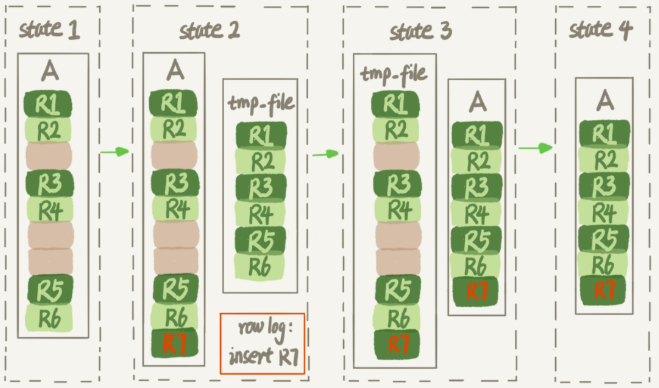

1. 建立一个临时文件，扫描表 A 主键的所有数据页
2. 用数据页中表 A 的记录生成 B+ 树，存储到临时文件中
3. 生成临时文件的过程中，将所有对 A 的操作记录在一个日志文件中（`row log`）中，对应的是上图中 `state2` 的状态
4. 临时文件生成后，将日志文件中的操作应用到临时文件，得到一个逻辑数据上与表 A 相同的数据文件，对应上图中 `state3` 的状态
5. 用临时文件替换表 A 的数据文件

因为日志文件记录和重放操作这个功能的存在，这个方案在重建表的过程中，允许对表 A 做增删改操作。`alter` 语句在启动的时候需要获取 `MDL` 写锁，但是这个写锁在真正拷贝数据之前就退化成读锁了。（退化的原因是为了实现 `Online`，`MDL` 读锁不会阻塞增删改操作，但又不能直接解锁，需要确保其他线程对这个表同时做 `DDL`）对于一个大表来说，`Online DDL` 最耗时的过程就是拷贝数据到临时表的过程，这个步骤的执行期间可以接受增删改操作。所以，相对于整个 `DDL` 过程来说，锁的时间非常短。对业务员来说，就可以认为是 `Online` 的。

重建会扫描原表数据和构建临时文件。对于很大的表来说，这个操作是很消耗 I/O 和 CPU 资源的。因此，对于线上服务，要很小心地控制操作时间，如果想要比较安全的操作，可以使用 `github` 开源的 `gh-ost` 来做。

#### `Online` 和 `inplace`

`Online DDL` 之前，重建表时，源表的数据导出来的存放位置是 `tmp_table` 。是一个临时表，是在 `server` 层创建的；而 `Online DDL` 根据源表重建处理的数据是放在 `tmp_file` 里的，这个临时文件是 `InnoDB` 在内部创建出来的，整个 `DDL` 过程都在 `InnoDB` 内部完成。对于 `sever` 层来说，没有把数据挪动到临时表，是一个 “原地” 操作，即是 `inplace` 。

重建表语句 `alter table t engine=InnoDB` 隐含地意思是：

```mysql
alter table t engine=innodb, ALGORITHM=implace;
```

跟 `inplace` 对应的就是拷贝表的方式，用法是：

```mysql
alter table t engine=innodb, ALGORITHM=copy
```

当使用 `ALGORITHM=copy` 的时候，表示的是强制拷贝表，对应的流程非 `Online DDL` 的操作过程。

如果要给 `InnoDB` 表的一个字段加全文索引，写法是：

```mysql
alter table add FULLTEXT(field_name);
```

这个过程是 `inplace` 的，但会阻塞增删改操作，是非 `Online` 的

两者逻辑之间的关系是：

* `DDL` 过程如果是 `Online` 的，就一定是 `inplace` 的
* `inplace` 的 `DDL`，有可能不是 `Online` 的。到 8.0，添加全文索引和空间索引就是这种情况

如果要收缩一个表，只是 `delete` 掉表里面不用的数据，表文件的大小是不会变的，需要通过 `alter table` 命令重建表，才能达到表文件变小的目的。5.6 版本的 `Online DDL` 方式可以在业务低峰期使用，而 5.5 及之前的版本，这个命令是会阻塞 `DML` 的。

* `optimize table t` 等于 `recreate` + `analyze`
* `alter table t engine = InnoDB` 即是 `recreate`
* `analyze table t` 是对表的索引信息做重新统计，没有修改数据，这个过程中加了 `MDL` 读锁

### innodb存储结构

#### 表空间结构

记录是按照行来存储的，但是数据库的读取并不以行为单位，在数据库中，不论读一行，还是读多行，都是将这些行所在的数据页进行价值。数据库管理存储空间的基本单位是页。

一个页（Page）中可以存储多个行记录（Row），同时在数据库中，还存在着区（Extent）、段（Segment）、表空间（Tablespace）。行、页、区、段、表空间关系：

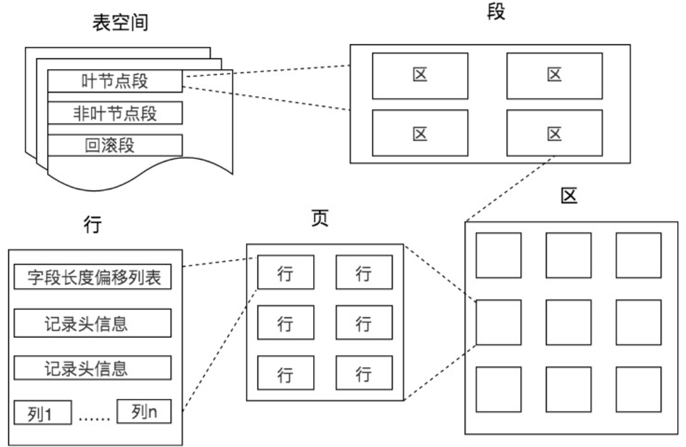

*一个表空间包含一个或多个段、一个段包括一个或多个区、一个区包括多个页，一个页中可以有多行记录*

* 区（Extent）是比页大一级的存储结构，在 InnoDB 存储引擎中，一个区会分配 64 个连续的页。

  在启用了参数 `innodb_file_per_table` 后，创建的表默认大小是 96kb，在每个段开始时，先用 32 个页大小的碎片页（fragment page) 来存放数据，在使用完这些页后才是 64 个连续页的申请（即分配一个区）

* 段（Segment）由一个或多个区组成，区在文件系统是一个连续分配的空间（在 InnoDB 中是连续 64 个页），不过在段中不要求区与区之间是相邻的。段是数据库中的分配单位，不同类型的数据库对象以不同的段形式存在。当创建数据表、索引的时候，就会相应创建对应的段即创建表时会创建一个表段，创建一个索引时会创建一个索引段。

  常见的段有数据段、索引段、回滚段等，Innodb 存储引擎是索引组织的，因此数据即索引，索引即数据，数据段即为 B+ 树的叶子节点（leaf node segment），索引段即为 B+ 树的非叶子节点（non-leaf node segment）。再innodb 中，对段的管理都是由引擎自身完成的

* 表空间（Tablespace）是一个逻辑容器，表空间存储的对象是段，在一个表空间中可以有一个或多个段，但是一个段只能属于一个表空间。数据库由一个或多个表空间组成，表空间从管理上可以划分为系统表空间，用户表空间，撤销表空间，临时表空间

在 InnoDB 中存在两种表空间的类型：共享表空间和独立表空间。如果是共享表空间即多张表共用一个表空间。如果是独立表空间即每张表有一个独立的表空间数据和索引信息都会保存在自己的表空间中。独立的表空间可以在不同的数据库之间进行迁移

```mysql
// 查看 Innodb 表空间类型：
show variables like 'innodb_file_per_table';
```

如果为 `ON` ，即每张表都会保存为一个 `.ibd` 文件

#### 数据页内结构

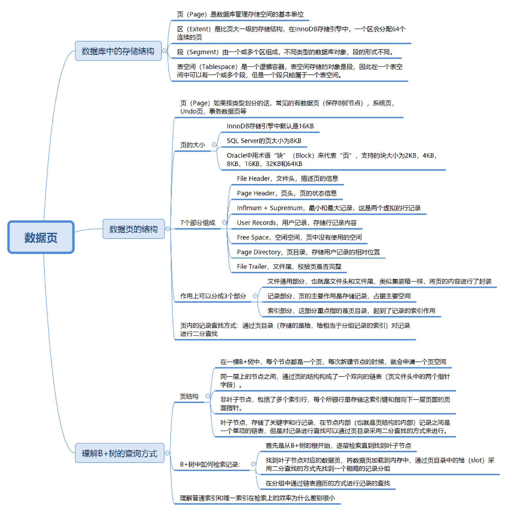

页（Page）按类型划分：数据页（保存 B+ 树节点）、系统页、Undo 页和事务数据页。数据页是最常使用的页。表页的大小限定了表行的最大长度，不同 DBMS 的表页大小不同。在 MySQL 的 InnoDB 存储引擎中，默认页的大小是 16KB

* 数据页（B-tree Node)
* undo 页（undo Log Page)
* 系统页（System Page)
* 事务数据页（Transaction system Page)
* 插入缓冲位图页（Insert Buffer Bitmap)
* 插入缓冲空闲列表页（Insert Buffer Free List)
* 未压缩的二进制大对象页（Uncompressed BLOB Page)
* 压缩的二进制大对象页（compressed BLOB Page）

```mysql
// 获取Innodb数据页大小
show variables like '%innodb_page_size%';
```

数据库 I/O 操作的最小单位是页，与数据库相关的内容都会存储在页结构里。数据页结构示意图：

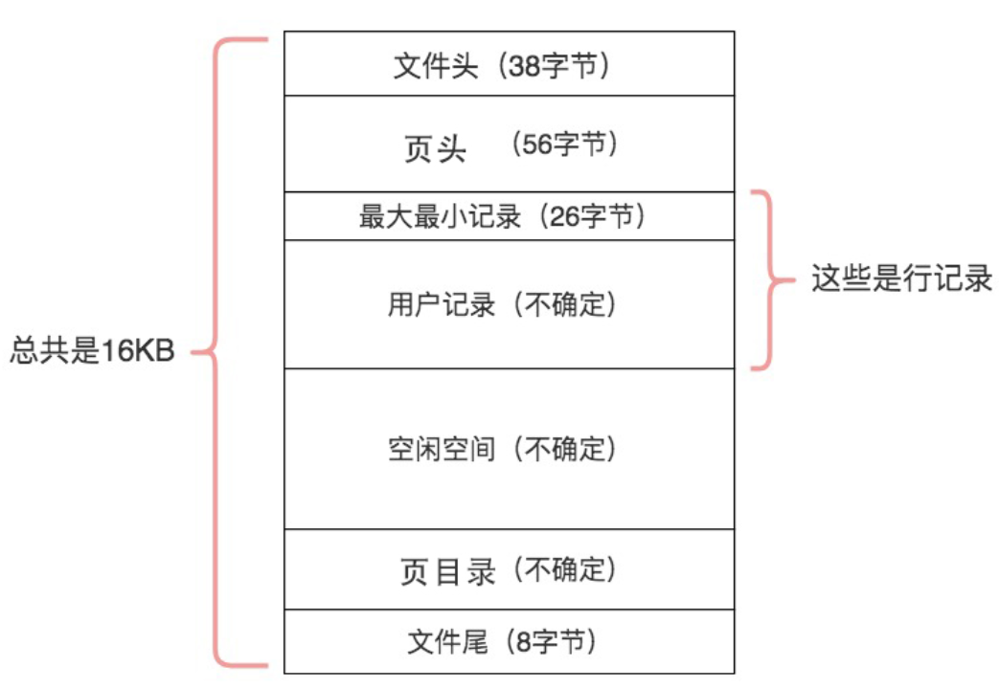

##### 文件头 File Header

占用 38 字节，文件头，描述页的信息。文件头中两个字段，分别是 `FIL_PAGE_PREV` 和 `FIL_PAGE_NEXT`，它们的作用相当于指针，分别指向上一个数据页和下一个数据页。连接起来的页相当于一个双向的链表。

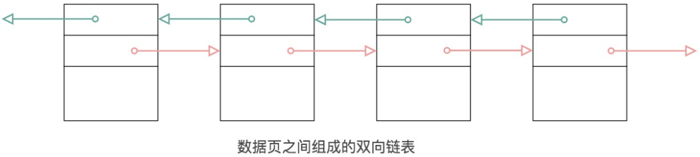

采用链表的结构让数据页之间不需要是物理上的连续，而是逻辑上的连续

*文件头组成部分*：

* FIL_PAGE_SPACE_OR_CHKSUM

  4 字节，当 MySQL 为 MySQL 4.0.14 之前的版本时，该值为 0。在之后的 MySQL 版本中，该值代表页的 checksum 值（一种新的 checksum 值）

* FIL_PAGE_OEESET

  4 字节，表空间中页的偏移值。如某独立表空间 `a.ibd` 的大小的 1 GB，如果页中大小为 16 KB，那么总共有 65536 个页。FIL_PAGE_OFFSET 表示该页在所有页中的位置。若此表空间的 ID 为 10，那么搜索页（10，1）就表示查找表 a 中的第二个页

* FIL_PAGE_PREV

  4 字节，当前页的上一个页

* FIL_PAGE_NEXT

  4 字节，当前页的下一个页

* FIL_PAGE_LSN

  8 字节，该页最后被修改的日志序列位置 LSN（Log Sequence Number）

* FIL_PAGE_TYPE

  2 字节，InnoDB 存储引擎页的类型，常见的类型如下， `0x45BF`，该值代表了存放的是数据页，及实际行记录的存储空间

  *InnoDB存储引擎中页的类型*

  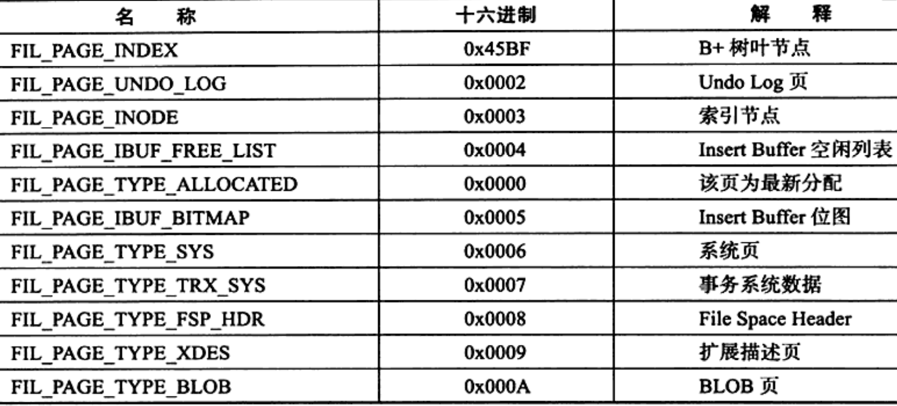

* FILE_PAGE_FILE_FLUSH_LSN

  8 字节，该值仅在系统表空间的一个页中定义，代表文件至少被更新到了该 LSN 值。对于独立表空间，该值都为 0

* FILE_PAGE_ARCH_LOG_NO_OR_SPACE_ID

  4 字节，4.1 开始，该值代表页属于那个表空间

##### 页头 Page Header

该部分用来记录数据页的状态信息，由 14 个部分组成，共占用 56 字节

* PAGE_N_DIR_SLOTS

  2 字节，在 Page Directory 页目录中的 Slot（槽）数

* PAGE_HEAP_TOP

  2 字节，堆中第一个记录的指针，记录在页中时根据堆的形式存放的

* PAGE_N_HEAP

  2 字节，堆中的记录数，一共占用 2 字节，但是第 15 位表示行记录格式

* PAGE_FREE

  2 字节，指向可重用空间的首指针

* PAGE_GARBAGE

  2 字节，已删除记录的字节数，即行记录结构中 delete flag 位 1 的记录大小的总数

* PAGE_LAST_INSERT

  2 字节，最后插入记录的位置

* PAGE_DIRECTION

  2 字节，最后插入的方向，可能的取值为：PAGE_LEFT（0x01），PAGE_RIGHT（0x02），PAGE_SAME_REC（0x03），PAGE_SAME_PAGE（0x04），PAGE_NO_DIRECTION（0x05）

* PAGE_N_DIRECTION

  2 字节，一个方向连续插入记录的数量

* PAGE_N_RECS

  2 字节，该页中记录的数量

* PAGE_MAX_TRX_ID

  8 字节，修改当前页的最大事务 ID，该值仅在 Secondary Index 中定义

* PAGE_LEVEL

  2 字节，当前页在索引树中的位置，0x00 代表叶节点，即叶节点总是在第 0 层

* PAGE_INDEX_ID

  8 字节，索引 ID，表示当前页属于哪个索引

* PAGE_BTR_SEG_LEAF

  10 字节，B+ 树数据页非叶子节点所在段的 segment header，该值仅在 B+ 树的 Root 页中定义

* PAGE_BTR_SEG_TOP

  10 字节，B+ 树数据页所在段的 segment header，该值仅在 B+ 树的 Root 页中定义

##### Infimum 和 Supremum Record

在 InnoDB 存储引擎中，每个数据页中有两个虚拟的行记录，用来限定记录的边界。Infimum 记录是比该页中任何主键值都要小的值，Supremum 指比任何可能大的值还要大的值。这两个值在页创建时被建立，并且在任何情况下不会被删除。在 Compact 行格式和 Redundant 行格式下，两者占用的字节数各不相同。

##### User Record 和 Free Space

User Record 即实际存储行记录的内容。InnoDB 存储引擎表总是 B+ 树索引组织的。Free Space 即空闲空间，同样也是个链表数据结构。在一条记录被删除后，该空间会被加入到空闲链表中，当有新记录插入时，会从空闲空间中进行分配用于存储新记录

##### 页目录 Page Directory

Page Directory 中存放了记录的相对位置（注意，这里存放的是页相对位置，而不是偏移量），有些时间这些记录指针为 Slots（槽）或目录槽（Directory Slots）。与其他数据库系统不同的是，在 InnoDB 中并不是每个记录拥有一个槽，Innodb 存储引擎的槽是一个稀疏目录（sparse directory），即一个槽中可能包含多个记录。伪记录 Infimum 的 n_owned 值总是 1，记录 Supremum 的 n_owned 的取值范围为 [1, 8]，其他用户记录 n_owned 的取值范围为 [4, 8]。当记录被插入或删除时需要对槽进行分裂或平衡的维护操作。

不确定大小，存储用户记录的相对位置。它起到了记录索引作用，在页中，记录是以单向链表的形式进行存储的。单向链表的特点就是插入、删除非常方便，但是检索效率不高。因此在页目录中提供了二分查找的方式，用来提高记录的检索效率。

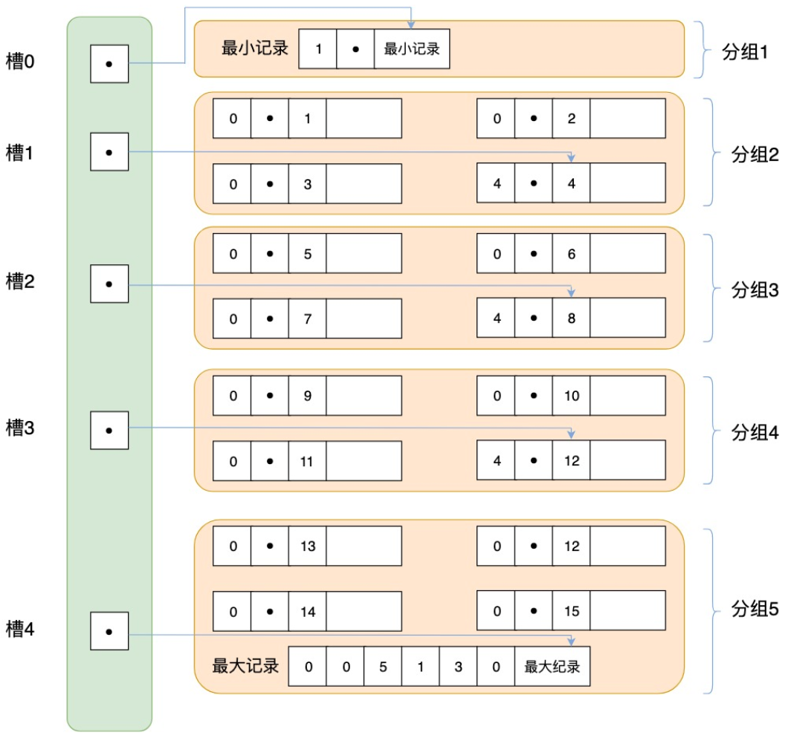

将所有的记录分成几个组，这些记录包括最小记录和最大记录，但不包括标记为“已删除”的记录。第一组即最小记录所在的分组只有 1 条记录；最后一组，就是最大记录所在的分组，会有 1 ～ 8 条记录；其余的组记录数量在 4 ～ 8 条之间。除了第 1 组以外，其余组的记录数会尽量平分。在每个组中最后一条记录的头信息中会存储该组一共有多少条记录，作为 `n_owned` 字段。页目录用来存储每组最后一条记录的地址偏移量，这些地址偏移量会按照先后顺序存储起来，每组的地址偏移量也被称为“槽”（slot），每个槽相当于指针指向了不同组的最后一个记录。页目录存储的是槽，槽相当于分组记录的索引。

由于在 InnoDB 存储引擎中 Page Directory 是稀疏目录，二叉查找的结果是一个粗略的结果，因此 InnoDB 存储引擎必须通过 recorder header 中的 next_record 来继续查找相关记录。这些记录不包括在 Page Directory 中。

B+ 树索引本身不能找到具体的一条记录，能找到的只是该记录所在的页。数据库把页载入到内存，然后通过 Page Direcotory 再进行二叉查找

##### 文件尾 File Tailer

8 字节，文件尾，校验页是否完整。只有一个 FIL_PAGE_END_LSN 部分，占用 8 字节，前 4 字节代表该页的 checksum 值，最后 4 字节和 File Header 中的 FIL_PAGE_LSN 相同。将这两个值与 File Header 中的 FIL_PAGE_SPACE_OR_CHKSUM 和 FIL_PAGE_LSN 值进行比较，看是否一致（checksum 的比较需要通过 InnoDB 的 checksum 函数来进行比较，不是简单的等值比较），以此来保证页的的完整性（not corrupted）。

在默认配置下，InnoDB 存储引擎每次从磁盘读取一页就会检测该页的完整性，即页是否发生 Corrupt，这就是通过 File Tailer 部分进行检测，而该部分的检测会有一定的开销。可以通过参数 `innodb_checksums` 来开启或关闭对这个页完整性的检查。

MySQL 5.6.6 版本开始新增了参数 `innodb_checksum_algorithm`，该参数用来控制检测 `checksum` 函数的算法，默认值为 `crc32`，可设置的值有：`innodb`，`crc32`，`none`，`strict_innodb`，`strit_crc32`，`strict_none`

`innodb` 为兼容之前版本 InnoDB 页的 checksum 检测方式，crc32 为 MySQL 5.6.6 版本引进的新的 checksum 算法，该算法较之前的 innodb 有着较高的性能。但是若表中所有页的 checksum 值都 strict 算法保存，那么低版本将不能读取这些页。none 表示不对页启用 checksum 检查。`strict_*` 正如其名，表示严格按照设置的 checksum 算法进行页的检测。因此若低版本数据库升级到 5.6.6 或之后的版本，启用 `strict_crc32` 将导致不能读取表中的页。启用 `strict_crc32` 方式是最快的方式，因为其不再对 `innodb` 和 `crc32` 算法进行两次检测。若数据库从低版本升级而来，则需要进行 mysql_upgrade 操作

#### InnoDB 行格式

InnoDB 表默认行格式由 `innodb_default_row_format` 变量定义，默认为 `dynamic`，重建表操作可能会静默的将行格式更改为该变量值（8.0.18 已确定不会），8.0.1 及之前重建表后会隐式改变行格式为 `innodb_default_row_format` 的值

表的行格式决定其行的物理存储方式，太长而无法容纳在B树页面上的可变长度列存储在单独分配的磁盘页面上，这些页面为溢出页面，这些列为页外列。页外列的值存储在溢出页面的单链表中，每个列都有一个或多个溢出页面的列表，根据列的长度，所有或可变长度列值的前缀存储在 B 树中。

数据是按行进行存放的。每个页存放的行记录是最多约等（page size / 2 -200）行的记录。在 InnoDB 1.0.x 版本之前，InnoDB 存储引擎提供了 compact 和 Redundant 两种格式来存放行记录数据，这是目前使用最多的一种格式。Redundant 格式是为兼容之前版本而保留的。

```mysql
# row_format 属性表示当前所使用的行记录结构类型
show table status like 'table_name'\G;
# 查询 INFORMATION_SCHEMA.INNODB_TABLES 表
select NAME, ROW_FORMAT from information_schema.innodb_tables where name = 'test/t1';
```

##### Compact 行记录格式

Compact 行记录是在 5.0 中引入的，其设计目的是高效地存储数据。即一个页中存放的行数据越多，其性能就越高。

与 REDUNDANT 行格式相比，COMPACT 行格式减少了大约 20% 的行存储空间，代价是增加了某些操作的 CPU 使用率。如果工作负荷是典型的受缓存命中率和磁盘速度限制的工作负荷，则 COMPACT 格式可能会更快。如果工作负载受 CPU 速度限制，COMPACT 格式可能会变慢。

使用 COMPACT 行格式的表在 B 树节点中的索引记录中存储可变长度列（`VARCHAR`，`VARBINARY`，`BLOB`，`TEXT`）的前 768 个字节，其余存储在溢出页上。大于或等于 768 字节的固定长度列编码为可变长度列，可存储在页面外。如果列的值为 768 字节或更少，则不使用溢出页，并且可能会导致 I/O 中的某些节省，因为该值完全存储在 B 树节点中。这适用于相对较短的 BLOB 列值，但可能会导致 B 树节点填充数据而不是键值，从而降低其效率。具有许多 BLOB 列的表可能会导致 B 树节点变得太满，并且包含的行太少，从而使整个索引的效率低于行较短或列值存储在页面外时的效率。

* 每个索引记录包含一个 5 字节标头，该标头前面可能带有一个可变长度标头，标头用于链接一起连续记录，和行级锁定

* 记录标头的可变长度部分包含用于指示 NULL 列的位矢量。如果索引中可以为 NULL 的列数为 N，则位矢量将占用 `ceiling(N/8)` 字节。（如果存在 9 到 16 列可以是 null ，则NULL 标志位占用两字节）NULL 的列不占用此矢量中的位以外的空间。每个长度需要一个或两个字节，具体取决于列的最大长度，如果索引中的所有列不是 NULL 并且具有固定长度，则记录标头没有可变长度部分

* 对于每个非 NULL 可变长度字段，记录标头包含一个或两个字节的列长度。仅当列的一部分存储在溢出页外部或最大长度超过 255 字节且实际长度超过 127 字节时，才需要两个字节。 对于外部存储的列，2字节的长度表示内部存储部分的长度加上指向外部存储部分的20字节指针。内部部分是768个字节，因此长度是768 + 20。20字节的指针存储列的真实长度。 

* 记录头后面是非NULL列的数据内容

* 聚集索引中的记录包含所有用户定义列的字段。还有一个 6 字节的事务 ID 字段和一个 7 字节的滚动指针字段

* 如果没有为表定义主键，则每个聚集索引记录还包含一个 6 字节的行 ID 字段

*  每个二级索引记录包含不在二级索引中的，为聚簇索引键定义的所有主键列。如果任何主键列的长度是可变的，则即使二级索引是在固定长度的列上定义的，每个二级索引的记录头都具有可变长度的部分来记录其长度 

* 在内部，对于非可变长度字符集，固定长度字符列（例如）以 [`CHAR(10)`](https://dev.mysql.com/doc/refman/5.7/en/char.html)固定长度格式存储。

  尾随空格不会从[`VARCHAR`](https://dev.mysql.com/doc/refman/5.7/en/char.html)列中截断

* 在内部，对于可变长度的字符集（如 utf8mb3 和 utf8mb4），InnoDB 尝试通过修剪尾随空格将 CHAR（N） 存储在 N 字节中。如果 CHAR（N） 列值的字节长度超过 N 字节，则尾随空格将修剪为列值字节长度的最小值。CHAR（N） 列的最大长度是最大字符字节长度 = N。

* 为 CHAR（N） 保留最少的 N 个字节。在许多情况下，保留最小空间 N 可就地完成列更新，而不会导致索引页碎片。相比之下，使用 REDUNDANT 行格式时，CHAR（N） 列占用的最大字符字节长度 = N。

* 大于或等于 768 字节的固定长度列编码为可变长度字段，可存储在页外。例如，如果字符集的最大字节长度大于 3，则 CHAR（255） 列可以超过 768 字节，就像 utf8mb4 一样。

*Compact 行记录格式：*

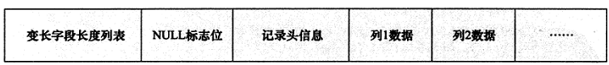

* 记录头信息（record header），固定占用 5 字节（40 位），每位含义

  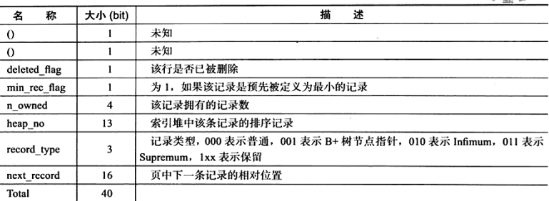


##### Redundant 行记录格式

Redundant 是 MySQL 5.0 之前 InnoDB 的行记录存储方式，MySQL 5.0 支持 Redundant 是为了兼容之前版本的页格式。使用 Redundant 行格式的表将变长列值（`VARCHAR`，`VARBINARY`，`BLOB`，`TEXT`）的前 768 个字节存储在 B 树节点内的索引记录中，其余的存储在溢出页上。大于或等于 768 字节的固定长度被编码为可变长度列，可以在页外存储（如 `CHAR(255) utf8mb4`）。如果列值等于或小于 768 个字节，则不使用溢出页，并且由于该值完全存储在 B 树节点中，可以节省一些 I/O。

Redundant 行格式存储特性：

* 每个索引记录包含一个 6 字节的标头，用于将连续的记录链接在一起，并用于行级锁定
* 聚集索引中的记录包含所有用户定义列的字段和一个 6 字节的事务 ID 字段（transaction ID）和一个 7 字节的滚动指针字段（roll pointer）
* 如果没有为表定义主键，则每个聚集索引记录还包含一个 6 字节的 row_id 字段
* 每个二级索引记录包含不在二级索引中的，为聚集索引键定义的所有主键列
* 一条记录包含一个指向该记录的每个字段的指针。如果记录中字段的总长度小于 128 字节，则指针为 1 个字节，否则两个字节。指针数组称为记录目录，指针记录的是数据部分
* 在内部，定长字符列以定长存储，尾部空格不会从 `VARCHAR` 列截断
* 大于或等于 768 字节的固定长度列被编码为可变长度列，可以在页外存储。
* SQL NULL 值在记录中保留一个或两个字节。SQL NULL 值如果存储在可变长度列中，则记录的数据部分中保留零字节。对于固定长度列，列的固定长度保留在记录的数据部分中。为 null 值保留固定空间允许将列从 null 值更新为非 null 值，而不会导致索引页碎片

*Redundant行记录格式*


* 字段长度偏移列表，同样按照列的顺序逆序放置。若列的长度小于 255 字节，用 1 字节表示；若大于 255 字节用 2 字节表示。

* 记录头信息，redundant 行记录格式的记录头占用 6 字节，每位含义：

  *redundant行格式记录头信息*

  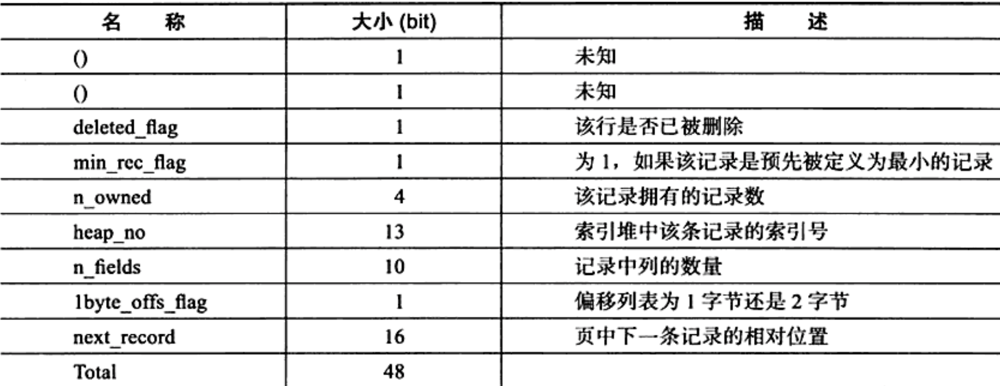

##### Dynamic 格式

该 DYNAMIC 行格式提供相同的存储特性 COMPACT 行格式，但增强的变长列的存储功能，并支持大型索引键前缀。InnoDB 可完全在页外存储长的可变长度列值，而聚集索引记录仅包含指向溢出页的 20 字节指针，大于或等于 768 字节的固定长度字段被编码为可变长度字段。

列是否页外存储取决于页面大小和行的总大小。当一行太长时，将选择最长的列进行页外存储，直到聚簇索引记录适合 B 树页面为止。小于或等于 40 字节的 TEXT 和 BLOB 列将存储在行中。DYNAMIC 行格式避免了用大量长列数据字节填充 B 树节点的问题，可以保持整个行存储在索引节点中的效率。支持索引键的前缀可达 3072 字节。

##### COMPRESSED 行格式

COMPRESSED 行格式提供 DYNAMIC 行格式相同的存储特性和功能，但增加了对表和索引数据压缩的支持。

可以在常规表空间和单独表空间存储 COMPRESSED 格式，系统表空间不支持 COMPRESS 格式，由于物理页大小不同，压缩表和未压缩表不能在同一常规表空间中共存。

InnoDB 1.0.X 版本开始引入了新的文件格式（file fromat，新的页格式），以前支持的 Compact 和 Redundant 格式称为 Antelope 文件格式，新的文件格式为 Barracuda 文件格式，Barracuda 文件格式下拥有两种新的行记录格式：Compressed 和 Dynamic，新的两种记录格式对于存放在 BLOB 中的数据采用采用了完全的行溢出的方式：在数据页中只存放 20 个字节的指针，实际的数据都存放在 Off Page 中，而之前的 Compact 和 Redundant 两种格式会存放 768 个前缀字节，Compressed 行记录格式下，存储在其中的行数据会以 zlib 的算法进行压缩，对于大长度类型的数据能够进行非常有效的存储

### 数据库缓存池

*缓存池磁盘IO*


磁盘 I/O 需要消耗的时间很多，而在内存中进行操作，效率则会高很多，为了让数据表或者索引中的数据随时被我们所用，DBMS 会申请占用内存来作为数据缓冲池，这样可以让磁盘活动最小化，从而减少与磁盘直接进行 I/O 的时间。缓冲池管理器会尽量将经常使用的数据保存起来，在数据库进行页面读操作的时候，首先会判断该页面是否在缓存池中，如果存在就直接读取，如果不存在，就会通过内存或磁盘将页面存放到缓存池中再进行读取

*缓存在数据库中结构*

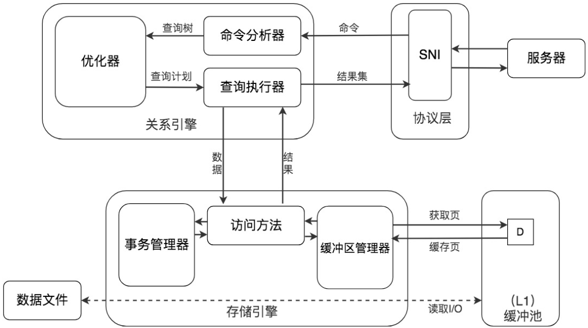

当对数据库中的记录进行修改的时候，首先会修改缓冲池中页里面的记录信息，然后数据库后台会以一定的频率刷新到磁盘上。缓存池会采用一种叫做 checkpoint 的机制将数据回写到磁盘上。

#### 查看缓存池大小

##### MyISAM 键缓存 Key Caches

MyISAM 键缓存默认只有一个键缓存，可以创建多个。MyISAM 自身只缓存索引，不缓存数据（依赖操作系统缓存数据）。如果大部分时 MyISAM 表，就应该为键缓存分配较多内存。

默认情况下，MyISAM 将所有索引都缓存在默认键缓存中，但也可以创建多个命名得键缓冲，这样就可以同时缓存超过 4 GB 的内存。

```ini
# 创建多个键缓存 my.cnf
key_buffer_1.key_buffer_size = 1G
key_buffer_2.key_buffer_size = 1G
```

上面将配置 3 个键缓存：两个明确定义，一个默认。

```mysql
# 将表映射到对应的缓冲区
CACHE INDEX t1, t2 IN key_buffer_1;
# 将表索引预载到缓冲区
LOAD INDEX INTO CACHE t1, t2
```

任何没明确指定映射到那个键缓冲区的索引，在 MySQL 第一次需要访问 `.MYI` 文件时，都会分配到默认缓冲区。可以通过 `SHOW STATUS` 和 `SHOW VARIABLES` 命令的信息来监控键缓冲的使用情况。

```sql
# 监控键缓冲的使用情况
100 - ((key_blocks_unused * key_cache_block_size) * 100 / key_buffer_size)
# 监控
mysqladmin extended-status -r -i 10 | grep key_reads
```

即使没有任何 MyISAM 表，依然需要将 `key_buffer_size` 设置为较小的值。MySQL 服务器有时会在内部使用 MyISAM 表（GROYP BY）语句可能使用 MyISAM 做临时表

* `key_buffer_size`

  任何没有分配给它的内存都可以被操作系统缓存利用。5.0 有一个规定有效上限是 4 GB，不管系统是什么架构。5.1 允许更大的值。

  在决定键缓存需要分配多少内存前，确定 MyISAM 索引实际上占用多少磁盘空间是很有帮助的。不需要把键缓存设置得比需要缓存得索引数据还大。查询 `INFORMATION_SCHEMA` 表得 `INDEX_LENGTH` 字段，把它们值相加，就可以得到索引存储占用得空间

  ```mysql
  # 索引占用空间
  SELECT SUM(INDEX_LENGTH) FROM INFORMATION_SCHEMA.TABLES WHERE ENGINE='MYISAM';
  ```

  类 UNIX 系统，查看文件

  ```shell
  du -sch `find /path/to/mysql/database/ -name "*.MYI"`
  ```

  设置键缓存时，不要超过索引得总大小，或者不超过为操作系统缓存保留总内存得 25% ~ 50%，以更小得为准。

* `key_cache_block_size`

  块大小对于写密集型负载很重要，它影响了 MyISAM、操作系统缓冲，以及文件系统之间的交互。如果缓冲块太小了，可能会碰到写时读取（read-around-write，操作系统在执行写操作之前必须先从磁盘上读取一些数据）。5.0  及之前无法配置索引块大小，5.1 之后，可以设置 MyISAM 的索引块大小跟操作系统一样，以避免写时读取。

##### InnoDB

`innodb_buffer_pool_size` 在数据库中进行读取页的操作，首先将从磁盘读到的页存放在缓存池中，这个过程称为将页“FIX”在缓存池中，下一次再读相同的页时，首先判断该页是否在缓存池中。若在缓存池中，则该页在缓存池被命中，直接读取该页。对于数据库中页的修改操作，首先修改在缓存池中的页，然后再以一定的频率刷新到磁盘上，checkpoint 刷盘机制。

缓存池中缓存的数据页类型有：索引页、数据页、undo 页、插入缓冲（insert buffer)、自适应哈希索引（adaptive hash index）、Innodb 存储的锁信息（lock info）、数据字典信息（data dictionary）等。

*innodb缓存池数据对象*


从 innodb 1.0.x 开始，允许有多个缓冲池实例，每个页根据哈希值平均分配到不同缓存池实例中。可以减少数据库内部的资源竞争，增加数据库的并发处理能力。通过参数 `innodb_buffer_pool_instances` 来进行配置，默认为 1，修改该配置需要将 `innodb_buffer_pool_size` 设置为大于 1 G。`innodb_buffer_pool_size` 必须是 128 M （`innodb_buffer_pool_chunk_size`）的整数倍，且能整除 `innodb_buffer_pool_instances` ，不然 mysql 会自行调节 `innodb_buffer_pool_size` 大小。

对应的参数为 `innodb_buffer_pool_size`

```mysql
// 查看缓存池大小
show variables like 'innodb_buffer_pool_size';
// 修改缓存池大小
set global innodb_buffer_pool_size = 134217728;
// 查看缓存池个数
show variables like 'innodb_buffer_pool_instances';
```

#### 数据页加载的三种方式

如果缓存池中没有该页数据，那么缓存池有以下三种读取数据的方式，每种方式的读取效率都是不同的：

* 内存读取

  如果该数据存在于内存中，基本上执行时间在 1ms 左右，效率还是很高

* 随机读取

  如果数据没有在内存中，就需要在磁盘上对该页进行查找，整体时间预估在 10ms 左右

* 顺序读取

  顺序读取其实是一种批量读取的方式，请求的数据在磁盘上往往是相邻存储的，顺序读取可以帮我们批量读取页面，这样的话，一次性加载到缓存池中就不需要再对其他页面单独进行磁盘 I/O 操作了。如果一个磁盘的吞吐量是 40MB/S，那么对于一个 16KB 大小的页来说，一次可以顺序读取 2560（40MB/16KB）个页，相当于一个页的读取时间为 0.4 ms，采用批量读取的方式，即使是从磁盘上进行读取，效率也比从内存中只单独读取一个页的效率要高

#### 通过 last_query_cost 统计 SQL 语句的查询成本

一条 SQL 查询语句在执行前需要确定查询计划，如果存在多种查询计划的话，MySQL 会计算每个查询计划所需要的成本，从中选择成本最小的一个作为最终执行的查询计划。如果想要查看某条 SQL 语句的查询成本，可以在执行完 SQL 语句之后，通过查看当前会话的 `last_query_cost` 变量值来得到当前查询的成本。这个查询成本对应的是 SQL 语句所需要读取的页的数量。

```mysql
show status like 'last_query_cost';
```

