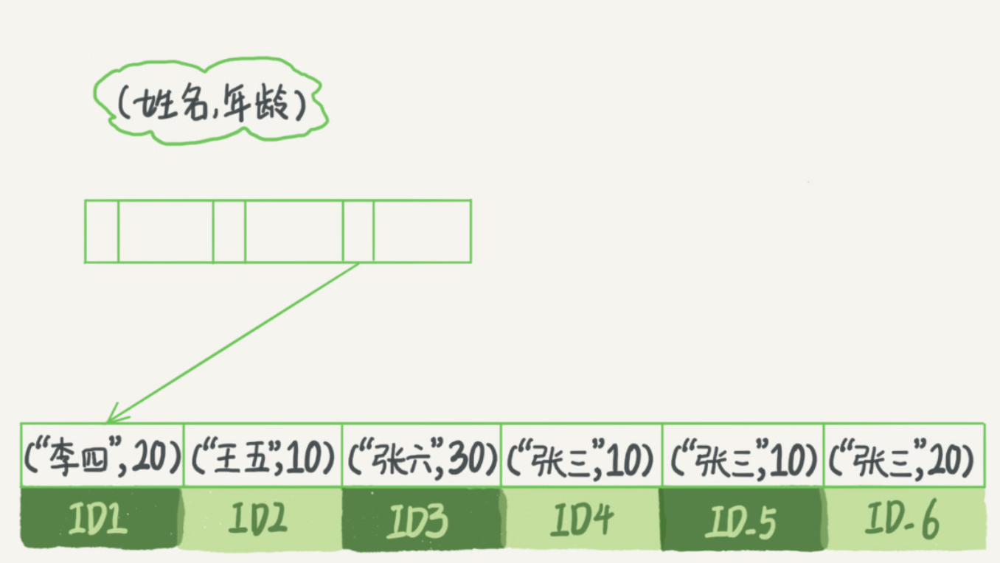
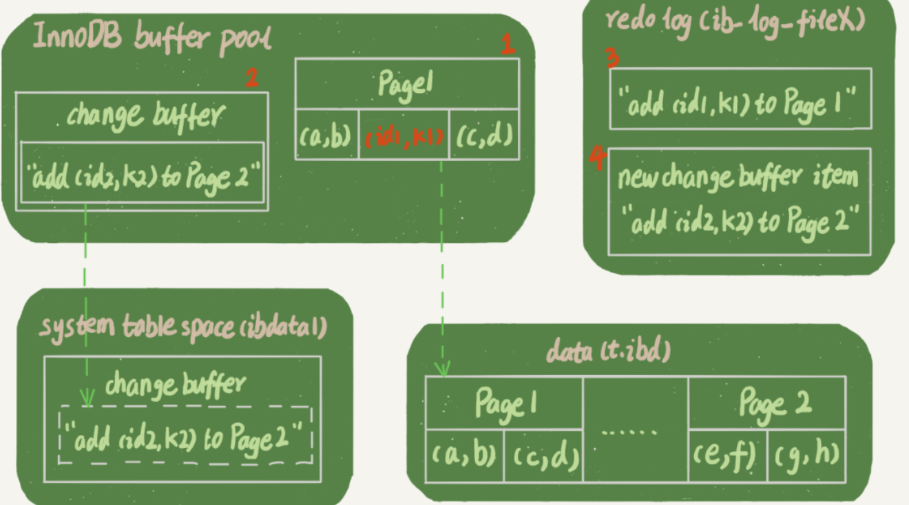
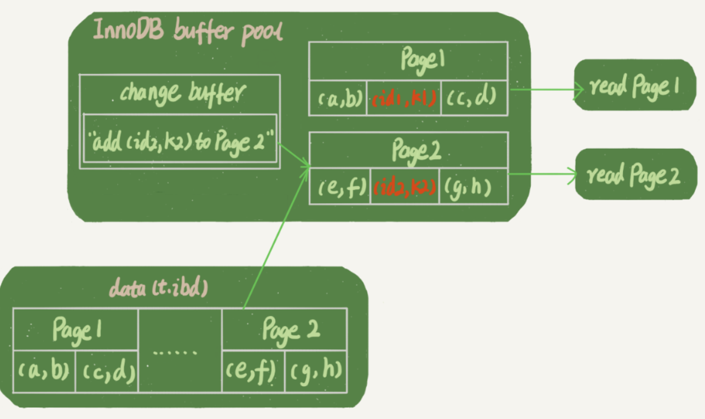

## `Mysql`索引

在 `Mysql` 中，索引是在存储引擎层实现地，并没有统一地索引标准，不同存储引擎索引地工作方式不一样。即使多个存储引擎支持同一种类型地索引，其底层地实现也可能不同。

### `InnoDB`索引模型

在 `InnoDB` 中，表都是根据主键顺序以索引地形式存放地，这种存储方式的表称为索引组织表。`InnoDB` 使用了 `B+` 树索引模型，数据都是存储在 `B+` 树中的，每一个索引在 `InnoDB` 里对应一棵 `B+` 树

* 主键索引的叶子节点存的是整行数据。在 `InnoDB` 里，主键索引也被称为聚簇索引（clustered index）
* 非主键索引的叶子节点内容是主键的值。在 `InnoDB` 中，非主键索引也被称为二级索引（secondary index）

#### 主键索引和普通索引的查询区别

* `select * from T where ID=500` 只需要搜索 `ID` 这个 `B+` 树
* `select * from T where K=5` 要先搜索 `K` 索引树，得到主键值，再在主键索引树上索引一次，过程称为回表，基于非主键索引的查询需要多扫描一棵索引树，尽量使用主键查询

#### 索引维护

B+ 树为了维护索引有序性，在插入新值会进行维护。如果插入位置的数据页满了，则需要申请一个新的数据页，然后挪动部分数据过去。这个过程称为页分裂。在这种情况下，性能会受影响，页分裂操作还影响数据页的利用率。原本放在一个页的数据，现在分到两个页中，整体空间利用率降低大约 50%。当相邻两个页由于删除了数据，利用率很低后，会将数据页做合并（分裂过程的逆向过程）。索引可能因为删除，或者页分裂等原因，导致数据页有空洞，重建索引的过程会创建一个新的索引，把数据按顺序插入，这样页面的利用率最高，即索引更紧凑，更省空间。

* 自增主键：自增主键的插入数据模式，是追加操作，不涉及到挪动其他记录，不会触发叶子节点的分裂，而用逻辑字段做主键，则往往不容易保证有序插入，这样写数据成本相对较高。由于每个非主键索引的叶子节点上都是主键的值。如果用整型做主键，则只要 4 字节，如果是长整型则是 8 字节。主键长度越小，普通索引的叶子节点就越小，普通索引占用的空间也就越小
* 典型的 `KV` 场景适合用业务字段直接做主键（即：只有一个索引；该索引必须是唯一索引）
* 删除，新建主键索引，都会将整个表重建。会同时去修改普通索引对应的主键索引，性能消耗比较大，可以使用 `alter table T engine=InnoDb` 代替。

### 索引的查询流程

**尽量少地访问资源是数据库设计的重要原则之一。在使用数据库的时候，尤其在设计表结构时，也要以减少资源消耗作为目标**

```mysql
mysql> create table T (
ID int primary key,
k int NOT NULL DEFAULT 0, 
s varchar(16) NOT NULL DEFAULT '',
index k(k))
engine=InnoDB;
insert into T values(100,1, 'aa'),(200,2,'bb'),(300,3,'cc'),(500,5,'ee'),(600,6,'ff'),(700,7,'gg');

```

`select * from T where k between 3 and 5`，需要执行几次树的搜索操作，会扫描多少行？

这条 SQL 查询语句的执行流程

1. 在 k 索引树上找到 k = 3 的记录，取得 ID = 300；
2. 再到 ID 索引树查询 ID = 300 对应的 R3；
3. 在 K 索引树取下一个值 k = 5，取得 ID = 500
4. 再回到 ID 索引树查到 ID = 500 对应的 R4；
5. 在 k 索引树取下一个值 k = 6，不满足条件，循环结束

在这个过程中，回到主键索引树搜索的过程，成为回表。这个查询读了 k 索引树的 3 条记录（步骤1，3 和 5），回表了两次（步骤 2 和 4）。

在这个查询语句中，由于查询结果所需要的数据只在主键索引上有，所以不得不回表。可以经过索引优化，避免回表过程

#### 覆盖索引

如果执行的语句是 `select ID  from T where k between 3 and 5`，这时只需要查 ID 的值，而 ID 的值已经在 k 索引树上了，因此可以直接提供结果，不需要回表。即在这个查询里面，索引 k 已经覆盖了查询需求，即为覆盖索引。

**由于覆盖索引可以减少树的搜索次数，显著提升查询性能，所以使用覆盖索引是一个常用的性能优化手段**

在引擎内部使用覆盖索引在索引 k 上其实读了 3 个记录，R3-R5（对应的索引 k 上的记录项），但是对于 Mysql 的 Server 层来说，它就是找引擎拿到了两条记录，因此 Mysql 认为扫描行数是 2。

因为索引字段的维护总是有代价的，在建立冗余索引来支持覆盖索引时要权衡考虑。

#### 最左前缀原则

B+ 树这种索引结构，可以利用索引的”最左前缀“，来定位记录

```c
create table `tuser` (
	`id` int(11) not null,
	`id_card` varchar(32) default null,
	`name` varchar(32) default null,
	`age` int(11) default null,
	`ismale` tinyint(1) default null,
	primary key (`id`),
	key `id_card` (`id_card`),
	key `name_age` (`name`, `age`)
) ENGINE = InnoDB
```

*name，age 索引图*



 可以看到，索引项时按照索引定义里面出现的字段属性排序的。

当逻辑需求是查到所有名字是 “张三” 的人时，可以快速定位到 ID4，然后向后遍历得到所有需要的结果。如果要查的是所有名字第一个字是 “张” 的人，SQL 语句 `where name like '张%'。这时，也能够用上这个索引，查找到第一个符合条件的记录是 ID3，然后向后遍历，直到不满足条件为止。

不只是索引的全部定义，只需要满足最左前缀，就可以利用索引来加速检索。这个最左前缀可以是联合索引的最左 N 个字段，也可以是字符串索引的最左 M 个字符

在建立联合索引的时候，如何安排索引内的字段顺序。

评估的标准是，索引的复用能力。因为可以支持最左前缀，所以当已经有了（a，b) 这个联合索引后，一般就不需要单独在 a 上建立索引了。因此，**第一原则是，如果通过调整顺序，可以少维护一个索引，那么这个顺序往往就是需要优先考虑采用的**

如果既有联合查询，又有基于 a，b 各自的查询，而查询条件里只有 b 的语句，是无法使用 a，b 这个联合索引的，这时候不得不同时维护（a，b)、（b) 这两个索引。这个时候考虑的原则就是空间了。

#### 索引下推

`select * from tase where name like '张%' and age = 10 and issmale = 1`

依据前缀索引规则，该语句在搜索索引树的时候，只能用 “张”，找到第一个满足条件的记录 ID3。然后是判断其他条件是否满足。在 MySQL 5.6 之前，只能从 ID3 开始一个个回表。到主键索引上找出数据行，再对比字段值。而 MySQL 5.6 引入的索引下推优化（index condition pushdown)，可以在索引遍历过程中，对索引中包含的字段先做判断，直接过滤掉不满足条件的记录，减少回表次数。

### 普通索引与唯一索引区别

#### 查询过程

假定，执行查询的语句是 `select id from T where K=5`。这个查询语句在索引树上查找的过程，先是通过 B+ 树从树根开始，按层搜索到叶子节点，即数据页，在数据页内部通过二分法来定位记录

* 对普通索引来说，查到满足条件的第一个记录后，需要查找下一个记录，直到碰到第一个不满足条件的记录
* 对于唯一索引来说，由于索引定义了唯一性，查找到第一个满足条件的记录后，就会停止继续检索

但是，这两种不同带来的性能差距是微乎其微即常数时间差异

`InnoDB` 的数据是按数据页为单位读写的。当需要读一条记录的时候，并不是将这个记录本身从磁盘读出来，而是以页为单位，将其整体读入内存。在 `InnoDB` 中，每个数据页的大小默认是 16kb。

因为引擎是按页读写的，当找到 k = 5 的记录的时候，它所在的数据页就都在内存里了，对于普通索引来说，要多做的那一次查找与判断，只需要一次指针寻址和一次计算。当然，如果找到的记录刚好是数据页的最后一个记录，那么要取下一条记录，必须读取下一个数据页，这个操作会稍微复杂一些。但，对于整型字段，一个数据页就可以放近千个 key，因此该情况引起的性能损耗可以忽略不计

#### 更新过程

* **change buffer：** 当需要更新一个数据页时，如果数据页在内存中就直接更新，而如果这个数据页还没有在内存中，在不影响数据一致性的前提下，`InnoDB` 会将这些更新操作缓存在 `change buffer` 中，这样就不需要从磁盘中读入这个数据页了。在下次查询需要访问这个数据页的时候，将数据页读人内存，然后执行 `change buffer` 中与这个页有关的操作。通过这种方式就能保证这个数据逻辑的正确性。`change buffer` 实际上它时可以持久化的数据，即 `change buffer` 在内存中有拷贝，也会被写入到磁盘上。

* **merge：** 将 `change buffer` 中的操作应用到原数据页中，得到最新结果的过程称为 `merge` 。除了访问这个数据页会触发 `merge` 外，系统有后台线程会定期 `merge` 。在数据库正常关闭的过程中，也会执行 `merge` 操作

  `merge` 的执行流程是：

  1.从磁盘读入数据页到内存（老版本的数据页）；

  2.从 `change buffer` 里找出这个数据页的 `change buffer` 记录（可能有多个），依次应用，得到新版本数据页；

  3.写 `redo log`。这个 `redo log` 包含了数据的变更和 `change buffer` 的变更

  到这里 `merge` 过程就结束了。这时候，数据页和内存中 `change buffer` 对应的磁盘位置都还没有修改，属于脏页，之后各自刷回自己的物理数据，就是另外一个过程了。

* 如果能够将更新操作记录先记录在 `change buffer` ，减少读磁盘，语句的执行速度会得到明显的提升。而且，数据读入内存是需要占用 `buffer pool` 的，所以这种方式还能避免占用内存，提高内存利用率

**以下条件下可以使用 change buffer**

对于唯一索引来说，所有的更新操作都要先判断这个操作是否违反唯一约束。如果要插入一条记录，需要先判断现在表中是否已经存在该条记录，而这必须要将数据页读入内存才能判断。但如果已经读入到内存了，那么直接更新内存会更快，就不会使用 `change buffer` 了。因此，唯一索引的更新就不能使用 `change buffer` ，实际上只有普通索引可以使用

`change buffer` 用的是 `buffer pool` 里的内存，因此不能无限增大。`change buffer` 的大小，可以通过参数 `innodb_change_buffer_max_size` 来动态设置。这个参数设置为 50 的时候，表示 `change buffer` 的大小最多只能占用 `buffer pool` 的 50%。

**插入数据时InnoDB的处理流程**

第一种是，**这个记录要更新的目标页在内存中**，此时，`InnoDB` 的处理流程如下：

* 对于唯一索引来说，找到 3 和 5 之间的位置，判断到没有冲突，插入这个值，语句执行结束；
* 对于普通索引来说，找到 3 和 5 之间的位置，插入这个值，语句执行结束

此时，普通索引和唯一索引对更新语句的性能影响差别，只是一个判断，CPU 耗费忽略不计

第二种是，**这个记录要更新的目标页不在内存中**，此时，`InnoDB` 的处理流程是：

* 对于唯一索引来说，需要将数据页读入内存，判断到没有冲突，插入这个值，语句执行结束
* 对于普通索引来说，则是将更新记录在 `change buffer` ，语句执行就结束了

**change buffer 的使用场景**

* 因为 `merge` 的时候是真正进行数据更新的时刻，而 `change buffer` 的主要目的就是将记录的变更的动作缓存下来，所以在一个数据页做 `merge` 之前，`change buffer` 记录的变更越多即该页要更新的次数越多，收益越大。因此对于 **写多读少** 的业务来说，页面在写完以后马上被访问到的概率比较小，此时 `change buffer` 的使用效果最好。通常为账单类、日志类的系统
* 假设一个业务的更新模式是写入之后马上会做查询，那么即使满足了条件，将更新先记录在 `change buffer`，但之后由于马上要访问这个数据页，会立即触发 `merge` 过程。这样随机访问 IO 的次数不会减少，反而增加了 `change buffer` 的维护代价。所以对于这种业务模式来说，`change buffer` 反而起到了副作用

### 索引的选择

唯一索引与普通索引在查询能力上是没差别的，主要应考虑对更新性能的影响。一般使用普通索引

如果所有的更新后面，都马上伴随着对这个记录的查询，那么应该关闭 `change buffer`。而在其他情况下，`change buffer` 都能提升更新性能

在实际使用中，`change buffer` 和普通索引的配合使用，对于数据量大的表的更新优化还是很明显的。

**change buffer 和 redo log**

假定插入语句为 `insert into t(id,k) values(id1,k1),(id2,k2);`

假定当前 k 索引树的状态，查找到位置后，k1 所在的数据页在内存（`InnoDB buffer pool`）中，k2 所在的数据页不在内存中，下图是带 `change buffer` 的更新状态图

*带changebuffer的更新过程*



以上更新语句，涉及：内存，redo log (ib_log_fileX)，数据表空间(t.ibd)，系统表空间(ibdata1)。进行了如下操作

1. `Page 1` 在内存中，直接更新内存
2. `Page 2` 没有在内存中，就在内存的 `change buffer` 区域，记录下我要往 `Page2` 插入一行这个信息
3. 将上述两个动作记入 `redo log` 中

执行完上述过程后，事务就可以完成了。所以执行这条更新语句的成本很低，就是写了两处内存，然后写了一处磁盘（两次操作合在一起写了一次磁盘），而且还是顺序写的，而且虚线箭头，是后台操作，不影响更新的响应时间

**读请求的处理**

假定执行的语句为 `select * from t where k in (k1, k2)`。

如果读语句发生在更新语句后不久，内存中的数据都还在，此时的两个读操作就与系统表空间(ibdata1) 和 redo log(ib_log_fileX) 无关了

*带changebuffer的读过程*



1. 读 `page 1` 的时候，直接从内存返回。虽然磁盘上还是之前的数据，但这里直接从内存返回结果
2. 要读 `Page 2` 的时候，需要把 `page 2` 从磁盘读入内存中，然后应用 `change buffer` 里面的操作日志，生成一个正确的版本并返回结构。

直到需要读 `page 2` 的时候，这个数据页才会被读入内存

两种机制在提升更新性能上的收益的话，**redo log 主要节省的是随机写磁盘的 IO 消耗（转成顺序写），而 change buffer 主要节省则是随机读磁盘的 IO消耗**

### MySQL 优化器的逻辑

选择索引是优化器的工作。而优化器选择索引的目的，是找到一个最优的执行方案，并用最小的代价去执行语句。在数据库中，扫描行数是影响执行代价的因素之一，扫描的行数越少，即访问磁盘数据的次数越少，消耗的 CPU 资源越少，扫描行数并不是唯一的判断标准，优化器还会结合是否使用临时表、是否排序等因素进行综合判断

#### 扫描行数的判读

MySQL 在真正开始执行语句之前，并不能精确地知道满足这个条件的记录有多少条，而只能根据统计信息来估算记录数。

统计信息就是索引的“区分度“。显然，一个索引上不同的值越多，这个索引的区分度就越好。而一个索引上不同的值的个数，称为“基数”，即，这个基数越大，索引的区分度越好。使用 `show index from table` 方法，查看一个索引的基数（对应的 `cardinality` 字段）

MySQL 计算索引的基数并不是把整张表取出来一行行的统计，虽然可以得到精确的结果，但是代价太高了，所以使用采样统计

采样统计的时候，`InnoDB` 默认会选择 N 个数据页，统计这些页面上的不同值，得到一个平均值，然后乘以这个索引的页面数，就得到了这个索引的基数。而数据表是会持续更新的，索引统计信息也不会固定不变，所以，当变更的数据行数超过 `1/M` 的时候，会自动触发重做一次索引的统计

在 MySQL 中，有两种存储索引统计的方式，可以通过设置参数 `innodb_stats_persistent` 的值来选择

* 设置为 on 的时候，表示统计信息会持久化存储。这是，默认的 N 是 20，M 是 10
* 设置为 `off` 的时候，表示统计信息只存储在内存中。这是，默认的 N 是 8，M 是 16

由于是采样统计，所以不管 N 是 20 还是 8，这个基数都是很容易不准的

索引统计只是一个输入，对于一个具体的语句来说，优化器还有判断，执行这个语句本身要扫描多少行。

使用 `explain` 分析语句的 `rows` 字段即是预计扫描行数

#### MySQL通过以下规则进行采样统计

采样统计的时候，`InnoDB` 默认会选择 N 个数据页，统计这些页面上的不同值，得到一个平均值，然后乘以这个索引的页面数，就得到了这个索引的基数。而数据表是会持续更新的，索引统计信息也不会固定不变。所以，当变更的数据行数超过 1/M 的时候，会自动触发重新做一次索引统计。

在 MySQL 中，有两种存储索引统计的方式，可以通过设置参数 `innodb_stats_persistent` 的值来选择

* 设置为 `on` 的时候，表示统计信息会持久化存储。这时，默认的 N 是 20，M 是 10
* 设置为 `off` 的时候，表示统计信息只存储在内存中。这是，默认的 N 是 8，M 是 16

索引统计只是一个输入，对于一个具体的语句来说，优化器还有判断，执行这个语句本身要扫描多少行

使用 `explain select * from t where a bewteen 10000 and 20000` 来查看查询语句的累计扫描行数是多少。`explain select * from t force index(a) where a between 10000 and 20000` 来对比使用不同的索引来统计扫描行数。如果对比中发现 `explain` 的结果预估的 `rows` 值跟实际情况差距比较大，可以使用 `analyze table table_name` 来重新统计索引信息。

#### 索引选择异常和处理

* 采用 `force index` 强行选择一个索引。MySQL 会根据词法解析的结果分析出可能可以使用的索引作为候选项，然后在候选列表中依次判断每个索引需要扫描多少行。如果 `force index` 指定的索引在候选索引列表中，就直接选择这个索引，不再评估其他索引的执行代价。
* 修改语句，引导 MySQL 使用我们期望的索引
* 有些场景下，可以新建一个更合适的索引，来提供给优化器做选择，或删掉误用的索引

### 字符串索引的选择

在建立索引时关注的是区分度，区分度越高越好。因为区分度越高，意味着重复的键值越少。使用前缀索引很可能会损失区分度，所以需要预先设定一个可以接受的损失比例

* 直接创建完整索引，这样可能比较占用空间

* 创建前缀索引，节省空间，但会增加查询扫描次数，并且不能使用覆盖索引

* 倒序存储，再创建前缀索引，用于绕过字符串本身前缀的区分度不够的问题

* 创建 hash 字段索引，查询性能稳定，有额外的存储和计算消耗，跟第三种方式一样，都不支持范围扫描

  在表上再创建一个整数字段，来保存字段的函数校验码如（`crc32()`），同时在这个字段上创建索引。每次插入新记录的时候，都同时用 `crc32()` 这个函数得到校验码填到这个新字段。

在实际应用中，根据业务字段的特点选择使用哪种方式

