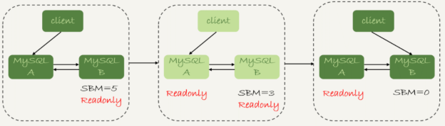

## 高可用相关

### 高可用性

#### 概述

通常以百分比表示，高可用性不是绝对的，只有相对更高得可用性。100% 得可用性是不可能达到得。可用性得 `9` 规则是表示可用性目标最普遍得方法。`99.999%` 得正常可用时间，每年只允许 5 分钟得宕机时间

确定一个可用时间目标，可用性每提高一点，所花费得成本都会远超之前；可用性得效果和开销得比例并不是线性得。需要保证多少可用时间，取决于成本。

#### 宕机原因

* 运行环境中，最普遍得问题是磁盘空间耗尽
* 在性能问题中，最普遍得原因是运行很糟糕得 SQL，或服务器 Bug 或错误行为导致得
* 糟糕得 Schema 和索引设计是第二大影响性能的问题
* 复制问题通常由于主备不一致导致
* 数据丢失问题通常由于 DROP TABLE 的误操作，且缺少可用备份问题

#### 实现高可用

* 避免导致宕机的原因来减少宕机时间
* 尽量保证在发生宕机时能够快速恢复，如制造冗余，并且具备故障转移能力。这两个维度的高可用性可通过两个相关的度量来确定：平均失效时间（`MTBF`）和平均恢复时间（`MTTR`）

##### 提升平均失效时间（MTBF）

* 测试恢复工具和流程，包括从备份中恢复数据
* 遵从最小权限原则
* 保持系统干净、整洁
* 使用好的命名和组织阅读来避免产生混乱
* 谨慎安排升级数据库服务器
* 使用 InnoDB 并进行适当配置，确保 InnoDB 是默认存储引擎，如果存储引擎被禁止，服务器就无法启动
* 通过 `skip_name_resolve` 禁止 DNS
* 除非必须，否则禁用查询缓存
* 避免使用复杂特性（复制过滤和触发器，除非确实需要）
* 监控重要组件和功能（磁盘空间RAID卷）
* 尽量记录服务器状态和性能指数，如果可能尽量保存作为分析
* 定期检查复制完整性
* 将备库设置为只读，不让复制自动启动
* 定期进行查询语句审查
* 归档并清理不需要的数据

##### 降低平均恢复时间（MTTR）

通过在系统中建立冗余来避免系统完全失效，并避免单点失效问题。找到并消除系统中的可能失效的单点，并结合切换到备用组件的机制是显著减少恢复时间的方法。可以采用两种方法来为系统增加冗余：增加空余容量和重复组件。

### 主备切换

正常情况下，只要主库执行更新生成的所有 `binlog` ，都可以穿到备库被正确的执行，备库就能达到跟主库一致的状态，这就是最终一致性，但是，MySQL 要提供高可用，只有最终一致性是不够的，有如下情景要考虑

#### 主备延迟

主备切换可能是一个主动运维动作，比如软件升级、主库所在机器按计划下线等，也可能是被动操作，比如主库所在机器掉电

主动切换的场景

##### 同步延迟

与数据同步有关的时间点主要包括以下三个：

1.主库 A 执行完成一个事物，写入 `binglog`，这个时刻为 T1；

2.之后传给备库 B，我们把备库 B 接收完这个 `binlog` 的时刻记为 T2；

3.备库 B 执行完成这个事务，这个时刻记为 T3；

主备延迟，就是同一个事务，在备库执行完成的时间和主库执行完成的时间之间的差值，也就是 `T3-T1` 可以在备库上执行 `show slave status` 命令，返回结果里面会显示 `seconds_behind_master` ，表示当前备库延迟多少秒。

`seconds_behind_master` 的计算方式是这样的

1.每个事务的 `binlog` 里面都有一个时间段，用于记录主库上写入的时间

2.备库取出当前正在执行的事务的时间字段的值，计算它与当前系统时间的差值，得到 `seconds_behind_master`，就是 `T3-T1` 。这个值的时间精度是秒（备库连接到主库的时候，会通过执行 `SELECT UNIX_TIMESTEAMP()` 函数来获得当前主库的系统时间。如果这时候发现主库的系统时间与自己不一致，备库在执行 `seconds_behind_master` 计算的时候会自动扣掉这个差值

在网络正常的时候，日志从主库传给备库所需的时间是很短的，即 `T2-T1` 的值是非常小的。即在网络正常情况下，主备延迟的主要来源是备库接收完 `binlog` 和执行完这个事务之间的时间差。

主备延迟最直接的表现是，备库消费中转日志的速度，比主库生产 `binlog` 的速度要慢。

#### 主备延迟的来源

* **备库性能不足**：有些部署条件下，备库所在机器的性能要比主库所在的机器性能差，或者多个库备份在同一机器上。更新请求对 `IOPS` 的压力，在主库和备库上是无差别的。更新过程中触发大量读操作。当备库机器上多个备库都在争抢资源的时候，就可能会导致主备延迟了。

  现阶段由于主备可能发生切换，备库随时可能变成主库，所以主备库选用相同规格的机器，并且做对称不是，是现在比较常见的情况。

* **备库压力较大**：因为主库提供了写能力，备库可能会提供一些读能力。或者一些运营后台需要的分析语句，不能影响正常业务，所以只能在备库上跑。备库的查询耗费了大量的 CPU 资源，影响了同步速度，造成了主备延迟

  这种情况下的处理一般为

  1.一主多从，除了备库外，可以多接几个从库，让这些从库来分担读的压力

  2.通过`binlog` 输出到外部系统，如 `Hadoop` 这类系统，让外部系统提供统计类查询的能力

* **大事务导致延迟**：主库必须等事务执行完成后才会写入 `binlog`，再传给备库。所以，如果一个主库上的语句执行 10 分钟，那这个事务很可能就会导致从库延迟 10 分钟（一次性用 delete 语句删除太多的数据，就是典型的大事务场景；大表的 DDL 场景也是典型的大事务）

#### 主备切换的策略

##### 可靠性优先策略

双 M 结构下，主备切换流程

​	*MySQL可靠性优先主备切换流程*

​	

* 判断备库 B 现在的 `seconds_behind_master`，如果小于某个值（如 5 秒）继续下一步，否则持续重试这一步
* 把主库 A 改成只读状态，把 `readonly` 设置为 `true`
* 判断备库 B 的 `seconds_behind_master` 的值，直到这个变为 0 为止
* 把备库 B 改成可读写状态，即把 `readonly` 设置为 `false`
* 把业务请求切换到备库 B

**这个切换流程是有不可用时间的**。在步骤 2 之后，主库 A 和备库 B 都处于 `readonly` 状态，这是系统处于不可写状态。直到步骤 5 完成才能恢复，关键时间就是主备延迟的时间

##### 可靠性优先策略下，异常切换

假定主库 A 备库 B 间的主备延迟是 30 分钟，这时候主库 A 掉电了。这种场景下，不能直接切换到备库 B，但是保持 B 只读：因为这段时间内，中转日志还没有应用完成，如果直接发起主备切换，客户端查询看不到之前执行完成的事务，会认为有 “数据丢失”

虽然随着中转日志的继续应用，这些数据会恢复回来，但是对于一些业务老说，查询到“暂时丢失数据的状态”也是不能被接受的

在满足数据可靠性的前提下，MySQL 高可用系统的可用性，是依赖于主备延迟的，延迟的时间越小，在主库故障的时候，服务恢复需要的时间就越短，可用性就越高

#### 可用性优先策略

即在不考虑主备延迟的情况下，直接把备库改成可读写状态，把业务请求切换到备库 B。那么系统几乎没有不可用时间了。但是这个流程可能会造成数据不一致的情况

