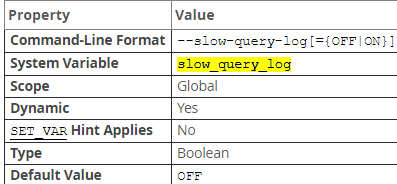
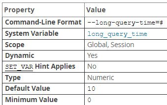
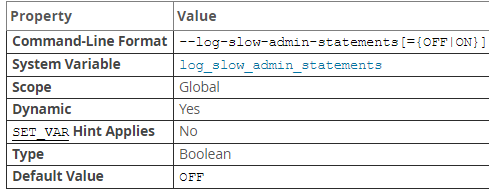
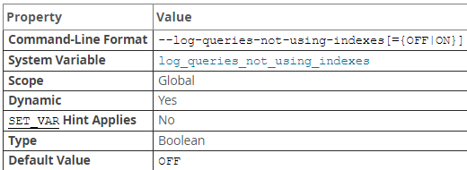

## 日志文件

### 错误日志（error log）

错误日志文件对 MySQL 的启动、运行、关闭过程进行了记录。

```mysql
# 错误日志文件
show variables like 'log_error';
```

### 慢查询日志（slow  log）

慢查询日志由 SQL 语句组成，这些语句需要花费超过 `long_query_time` 时间来执行并且最少请求了 `min_examined_row_limit` 行。可以使用命令行 `mysqldumpslow` 来分析慢查询日志

#### 参数

* `slow_query_log`

  

  是否启用慢速查询日志，可以是 0 或 OFF 以禁用日志，1 或 ON 开启。要指定日志文件名，使用 `--slow_query_log_file = file_name`，要指定日志目标，使用 `log_output` 系统变量。如果没有为慢日志指定名称，默认为 `host_name-slow.log`，除非指定了绝对路径名以指定其他目录，否则服务器将在数据目录中创建文件。

  要在运行时禁用或启用慢查询日志或geng'g

* `long_query_time` 

  

  如果查询所花的时间长于该值，服务器将增加 `slow_queries` 状态变量。如果启用了慢查询日志，则查询将记录到慢查询日志文件中。该值实时测量，不是 CPU 时间。在轻负载系统上低于阈值的查询可能会在重负载系统上高于阈值。最小和默认分别 0 和 10，可以将值指定为微秒的分辨率

* `log_slow_admin_statements`

  

  默认情况下，不记录管理语句，使用该变量修改，管理语句包含 `ALTER TABLE，ANALYZE TABLE，CHECK TABLE，CREATE_INDEX，DROP INDEX，OPTIMIZE TABLE，REPAIR TABLE`

* `log_queries_not_using_indexes`

  

  默认情况下，不记录未使用索引的查询，如果在启用慢查询日志的情况下启用此变量，则会记录预期将检索所有行的查询，此选项不一定意味着不使用索引（使用全索引扫描的查询使用索引，但由于索引不会限制行数而将被记录）