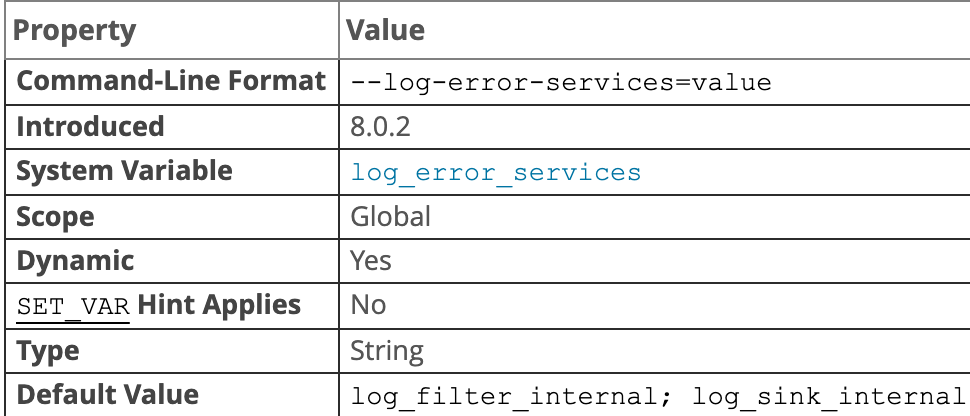
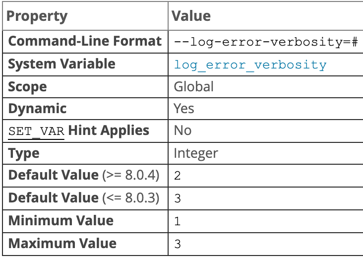
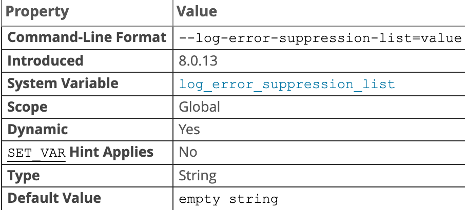
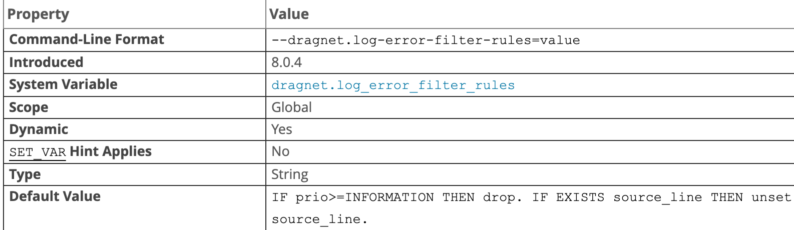

## 日志文件

### 常规查询日志和满查询日志输出

mysql 可以灵活控制写入普通查询日志和慢查询日志的输出目标，日志条目的可能目标是日志文件或系统数据库 `mysql` 中的 `general_log` 和 `slow_log` 表，可以选择文件输出表输出或两者

#### 启动时的日志控制

`log_output` 系统变量指定日志输出目的地，设置此变量本身并不会启用日志，必须分别启用日志，如果 `log_output` 在启动时未指定，则默认日志记录目标为 `FILE`，如果在启动时指定，则其值为一个或多个逗号分隔列表包含（`TABLE`，`FILE`，`NONE`）`NONE` 如果存在优先。

##### general_log

该系统变量控制记录一般查询日志，启动时指定，1 或 0，要指定文件记录默认名称以外的其他文件名称使用 `general_log_file` 变量指定。

```shell
# 启动一般查询日志并写入日志文件和表
--log_output=TABLE,FILE --general_log
```

##### slow_query_log

慢查询日志，输出文件以 `slow_query_log_file` 变量控制

```shell
# 启用慢查询日志
--log_ouput=FILE --slow_query_log
```

#### 运行时日志控制

`log_output`，`general_log`，`slow_query_log`，`general_log_file`，`slow_query_log_file` 可以在运行时修改，支持 session 与 global

#### 日志表

默认情况下，日志表使用 CSV 引擎，以逗号分隔的值格式写入数据的存储引擎，对于有权访问 `.csv` 文件的用户，可以直接导出 `.csv` 文件。

**日志表和打开文件太多错误**：如果选择 `TABLE` 作为日志目标并且日志表使用 CSV 引擎，可能会导致日志 `.csv` 文件打开许多文件描述符，可能会导致“打开文件太多”错误，可以通过执行 `FLUSH TABLE` 或确保 `open_files_limit` 大于 `table_open_cache_instances` 

```mysql
# 更改日志表
SET @old_log_state = @@GLOBAL.general_log;
SET GLOBAL general_log = 'OFF';
ALTER TABLE mysql.general_log ENGINE = MyISAM;
SET GLOBAL general_log = @old_log_state;
# 重命名日志表
USE mysql;
DROP TABLE IF EXISTS general_log2;
CREATE TABLE general_log2 LIKE general_log;
RENAME TABLE general_log TO general_log_backup, general_log2 TO general_log;
```

`TRUNCATE TABLE` 对日志表操作有效；`CHECK_TABLE` （有效）；`LOCK_TABLES`（无效）；`INSERT、DELETE、UPDATE` 不能在日志表使用，这些操作仅在服务区内部允许；`FLUSH TABLES WITH REAL LOCK` 和 `read only` 系统变量状态对日志表没有影响，服务器始终可以写入日志表；写入日志表的条目不会写入二进制日志，不会复制到从库；刷新日志表和日志文件，分别使用 `FLUSH TABLES` 或 `FLUSH LOGS`；不允许对日志表进行分区；mysqldump 转储包括报表中重新创建这些表，以便它们不会重新加载转储文件后失踪，日志表内容不转储；

### 错误日志（error log）

错误日志文件对 MySQL 的启动、运行、关闭过程进行了记录。包含诊断信息（错误，警告，注释，它们在服务器启动关及运行期间发送，如果 mysqld 注意到需要自动检查或修复表，它将向错误日志中写入一条记录）

```mysql
# 错误日志文件
show variables like 'log_error';
```

#### 错误日志组件配置

8.0 中，错误记录使用 MySQL 组件体系结构。错误日志子系统由执行日志事件过滤和写入的组件以及配置要启用那些组件以实现所需的日志记录结果的系统变量组成。

*log_error_services参数*



```mysql
# 默认组件 log_filter_internal log_sink_internal
select @@GLOBAL.log_error_services;
```

该变量可以包含具有 0，1 或许多元素的列表，对于列表可以使用分号或逗号（8.0.12）分隔，但不能同时使用，组件顺序决定服务器执行顺序。日志事件首先通过内置过滤器组件 `log_filter_internal`，然后再通过内置日志记录器组件 `log_sink_internal`。记录器是日志事件目的地，记录器将日志事件处理为特定格式的日志消息，并将这些消息写入其关联的输出。分配 `log_error_services` 不包含编写组件的值将导致从该点开始不写入日志处处，最后一个组成部分应该是记录器

输出目标由 `--log-error` 选项确定它们将错误信息写入控制还是文件，如果写入文件则确定错误日志文件名。（在 widow 上，`--pid-file` 和 `--console`）；`log_error_verbosity` 和 `log_error_suppression_list` 系统变量影响日志事件

要更改用于错误日志记录的日志组件集，需要加载组件并修改 `log_error_services` 值。添加或删除日志组件受以下约束：

* 要启用日志组件，首先需要加载（除非已内置或加载），然后在 `log_error_services` 值中添加，尝试在服务器启动时命名未知组件会导致其设置为默认值，尝试在运行时加载未知组件会产生错误，且该值不变。
* 要禁用日志组件，将其从 `log_error_services` 值中删除，如果该组件是可加载的且想卸载该组件，使用 `UNINSTALL COMPONENT`，尝试卸载仍在 `log_error_services` 值中组件会产生错误

```mysql
# 使用系统日志编写器而不是默认编写器，用于加载日志组件的URN前缀为 file://component_
INSTALL COMPONENT 'file://component_log_slink_syseventlog';
SET GLOBAL log_error_services = 'log_filter_internal; log_sink_sysenvent'
```

配置在每次服务器启动时启用的日志组件：

* 如果组件是可加载的，在运行时加载，加载组件会将其注册到 `mysql.component` 系统表中，以便服务器自动加载它以用于后续启动
* `log_error_services` 在启动时设置值以包括组件名称
* 在 `my.cnf` 文件中设置该值，在下次重启时生效
* 使用 `SET PERSIST` 为正在运行的实例设置该值，并保存该值以用于随后的服务器重启，立即生效，并在随后的重启中生效

```mysql
# 安装 json 记录器
INSTALL COMPONENT 'file://component_log_sink_json';
SET PERSIST log_error_services = 'log_filter_internal; log_sink_internal; log_sink_json'
```

```ini
[mysqld]
log_error_services='log_filter_internal; log_sink_internal; log_sink_json'
```

#### 默认错误日志配置

##### Windows 上的默认错误日志

在 windows 上，mysqld 使用 `--log-error`，`--pid-file`，`--console` 选项来确定默认的错误日志目的地是否是控制台或文件，如果是一个文件，的文件名；

* 如果 `--console` 则默认是控制台
* 如果 `--log-error` 未指定，或者未指定文件名，则默认目标是 `host_name.err` 在数据目录中命名的文件，除非 `--pid-file` 指定了该选项，在这种情况下，文件名是 PID 文件的基本名称和 `.err` 后缀的数据目录中文件
* 如果 `--log-error` 指定文件的名称，则默认目标是文件名加 `.err` 位于数据目录下的文件（如果没有后缀，则添加后缀），除非给出绝对路径名以指定其他位置

##### 类Unix上默认错误日志

在该系统上，mysqld 使用 `--log-error` 选项来确定错误日志目标是控制台还是文件，如果是文件，则使用文件名：

* 如果 `--log-error` 未给出，则默认目标是控制台
* 如果 `--log-error` 给出未命名文件，则默认目标是 `host_name.err` 在数据目录中命名的文件
* 如果 `--log-error` 指定文件的名称，则默认目标是文件名加 `.err` 位于数据目录下的文件（如果没有后缀，则添加后缀），除非给出绝对路径名以指定其他位置
* 如果 `--log-error` 选项在 `[server]`，`[mysqld]`，`[mysqld_safe]` 部分，则将其传递到 mysqld

##### 默认错误日志影响日志记录器

如果 `log_error` 为 `stderr`，则默认错误日志是控制台，并且将输出目标基于默认目标的日志记录器也将写入控制台：

* `log_sink_internal`、`log_sink_json`、`log_sink_test`、`log_sink_json` 等所有实例均写入控制台
* `log_sink_syseventlog`：无论 `log_error` 数值，始终都写入系统日志

如果 `log_error` 指示文件名。日志编写器基于该文件名为默认输出文件

* `log_sink_internal`、`log_sink_test` 这些写到 `log_error` 的值文件上
* `log_sink_json` 以 `log_error_services` 值命名的该编写器的连续实例将写入名为 file_name 的文件，再加上一个编号为`.NN.json` 的后缀：`file_name.00.json`，`file_name.01.json` 等。
* `log_sink_syseventlog`：无论 `log_error` 数值，始终都写入系统日志

#### 错误日志过滤器

错误日志配置通常包括一个日志过滤器和一个或多个日志编写器，对于错误日志过滤，mysql 提供以下组件：

##### 基于优先级 log_filter_internal

该组件根据错误日志事件的优先级 ERROR、WARNING、INFORMATION 和参数 `log_error_verbosity` 、`log_error_suppression_list` 变量提供错误日志过滤。该组件内置并默认启用

*log_error_verbosity参数*



指定用于处理用于错误日志事件的详细程度。该参数影响 `log_filter_internal` 错误日志过滤器组件执行的过滤，如果 `log_filter_internal` 禁用，`log_error_verbosity` 则无效。

用于错误日志事件具有的优先级 ERROR、WARNING 或 INFORMATION。`log_error_verbosity` 根据允许将优先级写入日志优先级控制详细程度

|        允许的优先级         | log_error_verbosity 的值 |
| :-------------------------: | :----------------------: |
|            ERROR            |            1             |
|       ERROR、WARNING        |            2             |
| ERROR，WARNING，INFORMATION |            3             |

还有一个优先级 `SYSTEM`，无论 `log_error_verbosity` 值如何，有关非错误情况下的系统消息都会打印到错误日志。包括（启动关闭以及对设置的重大更改）

如果 `log_error_verbosity` 为 2 或更大，错误日志记录不安全语句。如果值为 3 则将记录连接和访问被拒绝的错误及新连接尝试。如果使用复制，建议使用 2 或更大的值，以获得更多信息（如网络故障和重新连接的消息），如果在从服务器上大于等于 2， 则从服务器会将错误消息打印到错误日志（如二进制日志和中继日志坐标）。在MySQL错误日志中，系统消息被标记为 `System`。

*log_error_suppression_list参数*



该参数适用于错误日志事件，指定时它们用的优先级进行事件 WARNING 或 INFORMATION 进行降噪。如果某种特定类型的警告由于频繁发生但并不令人关注，因此在错误日志中被认为是不希望的噪音。影响 `log_filter_internal` 错误日志过滤器组件进行的过滤，如果该组件被禁用，该变量无效。

该变量值可以是空字符串或一个或多个逗号分隔值的列表，这些值指示要抑制的错误代码。错误代码可以符号或数字形式指定。可以指定带或不带 MY-前缀的数字代码，数字部分中的前导零不重要

```
# 允许格式
ER_SERVER_SHUTDOWN_COMPLETE
MY-000031
000031
MY-31
31
```

从可读性和可移植性的角度来看，符号值优于数字值，每个代码的值必须在允许的范围内

* 1 ～ 999：服务器和客户端使用的全局错误代码
* 10000：服务器错误代码，将写入错误日志（不发送给客户端）

指定的每个错误代码必须由 MySQL 实际使用。尝试指定不在允许范围内或允许范围内但未被 mysql 使用的代码会产生错误，并且该参数值保持不变。

```ini
# 配置实例
[mysqld]
log_error_verbosity=2
log_error_suppression_list='ER_PARSER_TRACE,MY-010001,10002'
```

此配置下，`log_error_verbosity` 允许具有 Error 或 WARING 优先级的消息。优先丢弃 WARING 优先级和在 `log_error_suppression_list` 中的代码。`log_error_verbosity` 为 1 时，`log_error_suppression_list` 无效

##### 基于规则 log_filter_dragnet

此过滤器根据用户提供的规则结合 `dragent.log_error_filter_rules` 参数提供错误日志过滤。

*dragnet.log_error_filter_rules参数*



过滤器规则控制 `log_filter_dragnet` 错误日志过滤器组件的操作。如果 `log_filter_dragnet` 未安装，则该参数不可用。如果已安装但未启用，则更改该参数无效。

8.0.12 开始，可以查询 `dragnet.Status` 变量以确定对该参数的最新复制结果，之前设置该值成功后查看 `show warnings` 则会产生一条注释。

### 慢查询日志（slow  log）

慢查询日志由 SQL 语句组成，这些语句需要花费超过 `long_query_time` 时间来执行并且最少请求了 `min_examined_row_limit` 行。可以使用命令行 `mysqldumpslow` 来分析慢查询日志

#### 参数

* `slow_query_log`

  

  是否启用慢速查询日志，可以是 0 或 OFF 以禁用日志，1 或 ON 开启。要指定日志文件名，使用 `--slow_query_log_file = file_name`，要指定日志目标，使用 `log_output` 系统变量。如果没有为慢日志指定名称，默认为 `host_name-slow.log`，除非指定了绝对路径名以指定其他目录，否则服务器将在数据目录中创建文件。

  要在运行时禁用或启用慢查询日志或geng'g

* `long_query_time` 

  

  如果查询所花的时间长于该值，服务器将增加 `slow_queries` 状态变量。如果启用了慢查询日志，则查询将记录到慢查询日志文件中。该值实时测量，不是 CPU 时间。在轻负载系统上低于阈值的查询可能会在重负载系统上高于阈值。最小和默认分别 0 和 10，可以将值指定为微秒的分辨率

* `log_slow_admin_statements`

  

  默认情况下，不记录管理语句，使用该变量修改，管理语句包含 `ALTER TABLE，ANALYZE TABLE，CHECK TABLE，CREATE_INDEX，DROP INDEX，OPTIMIZE TABLE，REPAIR TABLE`

* `log_queries_not_using_indexes`

  

  默认情况下，不记录未使用索引的查询，如果在启用慢查询日志的情况下启用此变量，则会记录预期将检索所有行的查询，此选项不一定意味着不使用索引（使用全索引扫描的查询使用索引，但由于索引不会限制行数而将被记录）

