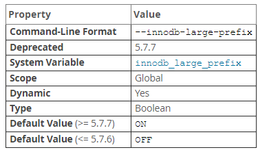

## InnoDB 表的限制

### 最大值和最小值

* 一个表最多可以包含 1017 列（5.6.9 之前是 1000），虚拟列包含在其中

* 最多建立 64 个二级索引

* 如果选项 `innodb_large_prefix` 启用（5.7 默认开启），对于使用 `DYNAMIC` 或 `COMPRESSED` 行格式的表，索引前缀长度支持 3072 Bytes。如果关闭该选项，或者使用其他行格式（`REDUNDANT` 或 `COMPACT`）的表，则索引前缀长度截断为 768 bytes

  适用于索引键前缀，也适用于全列索引键

  尝试使用超出限制的索引键前缀长度会返回错误。要避免复制配置中出现此类错误，如果不能在从服务器上启动 `innodb_large_prefix` 也不要在主服务器上启用 `innodb_large_prefix`

  **备注：innodb_large_prefix**

  *innodb_large_prefix属性*

  

  对于 `REDUNDANT` 或 `COMPACT` 行格式的表此选项不会影响允许的索引键前缀长度

  `innodb_large_prefix` 在 5.7 中默认为 `ON`。`innodb_file_format` 默认值为 `Barracuda`。这些默认值更改允许在使用 `DYNAMIC` 或 `COMPRESSED` 行格式时创建更大的索引键前缀。如果将任一选项设置为非默认值，则会以静默的放置阶段大于 767 byte 的索引键前缀

  `innodb_large_prefix` 已弃用，在以后的版本还将删除，`innodb_large_prefix` 引入了禁用大索引键前缀以与 `InnoDB` 不支持大索引键前缀的早期版本不兼容

* 如果在创建 MySQL 实例时指定选项将 `InnoDB` `page size`  减少到 8 kb或 4kb，则索引键的最大长度将按比例降低，基于 16 KB 的 `page size` 。则索引键的最大长度将按比例降低，`page size` 为 16 kb 时，索引键长度为 3072 bytes，8 kb 时为 1536 bytes，4 kb 时为 768 bytes

* 对列索引最多允许 16 列。超过限制会返回错误

* 最大行长度，除了可变长列（`VARCHAR`，`VARBINARY`，`BLOB`，`TEXT`），最大行长度略小于 `page size` 的一半，即如果 `page size` 为 16kb，则最大行长度为 8000 bytes，32 kb 或 64 kb 的最大记录大小约为16kb。`LONGBLOB` 和 `LONGTEXT` 列必须小于 4 GB，并且总行长度包括（BLOB 和 TEXT 列）必须小于 4 GB

* 虽然 `InnoDB` 在内部支持大于 65535 字节的行大小，但 MySQL 本身对所有列的组合大小增加了行大小限制  65535

  ```mysql
  mysql> CREATE TABLE t (a VARCHAR(8000), b VARCHAR(10000),
      -> c VARCHAR(10000), d VARCHAR(10000), e VARCHAR(10000),
      -> f VARCHAR(10000), g VARCHAR(10000)) ENGINE=InnoDB;
  ERROR 1118 (42000): Row size too large. The maximum row size for the
  used table type, not counting BLOBs, is 65535. You have to change some
  columns to TEXT or BLOBs
  ```

* 在某些较旧的操作系统上，文件必须小于 2GB。这不是 `InnoDB` 的限制，但如果需要大型表空间，可以使用几个较小的数据文件而不是一个大型数据文件进行配置

* `InnoDB` 日志文件的总大小最大可达 512 GB

* 最小表空间略大于 10 MB，最大表空间取决于 `page size` 大小

  *InnoDB最大表空间大小*

  

* 表空间文件的路径（包括文件名）不能超过 `windows` 上的 `MAX_PATH` 限制。在 `windows10` 之前，`MAX_PATH` 限制为 260 个字符。从 `window10 1607` 版本开始，`MAX_PATH` 限制从常见的 `win32` 文件和目录函数中删除

* `InnoDB` 中的 `page size` 默认大小为 16kb。可以通过在配置修改。支持 32 kb 和 64 kb 页面大小，但对于大于 16kb 的页面大小，不支持 `ROW_FORMAT = COMPRESSED`，对于 32 kb 和 64 kb 页面大小，最大记录大小为 16 kb。对于 `page size` 32 kb 时，`extent` 大小为 2 MB，对于 `page size` 64 kb 时，`extent` 大小为 4 MB

  使用特定 `InnoDB` 页面大小的 MySQL 实例无法使用来自不同页面大小的实例的数据文件或日志文件

  **备注：Page, Extents，Segments，Tablespaces**

  每个表空间都包含数据库页面。MySQL 实例中的每个表空间都具有相同的页面大小。默认情况下，所有表空间的 `page size` 为 16kb；

  对于 `page size` 为 16kb 时，`page size` 被分组为 1 MB 的 `extents`。32 kb 为 2 MB，64 kb 为 4MB。表空间内的 "文件" 在 `InnoDB` 中称为 `Segment` 。（这些 `Segment` 与回滚 `Segment` 不同，后者实际上包含许多表空间 `Segment`）

  当一个段在表空间内增长时，`InnoDB` 第一次将分配 32 个 `page`，之后 `InnoDB` 将整个 `extents` 分配给该段。`InnoDB` 一次可以向一个 `large segment `增加 4 个 `extents` ，来确保数据的良好顺序性

  在 `InnoDB` 中为每个索引分配两个 `Segment` 。一个用于 B-tree 的非叶子节点，一个用于叶子节点。保持叶子节点在磁盘的顺序性能提升 `I/O` 性能，这些叶子节点包含实际的表数据

  表空间中某些页面包含其他页面的位图，因此 `InnoDB` 表空间中的一些范围不能作为整体分配给段，只能作为单独的页面。

  从表中删除数据时，`InnoDB` 会收缩相应的B树索引。释放的空间是否可供其他用户使用取决于删除模式是否将单个页面或扩展区释放到表空间。删除表或删除其中的所有行可以保证将空间释放给其他用户，但请记住，只有清除操作才会删除已删除的行，这在事务回滚或一致性读取不再需要时会自动发生。

### InnoDB 表限制

* `Analyze table` 后查看 `show index` 这些统计只是估算

* `show table status` 在 `InnoDB` 中，除了表保留的物理大小外，rows 是估算

* `InnoDB` 不保留表中的内部行数，因为并发事务可能同时”看到“不同数量的行，因此 `SELECT COUNT(*)` 语句只计算当前事务可见的行

* 在Windows上，`InnoDB` 始终以小写形式在内部存储数据库和表名。要以二进制格式将数据库从Unix移动到Windows或从Windows移动到Unix，请使用小写名称创建所有数据库和表

* 必须将 `AUTO_INCREMENT` 列ai_col定义为索引的一部分，以便可以在表上执行等效的索引SELECT MAX（ai_col）查找以获取最大列值。 通常，这是通过使列成为某些表索引的第一列来实现的。

* `InnoDB` 在与 `AUTO_INCREMENT` 列关联的索引末尾设置独占锁，同时初始化表上的先前指定的`AUTO_INCREMENT` 列。

  在` innodb_autoinc_lock_mode = 0` 的情况下，`InnoDB` 使用特殊的 `AUTO-INC` 表锁模式，其中获取锁并在访问自动增量计数器时保持到当前SQL语句的末尾。 在保持`AUTO-INC`表锁时，其他客户端无法插入表中。 使用`innodb_autoinc_lock_mode = 1`的“批量插入”也会出现相同的行为。 表级别`AUTO-INC`锁不与`innodb_autoinc_lock_mode = 2`一起使用。

* 当`AUTO_INCREMENT`整数列用完值时，后续`INSERT` 操作将返回重复键错误。这是一般的MySQL行为。

* `DELETE FROM *tbl_name*` 不会重新生成表，而是逐个删除所有行。

* 级联外键操作不会激活触发器。

* 不能创建与内部的名称匹配的列名的表`InnoDB`列（其中包括`DB_ROW_ID`， `DB_TRX_ID`， `DB_ROLL_PTR`，和 `DB_MIX_ID`）。此限制适用于在任何字母大小写中使用名称。

### 锁

* [`LOCK TABLES`](https://dev.mysql.com/doc/refman/8.0/en/lock-tables.html)如果`innodb_table_locks=1`（默认值），则在每个表上获取两个锁 。除了MySQL层上的表锁之外，它还获取`InnoDB`表锁。4.1.2之前的MySQL版本没有获取 `InnoDB`表锁；可以通过设置选择旧行为 `innodb_table_locks=0`。如果未在 `InnoDB` 获取表锁，[`LOCK TABLES`](https://dev.mysql.com/doc/refman/8.0/en/lock-tables.html)即使某些表的记录被其他事务锁定， 也会完成。

  在MySQL 8.0中， [`innodb_table_locks=0`](https://dev.mysql.com/doc/refman/8.0/en/innodb-parameters.html#sysvar_innodb_table_locks)对于显式锁定的表没有任何影响 [`LOCK TABLES ... WRITE`](https://dev.mysql.com/doc/refman/8.0/en/lock-tables.html)。它对通过[`LOCK TABLES ... WRITE`](https://dev.mysql.com/doc/refman/8.0/en/lock-tables.html)隐式（例如，通过触发器）或通过隐藏（例如，通过触发器）锁定读取或写入的表有效 [`LOCK TABLES ... READ`](https://dev.mysql.com/doc/refman/8.0/en/lock-tables.html)。

* `InnoDB` 事务提交或中止时，将释放事务持有的所有锁。因此，它并没有多大意义，调用 [`LOCK TABLES`](https://dev.mysql.com/doc/refman/8.0/en/lock-tables.html)上 `InnoDB`表中 [`autocommit=1`](https://dev.mysql.com/doc/refman/8.0/en/server-system-variables.html#sysvar_autocommit)模式，因为所获得的`InnoDB`表锁将被立即释放。

* 无法在事务中锁定其他表，因为[`LOCK TABLES`](https://dev.mysql.com/doc/refman/8.0/en/lock-tables.html)执行隐式 [`COMMIT`](https://dev.mysql.com/doc/refman/8.0/en/commit.html)和 [`UNLOCK TABLES`](https://dev.mysql.com/doc/refman/8.0/en/lock-tables.html)。

### InnoDB 存储引擎的表空间

InnoDB 存储引擎的文件格式是 `.idb` 文件，数据会按照表空间（tablespace）进行存储，分为共享表空间和独立表空间。

```mysql
# 查看表空间存储方式
show variables like 'innodb_file_per_table';
```

* 独立表空间

  每个数据表都有自己的物理文件，即 `table_name.idb` 文件，在这个文件中保存了数据表中的数据、索引、表的内部数据字典等信息。它的优势在于每张表都相互独立，不会影响到其他数据表，存储结构清晰，利于数据恢复，同时数据表还可以在不同的数据库之间进行迁移。

  如果启用了 `innodb_file_per_table` 参数，每张表得表空间内存放得只是数据、索引和插入缓冲 bitmap 耶，其他类得数据，如：回滚，插入缓冲索引页、系统事务信息，二次写缓冲还是存放在共享表空间内。

* 共享表空间

  InnoDB 存储的表数据会放到共享表空间中，多个数据表共用一个表空间，同时表空间也会自动分成存放到磁盘上。优势在于单个数据表的大小可以突破文件系统大小的限制，最大可以达到 64 TB，即 InnoDB 存储引擎表空间的上限。缺点在于多个数据表存放在一起，结构不清晰，不利于数据的找回，同时将所有数据和索引都存放到一个文件中，也会使得共享表空间的文件很大

### InnoDB 内存

#### 缓存池

