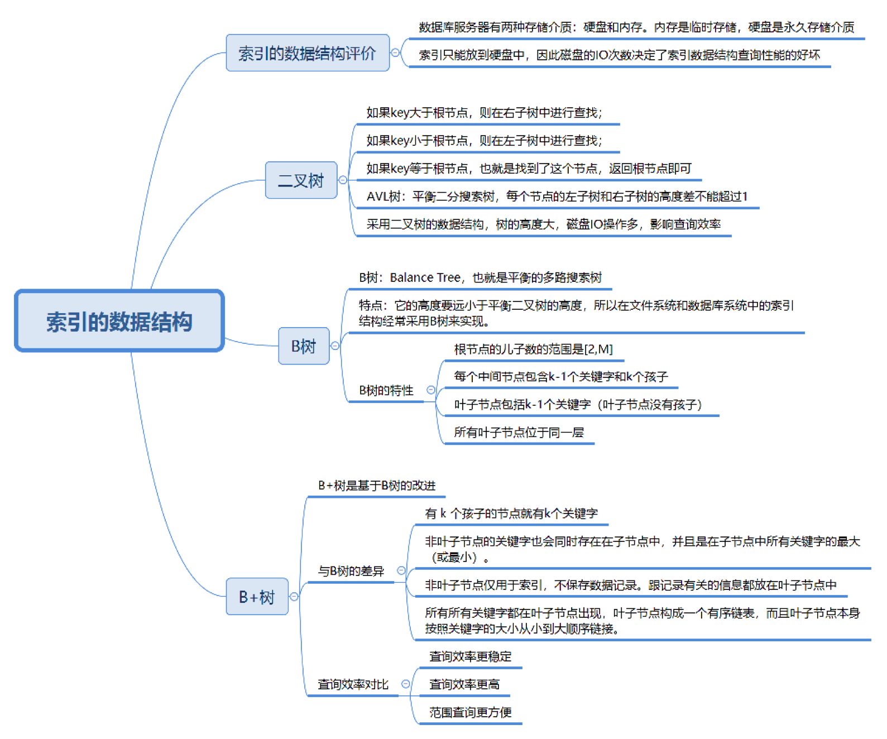
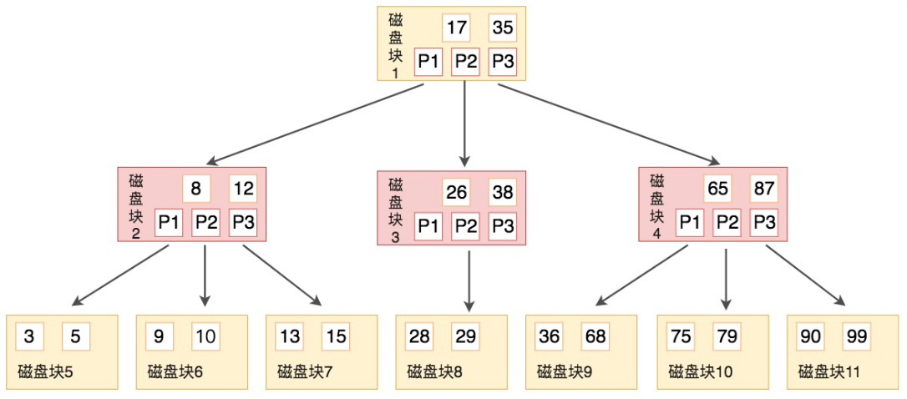
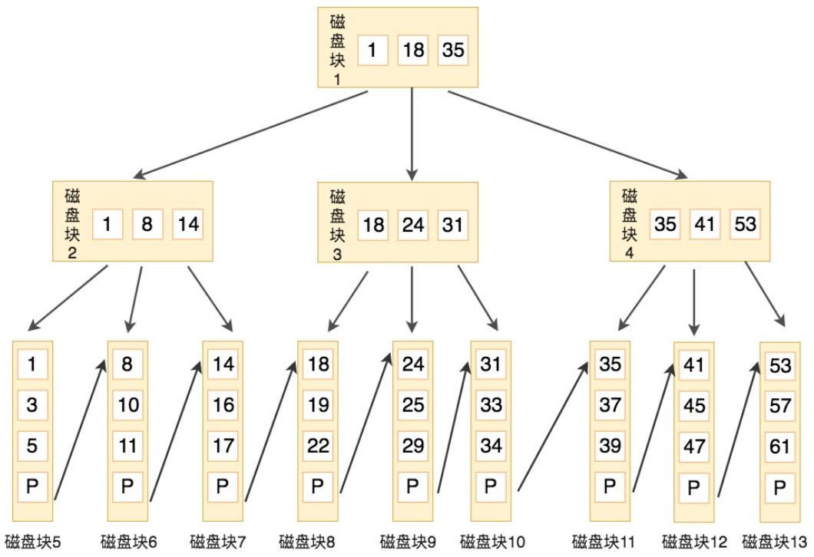
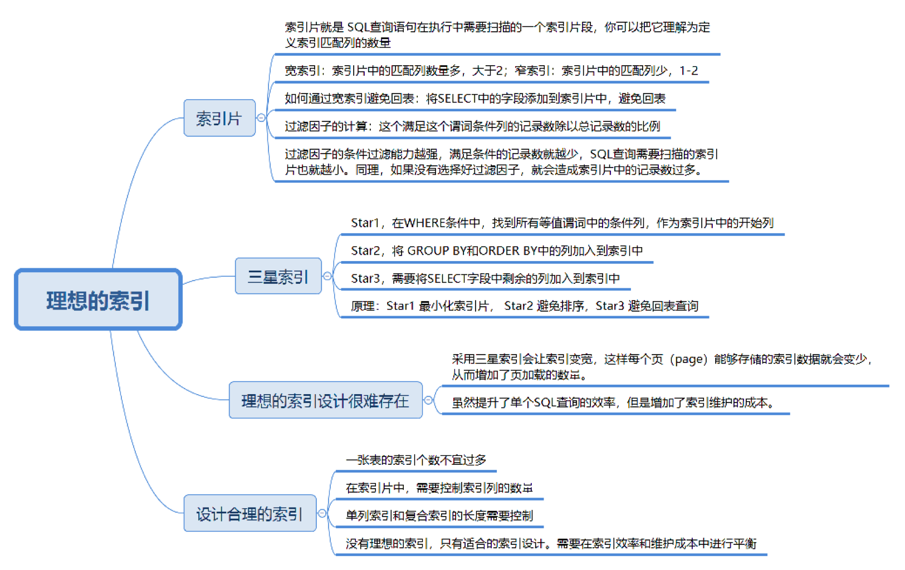

## 创建高性能的索引

索引（在 MySQL 中也称为 “键”（key））是存储引擎用于快速找到记录的一种数据结构。索引对于良好的性能非常关键。尤其是当表中的数据越来越大时，索引对性能的影响愈发重要。在数据量较小且负载较低时，不恰当的索引对性能的影响还不明显，但当数据量逐渐增大时，性能则会急剧下降。索引优化应该是对查询性能优化最有效的手段了。索引能够轻易将查询性能提高几个数量级

### 索引基础

在 MySQL 中，存储引擎先在索引中找到对应值，然后根据匹配的索引记录找到对应的数据行。索引可以包含一个或多个列的值。如果索引包含多个列，那么列的顺序也十分重要，MySQL 只能高效地使用索引的最左前缀列。

磁盘的 I/O 操作次数对索引的使用效率至关重要。虽然传统的二叉树数据结构查找数据的效率高，但很容易增加磁盘 I/O 操作的次数，影响索引使用效率。因此在构造索引的时候，更倾向于采用“矮胖”的数据结构。B 树和 B+ 树都可以作为索引的数据结构，在 MySQL 中采用的是 B+ 树，B+ 树在查询性能上更稳定，在磁盘页大小相同的情况下，树的构造更加矮胖，所需要进行的磁盘 I/O 次数更少，更适合进行关键字的范围查询

*索引数据结构*



#### B树

如果用二叉树作为索引的实现结构，会让树变得很高，增加磁盘 I/O 次数，影响数据查询的时间。因此一个节点就不能只有 2 个字节点，而应该允许有 M 个子节点（M > 2）。B 树的出现就是为了解决这个问题，B 树的英文是 Balance Tree，即平衡多路搜索树，它的高度远小于平衡二叉树的高度。在文件系统和数据库系统中的索引结构经常采用 B 树来实现

*B 树的结构*



*3阶的B树。磁盘块 2，里面的关键字为（8，12），它有 3 个孩子（3，5），（9，10），（13，15），（3，5） 小于 8，（9，10）在 8 和 12 中间，（13，15）大于 12*

##### B树查找

假定待查找关键字是 9，步骤为：

1.将待查找关键字 9 与根节点比较，9 小于 17 得到指针 P1；

2.按照指针 P1 找到磁盘块 2，关键字为（8，12），因为 9 在 8 和 12 之间，得到指针 P2；

3.按照指针 P2 找到磁盘块 6，关键字为（9，10），得到关键字 9

在 B 树的搜索过程中，比较的次数并不少，但如果把数据读取出来然后在内存中进行比较，这个时间可以忽略不计。而读取磁盘块本身需要进行 I/O 操作，消耗的时间比在内存中比较所需要的时间要多，是数据查找用时的重要因素，B 树相比于平衡二叉树来说磁盘 I/O 操作要少，在数据查询中比平衡二叉树效率要高

##### B树结构

B 树作为平衡的多路搜索树，它的每一个节点最多可包括 M 个子节点，M 称为 B 树的阶。每个磁盘块中包括了关键字和子节点的指针。如果一个磁盘块中包括了 x 个关键字，那么指针数就是 x+1。对于一个 100 阶的 B 树，如果有 3 层的话，最多可存储约 100 万的索引数据。对于大量的索引数据，采用 B 树的结构非常适合，因为树的高度远小于二叉树的高度。一个 M 阶的 B 树（M > 2）有如下特性：

* 根节点的儿子数范围是 `[2, M]`
* 每个中间节点包括 k - 1 个关键字和 k 个孩子，孩子的数量 = 关键字的数量 + 1，k 的取值范围为 `[ceil(M/2), M]`
* 叶子节点包括 k - 1 个关键字（叶子节点没有孩子），k 的取值范围为 `[ceil(M/2), M]`
* 假设中间节点的节点关键字为：`key[1]，key[2]...key[k-1]`，且关键字按照升序排序，即 `key[i] < key[i + 1]`。此时 k - 1 个关键字相当于划分了 k 个范围，也就是对应着 k 个指针，即为 `P[1], P[2],...P[k]`，其中 P[1] 指向关键字小于 Key[1] 的子树，P[i] 指向关键字属于`(key[i-1], key[i])` 的子树，P[k] 指向关键字大于 `key[k-1]` 的子树。
* 所有叶子节点位于同一层

#### B+树

B + 树基于 B 树做出了改进，主流的 DBMS 都支持 B+ 树的索引方式，B+ 树和 B 树的差异在于：

* 有 k 个孩子的节点就有 k 个关键字。即孩子数量 = 关键字数，而 B 树中，孩子数量 = 关键字数 + 1
* 非叶子节点的关键字也会同时存在在子节点中，并且是在子节点中所有关键字的最大（或最小）
* 非叶子节点仅用于索引，不保存数据记录，跟记录有关的信息都放在叶子节点中。而 B 树中，非叶子节点即保存索引，也保存数据记录
* 所有关键字都在叶子节点出现，叶子节点构成一个有序链表，而且叶子节点本身按照关键字的大小从小到大顺序链接

*B+ 树数据结构*



*阶数为 3 的 B+ 树，根节点中的关键字 1，18，35，分别是子节点（1，8，14），（18，24，31），（35，41，41，53）中的最小值。每一层父节点的关键字都会出现在下一层的子节点的关键字中，因此在叶子节点中包括了所有的关键字信息，并且每一个叶子节点都有一个指向下一个节点的指针，这样就形成了一个链表*

##### B+树搜索

假定要查找关键字 16，B+ 树会自顶向下逐层进行查找：

* 与根节点的关键字（1，18，35）进行比较，16 在 1 和 18 之间，得到指针 P1（指向磁盘块2）
* 找到磁盘块 2，关键字为（1，8，14），因为 16 大于 14，得到指针 P3（指向磁盘块 7）
* 找到磁盘块 7，关键字为（14，16，17），得到关键字 16，获取对应数据

整个过程一共进行了 3 次 I/O 操作，看起来 B+ 树和 B 树的查询过程类似，但是 B+ 树和 B 树的差异在于：

* B+ 树的中间节点不直接存储数据。
* B+ 树查询效率更稳定。因为 B+ 树每次只有访问到叶子节点才能找到对应的数据，而在 B 树中，非叶子节点也会存储数据，这样就会造成查询效率不稳定的情况，有时候访问到了非叶子节点就可以找到关键字，而有时候需要访问到叶子节点才能找到关键字
* B+ 树查询效率更高，通常 B+ 树比 B 树更矮胖（阶数更大，深度更低），查询所需要的磁盘 I/O 也会更少。同样的磁盘页大小，B+ 树可以存储更多的节点关键字。
* 不但对单个关键字的查询，在查询范围上，B+ 树的效率也比 B 树高。这是因为所有关键字都出现在 B+ 树的叶子节点中，并通过有序链表进行了链接。而在 B 树中则需要通过中序遍历才能完成查找范围的查找，效率要低很多

##### 数据页上使用 B+ 树查询

MySQL 的 InnoDB 存储引擎采用 B+ 树作为索引，而索引又可以分成聚集索引和非聚集索引（二级索引），这些索引都相当于一个 B+ 树。一个 B+ 树按照节点类型可以分成两部分：

* 叶子节点，B+ 树最底层的节点，节点的高度为 0，存储行记录
* 非叶子节点，节点的高度大于 0，存储索引键和页面指针，并不存储行记录本身

在一棵 B+ 树中，每个节点都是一个页，每次新建节点的时候，就会申请一个页空间。同一层上的节点之间，通过页的结构构成一个双向链表（页文件头中的两个指针字段）。非叶子节点，包括了多个索引行，每个索引行里存储索引键和指向下一层页面的页面指针。最后是叶子节点，它存储了关键字和行记录，在节点内部（即页结构的内部）记录之间是一个单向的链表，但是对记录进行查找，则可以通过页目录采用二分查找的方式来进行。

* 如果通过 B+ 树的索引查询行记录，首先从 B+ 树的根开始，逐层检索，直到找打叶子节点，即找到对应的数据页为止，将数据页加载到内存中，页目录中的槽（slot）采用二分查找的方式先找到一个粗略的记录分组，然后再在分组中通过链表遍历的方式查找记录

### 索引类型

索引有很多种类型，可以为不同的场景提供更好的性能。在 MySQL 中，索引是存储引擎层而不是服务器层实现的。并没有统一的索引标准：不同存储引擎的索引的工作方式并不一样，即不是所有的存储引擎都支持所有类型的索引，即使多个存储引擎支持同一种类型的索引，其底层实现也可能不同

#### B-Tree 索引

NDB 集群存储引擎内部实际上使用了 `T-Tree` 结构存储这种索引，即使其名字是 `BTREE`；`InnoDB` 则使用的是 `B+Tree`。存储引擎以不同的方式使用 `B-Tree` 索引，性能也各有不同。MyISAM 使用前缀压缩技术使得索引更小，但 `InnoDB` 则按照原数据格式进程存储。MyISAM 索引通过数据的物理位置引用被索引的行，而 `InnoDB` 则根据主键引用被索引的行。

`B-Tree` 通常意味着所有的值都是按顺序存储的，并且每个叶子页到跟的距离相同。

*B+Tree上的索引数据结构*


存储引擎不需要进行全表扫描来获取需要的数据，从索引的根节点开始进行搜索：根节点的槽中存放了指向子节点的指针，存储引擎根据这些指针向下层查找。通过比较节点页的值和要查找的值可以找到合适的指针进入下层子节点，这些指针实际上定义了子节点页中值的上限和下限，最终找到对应的值。叶子节点的指针指向的是被索引的数据，而不是其他的节点页。在根节点和叶子节点之间可能有很多层节点页。树的深度和表的大小直接相关。B-Tree 对索引列是顺序组织存储的，所以很适合查找范围数据。

索引对多个值进行排序的依据是 `CREATE TABLE` 语句中定义索引时列的顺序。B-Tree 索引适合用于全键值、键值范围和键前缀查找，其中键前缀查找只适用于根据最左前缀的查找。因为索引树中的节点是有序的，所以除了按值查找之外，索引还可以用域查询中的 `OREDR BY` 操作（按顺序查找）。即，如果 `B-Tree` 可以按照某种方式查找到值，就可以按照这种方式用于排序。

##### B-Tree 索引限制

* 如果不是按照索引的最左列开始查找，则无法使用索引。
* 不能跳过索引中的列
* 如果查询中有某个列的范围查询，则其右边所有列都无法使用索引优化查询

#### 哈希索引

哈希索引基于哈希表实现，只有精确匹配索引所有列的查询才有效。对于每一行数据，存储引擎都会对所有的索引列计算一个哈希码，哈希码是一个较小的值，并且不同的键值的行计算出来的哈希码也不一样。哈希索引将所有的哈希码存储在索引中，同时在哈希表中保存指向每个数据行的指针

在 MySQL 中，只有 Memory 引擎显式支持哈希索引，哈希索引是 Memory 引擎表的默认索引类型。Memory 引擎同时也支持 B-Tree 索引。Memory 引擎是支持非唯一哈希索引的（如果多个列的哈希值相同，索引会以链表的方式存储多个记录指针到同一个哈希条目中）。因为索引自身只需存储对应的哈希值，所以索引的结构十分紧凑，使哈希索引的查找速度非常快。

##### 哈希索引限制

* 哈希索引只包含哈希值和行指针，而不存储字段值，所以不能使用索引中的值来避免读取行。不过，访问内存中的行的速度很快，所以大部分情况下这一点对性能的影响并不明显
* 哈希索引数据并不是按照索引值顺序存储的，所以也无法用于排序
* 哈希索引也不支持部分索引列匹配查找，因为哈希索引始终是使用索引列的全部内容来计算哈希值的
* 哈希索引只支持等值比较查找，不支持任何范围查询
* 访问哈希索引的数据非常快，除非有很多的哈希冲突（当出现哈希冲突的时候，存储引擎必须遍历链表中的所有的行指针，逐行进行比较，直到找到所有符合条件的行）
* 如果哈希冲突很多的化，一些索引的维护操作的代价也会很高。（如果某个选择性很低的列上建立哈希索引，那么当从表中删除一行时，存储引擎需要遍历对应哈希值的链表中的每一行，找到并删除对应行的应用，冲突越多，代价越大）

NDB 集群引擎也支持唯一哈希索引，且在 NDB 集群引擎中作用非常特殊。

`InnoDB` 引擎有一个特殊的功能是 “自适应哈希索引”（adaptive hash index）。当 `InnoDB` 注意到某些索引值被使用得非常频繁时，它会在内存中基于 `B-Tree` 索引之上再创建一个哈希索引，这样就让 `B-Tree` 索引页具有哈希索引的一些优点（如快速的哈希查找，这是一个完全自动的、内部的行为，用户无法控制或配置，但可以关闭该功能）

#### 空间数据索引（R-Tree）

MyISAM 表支持空间索引，可以用作地理数据存储，和 `B-Tree` 索引不同，这类索引无须前缀查询。空间索引会从所有维度来索引数据。查询时，可以有效地使用任意维度来组合查询。必须使用 MySQL 的 GIS 相关函数如 `MBRCONTAINS()` 等来维护数据，MySQL 的 GIS 支持并不完善，一般不建议使用，开源数据库中对 GIS 的解决方案较好的是 `PostgreSQL` 和 `PostGIS`

#### 全文索引

全文索引是一种特殊类型的索引，它查找的是文本中的关键词，而不是直接比较索引中的值。全文搜索和其他几类索引的匹配方式完全不一样。它有许多需要注意的细节，如停用词、词干和复数、布尔查询等。全文索引类似于搜索引擎做的事情，而不是简单的 `where` 条件匹配

在相同的列上同时创建全文索引和基于值的 `B-Tree` 索引不会有冲突，全文索引适用于 `MATCH AGAINST` 操作，而不是普通的 `WHERE` 条件操作

### 索引的优点

索引可以让服务器快速定位到表的指定位置。但这并不是索引的唯一作用。常见的 `B-Tree` 索引，按照顺序存储数据，所以 MySQL 可以用来做 `ORDER BY` 和 `GROUP BY` 操作。因为数据是有序的，所以 `B-Tree` 也就会将相关的列值都存储在一起。最后，因为索引中存储了实际的列值，所以某些查询只使用了索引就能够完成全部查询。

* 索引可以大大减少服务器需要扫描的数据量
* 索引可以帮助服务器避免排序和临时表
* 索引可以将随机 I/O 变为顺序 I/O

*索引设计*



#### 索引片

索引片就是 SQL 查询语句在执行中需要扫描的一个索引片段，根据索引片中包含的匹配列的数量不同，将索引分成窄索引（如包含索引列数为 1 或 2）和宽索引（包含的索引列数大于 2）。如果索引片越宽，那么需要顺序扫描的索引页就越多；如果索引片越窄，就会减少索引访问的开销。可以利用宽索引来实现索引覆盖。

在索引片的设计中，还需要考虑一个因素，即过滤因子，它描述了谓词的选择性。在 WHERE 条件语句中，每个条件都称为一个谓词，谓词的选择性也等于满足这个条件的记录数除以总记录数的比例。过滤因子决定了索引片的大小，过滤因子的条件过滤能力越强，满足条件的记录数就越少，SQL 查询需要扫描的索引片也就越小，如果没有选择好索引片中的过滤因子，就会造成索引片中的记录数过多的情况

#### 索引的 “三星系统”

* 索引将相关的记录放到一起则获得一星

  在 where 条件语句中，找到所有等值谓词的条件列，将它们作为索引片的开始列

* 如果索引中的数据顺序和查找中的排列顺序一致则获得二星

  将 GROUP BY 和 ORDER BY 中的列加入到索引中

* 如果索引中的列包含了查询中需要的全部列则获得三星

  将 SELECT 字段中剩余的列加入到索引片中

索引并不总是最好的工具。总的来说，只有当索引帮助存储引擎快速查找到记录带来的好处大于其带来的额外工作时，索引才是最有效的。对于非常小的表，大部分情况下简单的全表扫描更高效。对于中到大型的表，索引就非常有效。但对于特大型的表，建立和使用索引的代价随之增长。这种情况下，则需要一种技术可以直接区分查询需要的一组数据

如果表的数量特别多，可以建立一个元数据信息表，用来查询需要用到的某些特性。对于 TB 级别的数据，定位单条记录的意义不大，所以经常会使用块级别元数据技术来替代索引

有时候并不能需要完全遵循三星：

* 采用三星索引会让索引片变宽，这样每个页能够存储的索引数据就会变少，从而增加了页加载的数量。如果数据量很大，过滤索引需要的磁盘空间也会很大，对缓存池所需空间压力也会增大
* 增加了索引维护的成本（频繁的页分裂和页合并）

### 高性能索引策略

#### 独立的列

如果查询中的列不是独立的，则 MySQL 就不会使用索引。”独立的列“ 指的是索引列不能是表达式的一部分，也不能是函数的参数

下面的查询无法用到 `actor_id` 列的索引

```mysql
select actor_id from sakila.actor where actor_id + 1 = 5;
```

下面的查询也无法用到索引

```mysql
select * from t where TO_DAYS(CURRENT_DATE) - TO_DAYS(date_col) <= 10
```

应该养成简化 WHERE 条件的习惯，始终将索引列放到单独比较符号的一侧

#### 前缀索引和索引选择性

如果需要索引一个很长的字符列，会让索引变得大且慢。除了可以使用哈希索引，通常还可以索引开始的部分字符，这样可以大大节约索引空间，从而提高索引效率，但这样也会降低索引的选择性（不重复的索引值和数据表的记录总数的比值）索引的选择性越高则查询效率越高，因为选择性高的索引可以让 MySQL 在查找时过滤掉更多的行。唯一索引的选择性是 1，这是最好的索引选择性，性能也是最好的

一般情况下，某个列前缀的选择性也是足够高的，足以满足查询性能。对于 BLOB，和 TEXT 或 VARCHAR 长度超过 `innodb_large_prefix` 为 `on` 时 3072 byte 为 `off` 时 768 byte 。必须使用前缀索引。

使用前缀索引时，可以通过反复计算不同前缀长度的索引区分读来获取最近前缀长度。类似

*计算前缀索引长度*

```mysql
select count(DISTINCT LEFT(column_name, 3)) / count(*) as prefix3,
count(DISTINCT LEFT(column_name, 4)) / count(*) as prefix4,
count(DISTINCT LEFT(column_name, 5)) / count(*) as prefix5,
count(DISTINCT LEFT(column_name, 6)) / count(*) as prefix6
FORM table_name;
```

*创建前缀索引*

```mysql
alter table table_name add key (column(7))
```

 #### 索引创建规律

* 字段的数值有唯一性的限制

  索引本身可以起到约束的作用，如唯一索引，主键索引都可以唯一性约束。

* 频繁作为 WHERE 查询条件的字段

* 需要经常 GROUP BY 和 ORDER BY 的列

* UPDATE、DELETE、WHERE 条件列

* DISTINCT 字段需要创建索引

* 做多表 JOIN 链接操作时，连接表的数量尽量不要超过 3 张，对于连接的字段创建索引，并且该字段在多张表中的类型必须一致

#### 不创建索引规律

* WHERE 条件（ORDER BY、GROUP BY）里用不到的字段不需要创建索引，索引的价值是快速定位，如果起不到定位的字段通常不需要创建索引
* 表记录太少或字段中有大量重复数据
* 频繁更新的字段不一定要创建索引，因为更新数据的时候，也需要更新索引，如果索引太多，在更新索引的时候也会造成负担，从而影响效率

#### 索引失效情况

* 如果索引进行了表达式计算
* 如果对索引使用函数，也会造成索引失效
* 在 WHERE 子句中，如果在 OR 前条件列进行了索引，而在 OR 后的条件列没有进行索引，那么索引会失效
* 当使用 LIKE 进行模糊查询的时候，前面不能是 %
* 索引列与 NULL 或 NOT NULL 进行判断的时候也会失效，因为索引并不存储空值
* 联合索引最左原则