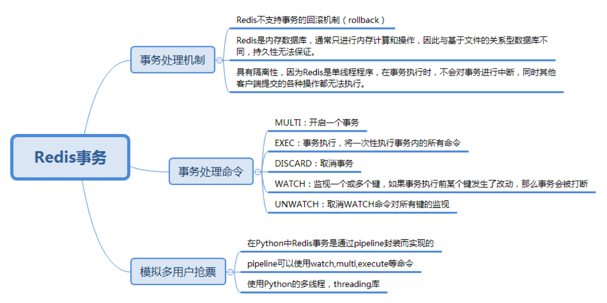

### redis基本操作

#### 基本使用

*数据类型及操作命令*

#### redis 事务机制

*redis事务机制*

##### 事务实现原理

redis 的事务处理与 RDBMS 的事务有一些不同。redis 不支持事务的回滚机制（Rollback），即当事务发生了错误（除了语法错误），整个事务依然会继续执行下去，直到事务中所有命令都执行完毕。只有当编程语法错误的时候，redis 命令才会执行失败。redis 是内存数据库，无法保证持久性，redis 提供了 RDB 和 AOF 模式来进行持久化。

* RDB（redis database）

  持久化可以把当前进程的数据生成快照保存到磁盘上，触发 RDB 持久化的方式分为手动触发和自动触发。持久化操作与命令操作不是同步进行，所以无法保证事务的持久性

* AOF（Append Only File）

  采用日志的形式记录每个写操作，弥补了 RDB 在数据一致性上的不足，但采用 AOF 模式，会大大降低 redis 的访问性能。启用 AOF 模式需要手动开启，有 3 种不同的配置方式：默认为 everysec：即每秒同步一次；always：只要有数据发生修改就会卸乳 AOF 文件；no：由操作系统决定什么时候记录到 AOF 文件中。

redis 是单线程程序，在事务执行时不会中断事务，其他客户端提交到各种操作都无法进行，总是具有隔离性。

redis 实现事务是基于 COMMAND 队列，如果 redis 没有开启事务，那么任何的 COMMAND 都会立即执行并返回结果。如果 redis 开启了事务，COMMAND 命令会放到队列中，并且返回排队的状态 QUEUED，只有调用 EXEC，才会执行 COMMAND 队列中的命令

##### 事务处理命令

* MULTI

  开启一个事务

* EXEC

  事务执行，将一次性执行事务内的所有命令

* DISCARD

  取消事务

* WATCH

  监视一个或多个键，如果事务执行前某个键发生了改动，那么事务也会被打断。可以使用和 MULTI 命令来处理共享资源的并发操作，采用乐观锁实现

* UNWATCH

  取消 WATCH 命令对所有键的监视

MULTI 后不能再执行 WATCH 命令，否则会返回 WATCH inside MULTI is not allowed 错误（因为 WATCH 代表的就是在执行事务前观察变量是否发生了改变，即 MULTI 之前，使用 WATCH）如果在执行命令过程中有语法错误，redis 也会报错，整个事务也不会被执行，redis 会忽略运行时发生的错误，不会影响到后面的执行

在 redis 只能够不存在悲观锁，事务处理要考虑并发请求情况，需要通过 WATCH + MULTI 的方式来实现乐观锁，如果监视的 KEY 没有发生变化则可以顺利执行事务，否则说明事务的安全性收到了破坏，服务器就会放弃执行这个事务，直接向客户端返回空回复 nil，事务执行失败后，可以重新进行尝试

