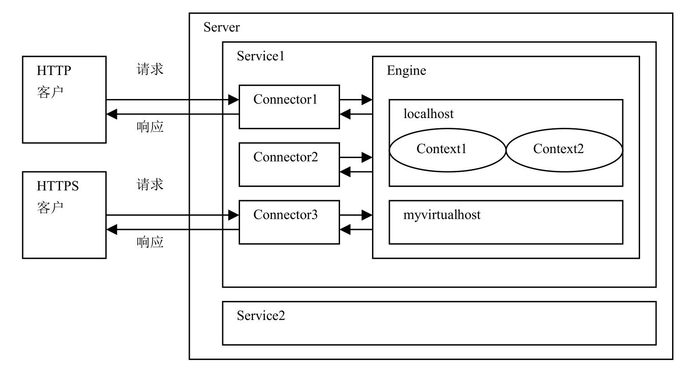

### Tomcat 安装

#### 安装及使用

##### 安装

* 安装 JDK，JDK 版本需满足 Tomcat 对应版本要求的最小 JDK 版本

* 下载解压 Tomcat 安装包

* 设置环境变量 

  ```shell
  export JAVA_HOME=/usr/local/tomcat
  export CATALINA_HOME=/usr/local/tomcat
  ```

##### 目录结构

*目录结构*


* `bin` 目录，启动和终止 Tomcat 的二进制程序

* `webapps` Tomcat 的 Web 应用目录，默认情况下把 Web 应用放在这个目录

* `conf` 配置文件目录，包括 `server.xml` 和 `tomcat-users.xml`；

* `lib` 存放 Tomcat 及所有 Web 应用都可以访问的 JAR 文件

* `logs` 存放 Tomcat 执行时产生的日志文件

  `catalina.Y-m-d.log`：记录 Tomcat 启动过程的信息，可以看到启动的 JVM 参数及操作系统等日志

  `localhost.Y-m-d.log`：记录 Web 应用在初始化过程中遇到的未处理的异常，会被 Tomcat 捕获输出到这个日志文件

  `localhost_access_log`：Tomcat 的请求日志，包括 IP 地址，请求路径，事件，协议及状态码

  `manager/host-manager`：Tomcat 自带的 manager 项目日志信息

* `work` Tomcat 的工作目录，在运行时把生成的一些工作文件放于此目录下。（默认存放 JSP 编译后产生的 Servlet 类文件）

* 将 `JAVA_HOME` 环境变量设为 JDK 安装目录

##### Tomcat 的组成结构

Tomcat 本身由一系列可配置的组件构成，其中核心组件是 Servlet 容器组件，它是所有其他 Tomcat 组件的顶层容器。Tomcat 的各个组件可以 `<CATALINA_HOME>/conf/server.xml` 文件进行配置

*各Tomcat组件之间关系*

```xml
<Server>
  <Service>
  	<Connector/>
    <Engine>
      <Host>
        <Context>
        </Context>
      </Host>
    </Engine>
  </Service>
</Server>
```

*Tomcat组件之间嵌套关系*



在以上 XML 中，每个元素都代表一种 Tomcat 组件，这些组件可分为四类：

* 顶层类元素

  包括 `<Server>` 元素和 `<Service>` 元素

  * Server 元素

    代表整个 Servlet 容器组件，可以包含一个或多个 Service 组件。由 `org.apache.catalina.Server` 接口来定义。

    |   属性    |                             描述                             |
    | :-------: | :----------------------------------------------------------: |
    | className | 指定实现 `org.apache.catalina.Server` 接口的类，默认为 `org.apache.catalina.core.StandardServer` |
    |   port    |     指定 Tomcat 监听 shutdown 命令的短裤，必须设置该属性     |
    | shutdown  | 终止Tomcat服务器运行时，发送给监听端口的字符串，必须设置该属性 |

  * Service 元素

    Service 元素中包含一个 Engine 元素，以及一个或多个 Connector 元素，这些 Connector 元素共享同一个 Engine 元素。由 `org.apache.catalina.Service` 接口定义

    |   属性    |                             描述                             |
    | :-------: | :----------------------------------------------------------: |
    | className | 指定实现接口类，默认 `org.apache.catalina.core.StandardService` |
    |   name    |                      定义 Service 名字                       |

* 连接器类元素

  为 `<Connector>` 元素，代表客户与服务器之间的通信接口，负责将客户的请求发送给服务器，并将服务器的响应结果发送给客户。

  ```xml
  <!-- 通过 8080 接收 HTTP 请求 -->
  <Connector port="8080" protocol="HTTP/1.1"
                 connectionTimeout="20000"
                 redirectPort="8443" />
  <!-- 通过 8009 端口接收其他 HTTP 服务器转发的请求 -->
  <Connector port="8009" protocol="AJP/1.3" redirectPort="8443" />
  ```

  |     属性      |                             描述                             |
  | :-----------: | :----------------------------------------------------------: |
  | enableLookups | 为 true，支持域名解析，可以把 IP 地址解析为主机名，Web 应用中调用 `request.getRemostHost()` 方法将返回客户的主机名，默认为 false |
  | redirectPort  | 指定转发端口，如果当前端口只支持 non-SSL 请求，在需要安全通信的场合，将把客户请求转发到基于 SSL 的 redirectPort 端口 |
  |     port      |                       设定 TCP 端口号                        |
  |   protocol    |                设定客户端的与服务端的通信协议                |

  *HTTP/1.1 Connector 元素的属性*

  |       属性        |                             描述                             |
  | :---------------: | :----------------------------------------------------------: |
  |      address      | 如果服务器有两个以上 IP 地址，该属性可以设定端口监听的 IP 地址，默认情况下，端口会监听服务器上所有 IP 地址 |
  |    maxThreads     | 设定处理客户请求的线程的最大数目，这个值苦厄定了服务器可以同时响应客户请求的最大数目，默认值为 200 |
  |    acceptCount    | 客户请求队列中存放了等待被服务器处理的客户请求。该属性用于设定在客户请求队列中的最大客户请求数。默认 100.如果队列已满，新的客户请求将被拒绝 |
  | connectionTimeout |   建立客户链接超时时间，单位毫秒， -1 为无限制。默认 20000   |
  |  maxConnections   | 设定在任何时刻服务器会接受并处理的最大连接数。当服务器接受和处理的连接数达到这个上限时，新的连接将被阻塞。 |
  |  maxCookieCount   | 指定对于一个客户请求所允许的最大 Cookie 数目。默认 200，如果设为一个负数，则无限制 |
  | maxHttpHeaderSize | 指定 HTTP 请求头和响应头的最大长度，以字节为单位，默认 8192（8kb） |
  |  maxSwallowSize   | 指定请求正文的最大长度，以字节为单位，默认 2097152（2mb）。为负，则无限制 |
  |     executor      |                    指定所使用执行器的名字                    |

* 执行器元素

  执行器类元素 `<Executor>` 代表可以被 Tomcat 的其他组件共享的线程池。由于 `<Connector>` 元素可能会引用 `<Executor>` 元素配置的执行器，因此需放在需要引用元素前面。

  |      属性       |                              --                              |
  | :-------------: | :----------------------------------------------------------: |
  |    className    | 指定实现类，默认 `org.apache.catalina.StandardThreadExecutor` |
  |      name       |             执行器名字，其他配置元素会引用该名字             |
  | threadPriority  | 设定线程池中线程的优先级别，默认值为 5（Thread.NORM_PRIORITY）取值 |
  |     daemon      |        设置线程池中的线程是否为后台线程，默认为 true         |
  |   namePrefix    | 设定线程池中的线程的名字的前缀，线程名字格式「前缀 + 线程序号」 |
  |   maxThreads    |           设定线程池中线程的最大数目，默认值为 200           |
  | minSpareThreads |  设定线程池中处于空闲或运行状态的线程的最小数目，默认为 25   |
  |   maxIdleTime   | 设定一个线程允许处理闲置状态的最长时间，单位毫秒，默认 60000，当线程池中的线程数超过了属性值，会关闭限制时间超过该值线程 |
  |  maxQueueSize   | 可运行任务队列中存放了等待运行的任务，此属性设定存放在该队列中任务的最大数目，默认值为 `Integer.MAX_VALUE` |

* 容器类元素

  代表处理客户请求并生成响应结果的组件，有四种容器类元素，分别为 ：`<Engine>`、`<Host>`、`<Context>`、`<Cluster>` 元素

  * Engine

    为特定的 Service 组件处理所有客户请求，处理在同一个 Service 中的所有 Connector 元素接收到的客户请求。由 `org.apache.catalina.Engine` 接口定义

    |    描述     |                             属性                             |
    | :---------: | :----------------------------------------------------------: |
    |  className  |  指定实现类，默认 `org.apache.catalina.core.StandardEngine`  |
    | defaultHost | 指定处理客户请求的默认主机名，在 Engine 的 Host 子元素中必须定义该主机 |
    |    name     |                      定义 Engine 的名字                      |

    Engine 中可以包含 `<Realm>`、`<Value>`、`<Host>` 子元素

  * Host

    为特定的虚拟主机处理所有客户请求，一个 Engine 元素中可以包含多个 Host 元素，每个 host 元素定义一个虚拟主机，可以包含一个或多个 web 应用。由 `org.apache.catalina.Host` 接口定义。

    |      属性       |                              --                              |
    | :-------------: | :----------------------------------------------------------: |
    |    className    |     指定实现类，默认 `org.apache.catalina.StandardHost`      |
    |     appBase     | 指定虚拟主机的目录，可以指定绝对目录，也可以指定相对于 `<CATALINA_HOME>` 的相对目录，如果未设定，默认为 `<CATALINA_HOME>/webapps` |
    |   unpackWARS    | 为 true，将把 Web 应用的 WAR 文件先展开为开发目录结构后再运行，如果设为 false，将直接运行 WAR 文件 |
    |   autoDeploy    | 为 true，当 Tomcat 服务器处于运行状态时，能够检测 appBase 下的文件，如果有新的 web 应用加入，会自动发布 |
    |      alias      |             指定虚拟主机的别名，可以指定多个别名             |
    | deployOnStartup | 为 true，当 Tomcat 启动时自动发布 appBase 目录下所有 web 应用，如果 Web 应用在 server.xml 中没有相应的 `<Context>` 元素，将采用默认 `<Context>` 元素。默认值为 true |
    |      name       |                       定义虚拟主机名字                       |

  * Context

    为特定的 Web 应用处理所有客户的请求，每个 Context 元素代表了运行在虚拟主机上的单个 Web 应用，一个 host 可以包含多个 Context 元素。由 `org.apache.catalina.Context` 接口定义。

    |    属性    |                              --                              |
    | :--------: | :----------------------------------------------------------: |
    | className  |    指定实现类，默认 `org.apache.catalina.StandardContext`    |
    |    path    |                指定访问该 Web 应用的 URL 入口                |
    |  docBase   | 指定 Web 应用的文件路径，可以给定绝对路径，也可以给定相对于 Host 的 appBase 属性的相对路径。如果 Web 采用开放目录接口，则指定根目录，采用 WAR 则指定 WAR 文件路径 |
    | reloadable | 为 true，在运行状态下会监视 WEB-INF/classes 和 WEB-INF/lib 目录下的 class 文件的改动，以及监视 WEB-INF/web.xml 文件的改动。如果有改动则自动刷新，默认为 false，（建议开放为 true，生产为 false） |
    |  cookies   |       指定是否通过 Cookie 来支持 Session，默认为 true        |

    Context 元素中可以包含 `<Realm>`、`<Value>`、`<Resource>` 等子元素

  * Cluster

    为 Tomcat 集群洗进行会话复制、Context 组件的属性的复制，以及集群范围内 WAR 文件的发布

* 嵌套类元素

  代表可以嵌入到容器中的组件，如 `<Value>` 元素和 `<Realm>` 元素

##### 启动

* Windows

  `startup.bat` 、`shutdown.bat`

* macos

  ```shell
  brew services tomcat
  ```
  
* linux

  ```shell
  catalina.sh run
  ```

##### 加载模式

Tomcat 的类加载器负责为 Tomcat 本身以及 Java Web 应用加载相关的类。假如 Tomcat 的类加载器要为一个 Java Web 应用加载一个名为 `Sample` 的类，类加载器会安装以下顺序到各个目录中去查找 `Sample` 类的 `.class` 文件，直到找到为止，如果所有目录都不存在 `.class` 文件，则抛出异常。加载顺序（子女优先）：

1.在 Java Web 应用的 `WEB-INF/classes` 目录下查找

2.在 Java Web 应用的 `WEB-INF/lib` 目录下的 JAR 文件中查找

3.在 Tomcat 的 lib 子目录下直接查找

4.在 Tomcat 的 lib 子目录下的 Jar 文件中查找

##### 配置

* 配置用户角色

  编辑 `conf` 目录中的 `Tomcat-user.xml` 来创建用户和角色。role 元素定义角色，user 元素定义用户。

  *tomcat-users.xml*

  ```xml
  <?xml version='1.0' encoding='utf-8'>
  <tomcat-users>
      <role rolename="manager-gui"/>
      <role rolename="admin-gui"/>
      <user username="tom" password="secret" roles="manager-gui,admin-guir"/>
      <user username="jerry" password="secret" roles="admin-gui"/>
  </tomcat-users>
  ```

* 允许远程访问

   `webapps` 下的 `host-manager` 和 `manager` 都有一个共同的文件夹 `META-INF`，里面都有 `context.xml`，这个文件夹的内容是

  ```xml
  <Context antiResourceLocking="false" privileged="true" >
    <Valve className="org.apache.catalina.valves.RemoteAddrValve"
           allow="127.d+.d+.d+|::1|0:0:0:0:0:0:0:1" />
  </Context>
  ```

  修改为无限制

  ```xml
  <Context antiResourceLocking="false" privileged="true" >
    <Valve className="org.apache.catalina.valves.RemoteAddrValve"
           allow=".*" />
  </Context>
  ```

#### 工作模式

Tomcat 有三种工作模式

* Tomcat 在一个 Java 虚拟机进程中独立运行，可看作是能运行 Servlet 的独立 Web 服务器
* Tomcat 运行在其他 Web 服务器的进程中，Tomcat 不直接和客户端通信，仅仅为其他 Web 服务器处理客户端访问 Servlet 的请求
* 尽管Tomcat在一个Java虚拟机进程中独立运行，但是它不直接和客户端通信，仅仅为与它集成的其他Web服务器处理客户端访问Servlet的请

#### 定义上下文

要将 Servlet/JSP 应用程序部署到 Tomcat 时，需要显式或隐式定义一个 Tomcat 上下文。在 Tomcat 中，每一个 Tomcat 上下文都表示一个 Web 应用程序

##### 显式定义 Tomcat 上下文

* 在 Tomcat 的 `conf/Catalina/localhost` 目录下创建一个 XML 文件
* 在 Tomcat 的 `conf/server.xml` 文件中添加一个 `Context` 元素

如果决定给每一个上下文都创建一个 XML 文件，那么这个文件名就很重要，因为上下文路径是从文件名衍生得到的。如把 `commerce.xml` 文件放在 `conf/Catalina/localhost` 目录下，那么应用程序的上下文路径就是 `commmerce`，并且可以利用 URL 访问一个资源 `http://localhost:8080/commerce/resourceName`。上下文文件中必须包含一个 `Context` 元素，作为它的根元素。这个元素大多没有子元素，它是该文件中唯一的元素。

```xml
<Context docBase="C:/apps/commerce" reloadable="true"/>
```

唯一必须的属性是 `docBase` ，它用来定义应用程序的位置。`reloadable` 属性是可选的，但是如果存在，并且它的值为 `true`，那么一旦应用程序中 Java 类文件或其他资源有任何增加、减少或更新，Tomcat 都会侦测到，并且一旦侦测到这些变化，Tomcat 就会重新加载应用程序。在部署期间，建议将 `reoloadable` 值设为 `true`，生产期间不设置该属性。当把上下文文件添加到指定目录时，Tomcat 就会自动加载应用程序。当删除这个文件时，Tomcat 就会自动卸载应用程序。

定义上下文的另一种方法是在 `conf/server.xml` 文件中添加一个 `Context` 元素。在 `Host` 元素下创建一个 `Context` 元素。此处定义上下文需要给上下文路径定义 `path` 属性

```xml
<Host name="localhost" appBase="webapps" unpackWARs="true" autoDeploy="true">
		<Context path="/commerce" docBase="C:/apps/commerce" reloadable="true"/>
</Host>
```

一般不建议通过 `server.xml` 文件来管理上下文，只有重启 Tomcat 后，更新才生效

##### 隐式定义

* 通过将一个 WAR 文件或者整个应用程序复制到 `Tomcat` 的 `webapps` 目录下可以隐式部署

#### 定义资源

定义一个 JNDI 资源，应用程序便可以在 Tomcat 上下文定义中使用。资源用 `Context` 元素目录下的 `Resource` 元素表示

```xml
<Context path="/appName" docBase="/your/app/path">
		<Resource name="jdbc/dataSourceName" auth="Container" type="javax.sql.DataSource"
				username="yourname"
				password="yourpasswd"
				driverClassName="com.mysql.jdbc.Driver"
				url="..."
				/>
</Context>
```

#### SSL 证书

将证书导入 `keystore` 后，复制放在服务器某个位置下的 `keystore`，并对 `Tomcat` 进行配置即可。打开 `conf/server.xml` 文件，在 `<service>` 下添加 `Connector` 元素

```xml
<Connector port="443" 
    minSpareThreads="5" 
    maxSpareThreads="75" 
    enableLookups="true"
    disableUploadTimeout="true"
    acceptCount="100"
    maxThreads="200"
    # ssl 配置
    cheme="https"
    secure="true"
    SSLEnabled="true"
    keystoreFile="/path/to/keystore"
    keyAlias="example.com"
    keystorePass="password"
    clientAuth="false"
    sslProtocol="TLS"
/>
```

