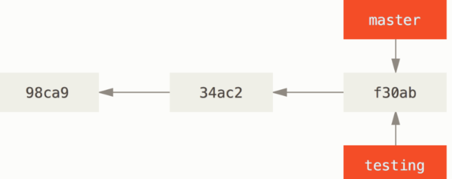
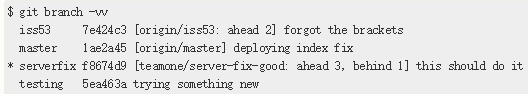

## Git 分支

#### 分支简介

当使用 `git commit` 进行提交操作时，Git 会先计算每一个子目录（本例中只有项目根目录）的校验和，然后在 Git 仓库中这些校验和保存为树对象。 随后，Git 便会创建一个提交对象，它除了包含上面提到的那些信息外，还包含指向这个树对象（项目根目录）的指针。如此一来，Git 就可以在需要的时候重现此次保存的快照

Git 的分支，其实本质上仅仅是指向提交对象的可变指针。 Git 的默认分支名字是 `master`。 在多次提交操作之后，你其实已经有一个指向最后那个提交对象的 `master` 分支。 它会在每次的提交操作中自动向前移动。

Git 的 “master” 分支并不是一个特殊分支。 它就跟其它分支完全没有区别。 之所以几乎每一个仓库都有 master 分支，是因为 `git init` 命令默认创建它，并且大多数人都懒得去改动它。

#### 分支创建

```shell
git branch testing
```

*创建分支*



`HEAD` 的特殊指针，指向当前所在的本地分支。使用 `git log --online --decorate` 查看各个分支当前所指的对象

#### 分支切换

```shell
git checkout <branch>
```

这样 `HEAD` 就指向 `testing` 分支了

```shell
git log --oneline --decorate --graph --all
```

查看分叉历史，会输出提交历史，各个分支的指向以及分支分叉情况

#### 分支合并

```shell
git checkout master
git merge <branch>
# 合并某个分支上的单个 commit
git cherry-pick <commit-hash>
```

#### 分支管理

```shell
# 列出所有分支
git branch
# 查看每一个分支最后一次提交
git branch -v
# --merged 和 --no-merged 可以过滤这个列表中已经合并或尚未合并到当前分支的分支
# 查看那些分支已合并到当前分支
git branch --merged
# 查看所有包含未合并工作的分支
git branch --no-merged
# 删除分支
git branch -d testing
```

#### 远程分支

远程引用是对远程仓库的引用（指针），包括分支、标签。可以通过 `git ls-remote (remote)` 来显式地获得远程引用的完整列表，或者 `git remote show (remote)` 获取信息。

远程分支以 `(remote)/(branch)` 形式命名。

远程仓库名字 “origin” 与分支名字 “master” 一样，在 Git 中并没有任何特别的含义一样。 同时 “master” 是当你运行 `git init` 时默认的起始分支名字，原因仅仅是它的广泛使用，“origin” 是当你运行 `git clone` 时默认的远程仓库名字。 如果你运行 `git clone -o booyah`，那么你默认的远程分支名字将会是 `booyah/master`。

##### 推送

公开分享一个分支时，需要将其推送到有写入权限的远程仓库上。本地的分支并不会自动与远程仓库同步 - 必须显式地推送想要分享的分支。`git push (remote) (branch)`

```shell
# 推送本地的 serverfix 分支来更新远程仓库上的 serverfix 分支
git push origin serverfix
```

等效

```shell
# 推送本地的 serverfix 分支，将其作为远程仓库的 <serverfix> 分支
git push origin serverfix:<serverfix>
```

如果想在自己的 `serverfix` 分支上工作，可以将其建立在远程跟踪分支上：

```shell
git checkout -b serverfix origin/serverfix
```

##### 跟踪分支

从一个远程跟踪分支检出一个本地分支会自动创建所谓的“跟踪分支”（它跟踪的分支叫做“上游分支”）。跟踪分支是与远程分支有直接关系的本地分支。如果在一个跟踪分支上输入 `git pull` ，Git 就能自动识别去哪个服务器上抓取，合并到那个分支

当克隆一个仓库时，它通常会自动地创建一个跟踪 `origin/master` 地 `master` 分支。跟踪远程分支

```shell
git checkout -b [branch] [remotename]/[branch]
```

等效于

```shell
git checkout --track origin/serverfix
```

设置于远程分支不同地名字

```shell
git checkout -b sf origin/serverfix
```

设置已有地本地分支跟踪一个刚刚拉取下来地远程分支，或者想要修改正在跟踪地上游分支，可以在任意时间使用 `-u` 或 `--set-upstream-to` 选项运行 `git branch` 来显式地设置

```shell
git branch -u origin/serverfix
```

当设置好跟踪分支后，可以通过 `@{upstream}` 或 `@{u}` 快捷方式来引用它。 所以在 `master`分支时并且它正在跟踪 `origin/master` 时，如果愿意的话可以使用 `git merge @{u}` 来取代 `git merge origin/master`。

查看设置的所有跟踪分支，可以使用 `git branch` 的 `-vv` 选项。这会将所有的本地分支列出来并且包含更多的信息。如每一个分支正在跟踪哪个远程分支于本地分支是否是领先、落后或是都有

```shell
git branch -vv
```

*跟踪远程分支*



这里可以看到 `iss53` 分支正在跟踪 `origin/iss53` 并且 “ahead” 是 2，意味着本地有两个提交还没有推送到服务器上。 也能看到 `master` 分支正在跟踪 `origin/master` 分支并且是最新的。 接下来可以看到 `serverfix` 分支正在跟踪 `teamone` 服务器上的 `server-fix-good` 分支并且领先 3 落后 1，意味着服务器上有一次提交还没有合并入同时本地有三次提交还没有推送。 最后看到 `testing` 分支并没有跟踪任何远程分支。

需要重点注意的一点是这些数字的值来自于你从每个服务器上最后一次抓取的数据。 这个命令并没有连接服务器，它只会告诉你关于本地缓存的服务器数据。 如果想要统计最新的领先与落后数字，需要在运行此命令前抓取所有的远程仓库。 可以像这样做：`$ git fetch --all; git branch -vv`

##### 拉取

当 `git fetch` 命令从服务器上抓取本地没有的数据时，它不会修改工作目录中的内容。只会获取数据然后让你自己合并。`git pull` 在大多数情况下是 `git fetch` 紧接着 `git merge` 命令。如果有一个设置好的跟踪分支，不管它是显式地设置还是通过 `clone` 或 `checkout` 命令创建，`git pull` 都会查找当前分支所跟踪的服务器与分支，从服务器上抓取数据然后尝试合并入那个远程分支

##### 删除远程分支

```shell
git push origin --delete serverfix
```

这个命令做的是从服务器上移除这个指针。Git 服务器通常会保留数据一段时间知道垃圾回收运行。如果不小心删除掉了，通常是很容易恢复的

#### 变基

在 Git 中整合来自不同分支的修改主要有两种方法：`merge` 和 `rebase` 

**变基：**使用 `release` 命令将提交到某一个分支上的所有修改都移至另一个分支上

```shell
git checkout experiment
# 变基
git rebase master
# 快进合并
git checkout master
git merge experiment
```

变基的原理是：首先找到这个两个分支（当前分支 experiment，变基操作的目标基底分支 `master`）的最近共同祖先 `C2`，然后对比当前分支相对于该祖先的历次提交，提取相应的修改并存为临时文件，然后将当前分支指向目标基底 C3，最后以此将之前另存为临时文件的修改依序应用

两种整合方法的最终结果没有任何区别，但是变基使得提交历史更加整洁。 你在查看一个经过变基的分支的历史记录时会发现，尽管实际的开发工作是并行的，但它们看上去就像是串行的一样，提交历史是一条直线没有分叉

一般这样做的目的是为了确保在向远程分支推送时能保持提交历史的整洁。（如向某个其他人维护的项目贡献代码时。在这种情况下，首先在自己的分支里进行开发，当开发完成时需要先将你的代码变基到 `origin/master` 上，然后再向主项目提交修改。这样的话，该项目的维护者就不再需要进行整合工作，只需要快进合并即可）

**快进合并：**由于当前 `master` 分支所指向的提交是你当前提交（有关 hotfix 的提交）的直接上游，所以 Git 只是简单的将指针向前移动。 换句话说，当你试图合并两个分支时，如果顺着一个分支走下去能够到达另一个分支，那么 Git 在合并两者的时候，只会简单的将指针向前推进（指针右移），因为这种情况下的合并操作没有需要解决的分歧——这就叫做 “快进（fast-forward）”。

##### 变基的风险

**不要对在仓库外有副本的分支执行变基**，只对尚未推送或分享给别人的本地修改执行变基操作清理历史，从不对已推送至别处的提交执行变基操作，这样，你才能享受到两种方式带来的便利。

只要你把变基命令当作是在推送前清理提交使之整洁的工具，并且只在从未推送至共用仓库的提交上执行变基命令，就不会有事。 假如在那些已经被推送至共用仓库的提交上执行变基命令，并因此丢弃了一些别人的开发所基于的提交，那你就有大麻烦了，你的同事也会因此鄙视你。

