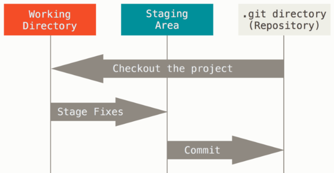
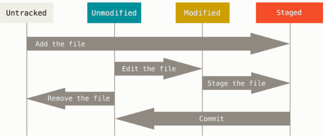
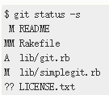
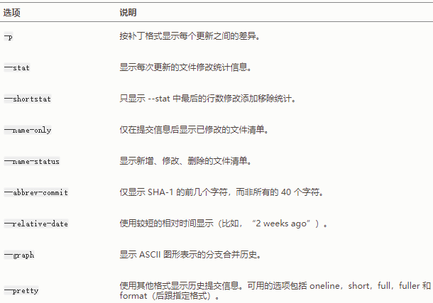
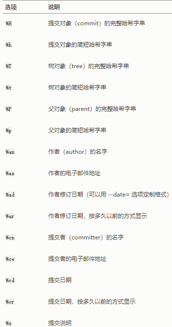
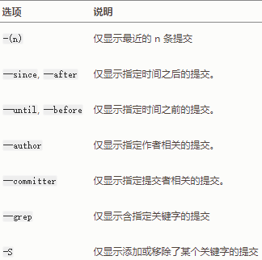

## git 基础

#### git 三种状态

* 已提交（committed）：数据已安全的保存在本地数据库中
* 已修改（modified）：修改了文件，但还每保存到数据库中
* 已暂存（staged）：对一个已修改文件做了标记，使之包含在下次提交的快照中

#### git 项目三个工作区域

*GIt仓库、工作目录、暂存区域*



* **git 仓库目录**：是 Git 用来保存项目的元数据和对象数据库的地方。这是 Git 中最重要的部分，从其他计算机克隆仓库时，拷贝的就是这里的数据
* **工作目录**：是对项目的某个版本独立提取出来的内容。这些从 Git 仓库的压缩数据库中提取出来的文件，放在磁盘上修改或使用
* **暂存区域：**是一个文件，保存了下次提交的文件列表信息，一般在 Git 仓库目录中。也称为索引

基本的 Git 工作流程：

1.在工作目录中修改文件

2.暂存文件，将文件的快照放入暂存区域

3.提交更新，找到暂存区域的文件，将快照永久性存储到 Git 仓库目录

如果 Git 目录中保存着特定版本的文件，就属于已提交状态。如果作了修改并已放入暂存区域，就属于已暂存状态。如果自上次取出后，作了修改但还没有放到暂存区域，就是已修改状态。

#### 获取 Git 仓库

有两种取得 Git 项目仓库的方法。第一种是在现有项目或目录下导入所有文件到 Git 中；第二种是从一个服务器克隆一个现有的 Git 仓库

##### 在现有目录中初始化仓库

```shell
# 在打算使用git对现有的项目进行管理，进入该目录并：
git init
```

该命令将创建一个名为 `.git` 的子目录，这个子目录含有初始化的 Git 仓库中所有的必须文件。这些文件是 Git 仓库的骨干。此时，**是一个初始化的操作，项目里的文件还没有被跟踪**。

如果是在一个已经存在文件的文件夹中初始化 Git 仓库来进行版本控制的化，应该开始跟踪这些文件并提交。

```shell
git add -A
git commit -m "initial project version"
```

##### 克隆现有仓库

克隆仓库的命令格式是 `git clone [url]`。

```shell
# 创建一个 libgit2 的目录
git clone https://github.com/libgit2/libgit2
# 克隆并自定义仓库名字 mylibgit 
git clone https://github.com/libgit2/libgit2 mylibgit
```

Git 支持多种数据传输协议：`https://`，`git://`，`ssh`

#### 记录每次更新到仓库

工作目录下的每一个文件不外乎两种状态：已跟踪或未跟踪。已跟踪的文件是指那些被纳入了版本控制的文件，在上一次快照中有它们的记录，在工作一段时间后，它们的状态可能处于未修改，已修改，已暂存。工作目录中除了已跟踪文件以外的所有其他文件都属于未跟踪文件，它们既不存在于上次快照的记录中，也没有放入暂存区中。初次克隆某个仓库的时候，工作目录中的所有文件都属于已跟踪文件，并处于未修改状态。编辑过文件之后，由于自上次提交后对它们做了修改，Git 将它们标记为已修改文件。

*使用 Git 时文件的生命周期*



##### 状态概览

`git status` 命令输出十分详细，使用 `git status -s` 或 `git status --short` 命令，可以得到更为紧凑的格式输出：

*git状态概览*



新添加的未跟踪文件前面有 `??` 标记，新添加到暂存区中的文件前面有 `A` 标记，修改过的文件前面有 `M` 标记。出现在有右边的 M 表示该文件被修改了但是还没有放入暂存区，出现在靠左边的 M 表示该文件被修改了并放入了暂存区。

##### 忽略文件

创建一个 `.gitignore` 文件，列出要忽略的文件模式。`.gitignore` 的格式规范如下：

* 所有空行或以 `#` 开头的行都会被 Git 忽略
* 可以使用标准的 `glob` 模式匹配
* 匹配模式可以以 `(/)` 开头放置递归 
* 匹配模式可以以 `(/)` 结尾指定目录
* 要忽略指定模式以外的文件或目录，可以在模式前加`!` 取反

星号（`*`）匹配零个或多个任意字符；`[abc]`匹配任何一个列在方括号中的字符（这个例子要么匹配一个 a，要么匹配一个 b，要么匹配一个 c）；问号（`?`）只匹配一个任意字符；如果在方括号中使用短划线分隔两个字符，表示所有在这两个字符范围内的都可以匹配（比如 `[0-9]` 表示匹配所有 0 到 9 的数字）。 使用两个星号（`*`) 表示匹配任意中间目录，比如 `a/**/z` 可以匹配 `a/z` , `a/b/z` 或 `a/b/c/z` 等。

##### 移除文件

要从 Git 中移除某个文件，必须要从已跟踪文件清单中移除（从暂存区域移除），然后提交。可以使用 `git rm` 命令。这样即可不出现在未跟踪文件清单中。下一次提交时，该文件就不再纳入版本管理了。如果删除之前修改过并且已经放到暂存区域的话，则必须要用强制删除选项 `-f` 。（这是一种安全特性，用于防止误删还没有添加到快照的数据，这样的数不能被 Git 恢复）

如果想把文件从 `git` 仓库中删除（亦从暂存区域移除），但仍然希望保留在当前工作目录中，即（想让文件保留在磁盘中，但是并不想让 Git 继续跟踪）使用 `--cached` 选项

```shell
git rm --cached README
```

`git rm` 后面可以使用 `glob` 模式。

#### 查看提交历史

`git log` 默认不用任何参数的话，`git log` 会按提交时间列出所有的更新，最近的更新排在最上面。这个命令会列出每个提交的 `SHA-1` 校验和、作者的名字和邮件、提交时间以及提交说明。常用选项：

*git log 常用选项*



* `-p` 用来显示每次提交的内容差异

  ```shell
  # 显示最近两次提交的差异
  git log -p -2
  ```

* `--stat` 选项在每次提交的下面列出所有被修改过的文件、有多少文件被修改了以及被修改过的文件的那些行被移除了或是添加了。在每次提交的最后还有一个总结

  ```
  git log --stat
  ```

* `--pretty`选项可以指定使用不同于默认格式的方式展示提交历史。这个选项有一些内建的子选项。如`oneline` 将每个提交放在一行显示。还有 `short`，`full` ，`fuller`。`format` 选项可以定制要显示的记录格式

  ```shell
  git log --pretty=oneline
  ```

  ```shell
  git log --pretty=format: "%h - %an, %ar : %s"
  ```

  *git log --pretty=format 常用选项*

  

*限制 git log 输出的选项*



#### 撤销操作

* 重新提交

  ```shell
  git commit --amend
  ```

  将暂存区中的文件提交。如果自上次提交以来未做任何修改，那么快照保持不变，修改的只是提交信息

* 取消暂存文件

  ```shell
  git reset HEAD <file>
  ```

* 撤销对文件的修改

  ```shell
  git checkout -- <file>
  ```

  还原成上次提交的样子

#### 远程仓库的使用

* 查看远程仓库

  ```shell
  git remote
  ```

  `-v` 选项，会显示需要读写远程仓库使用的 Git 保存的简写于其对应的 URL

* 添加远程仓库

  ```shell
  # 添加一个远程 Git 仓库，同时指定一个可以轻松引用的简写
  git remote add <shortname> <url>
  ```

* 从远程仓库中抓取和拉取

  ```shell
  git fetch [remote-name]
  ```

* 推送到远程仓库

  ```shell
  git push origin master
  ```

  只有当你有所克隆服务器的写入权限，并且之前没有人推送过时，这条命令才能生效。 当你和其他人在同一时间克隆，他们先推送到上游然后你再推送到上游，你的推送就会毫无疑问地被拒绝。 你必须先将他们的工作拉取下来并将其合并进你的工作后才能推送。 

* 远程仓库的移除与重命名

  ```shell
  # 重命名远程仓库的简写名
  git remote rename pu paul
  # 移除远程仓库
  git remote rm pual
  ```

#### 标签

##### 打标签

Git 可以给历史中的某一个提交打上标签，比较有代表性的是人们会使用这个功能来标记发布结点（v1.0)

##### 列出标签

```shell
git tag -l
# 查找标签
git tag -l 'v1.8.5*'
```

##### 创建标签

Git 使用两种主要类型的标签：轻量标签（lightweight）和附注标签（annotated）

一个轻量标签很像一个不会改变的分治 -- 它只是一个特定提交的引用

附注标签是存储在 Git 数据库中的一个完整对象。它们是可以被校验的；其中包含打标签者的名字，电子邮件地址，日期时间；还有一个标签信息；并且可以使用 GNU Privacy Guard（GPG）签名与验证。

通常建议创建附注标签，这样可以拥有以上信息；但是如果只是想用一个临时的标签，或者因为某些原因不想要保存那些信息，轻量标签也是可用的

* 附注标签

  ```shell
  git tag -a v1.4 -m 'my version 1.4'
  ```

  `-m` 选项指定了一条会存储在标签中的信息。如果没有为附注标签指定一条信息，Git 会运行编辑器要求输入信息

  ```shell
  git show v1.4
  ```

* 轻量标签

  轻量标签本质上是将提交校验和存储到一个文件中 - 没有保存任何其他信息

  ```shell
  git tag v1.1
  ```

##### 后期打标签

可以对过去的提交打标签，在标签末尾指定校验和

```shell
git tag -a v1.2 9fceb02
```

##### 共享标签

默认情况下，`git push` 命令并不会传送标签到远程仓库服务器上。在创建完标签后必须显示推送标签到共享服务器上。这个过程就像共享远程分支一样 `git push origin [tagname]`

```shell
git push origin v1.5
```

如果相应一次推送很多标签，使用 `--tags` 选项的 `git push` 命令。

```shell
git push origin --tags
```

##### 拉取标签

```shell
git pull origin --tags
```

##### 删除标签

```shell
# 删除本地
git tag -d <tagname>
# 删除远程
git push origin --delete <tagname>
```

上述命令不会从任何远程仓库中移除这个标签，必须使用 `git push <remote>:refs/tags/<tagname>` 来更新远程仓库

```shell
giit push origin:refs/tags/v1.4-lw
```

##### 检出标签

如果想查看某个标签指向的文件版本，可以使用 `git checkout` ，但这会使仓库处于 “分离头指针（detached HEAD)" 状态。在分离头指针状态下，如果做了某些更改然后提交它们，标签不会发生变化，但你的新提交将不属于任何分支，并且无法访问，除非确切的提交哈希。

